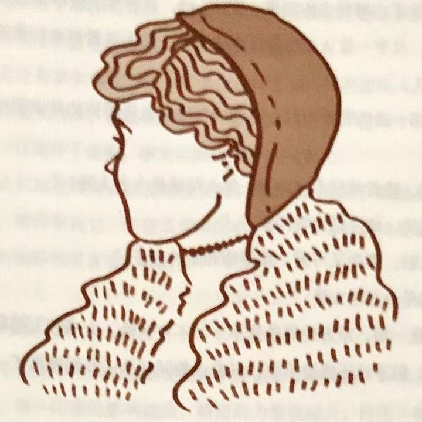
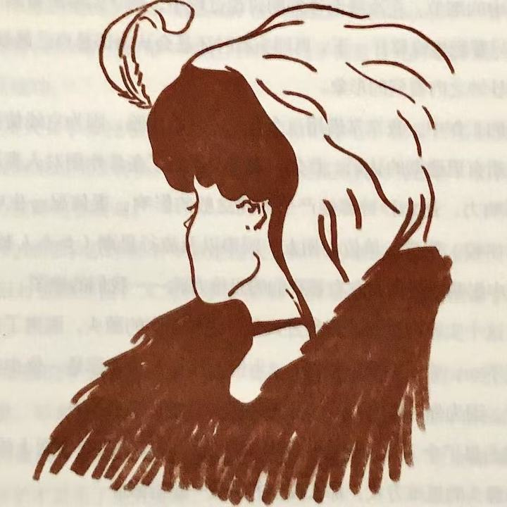
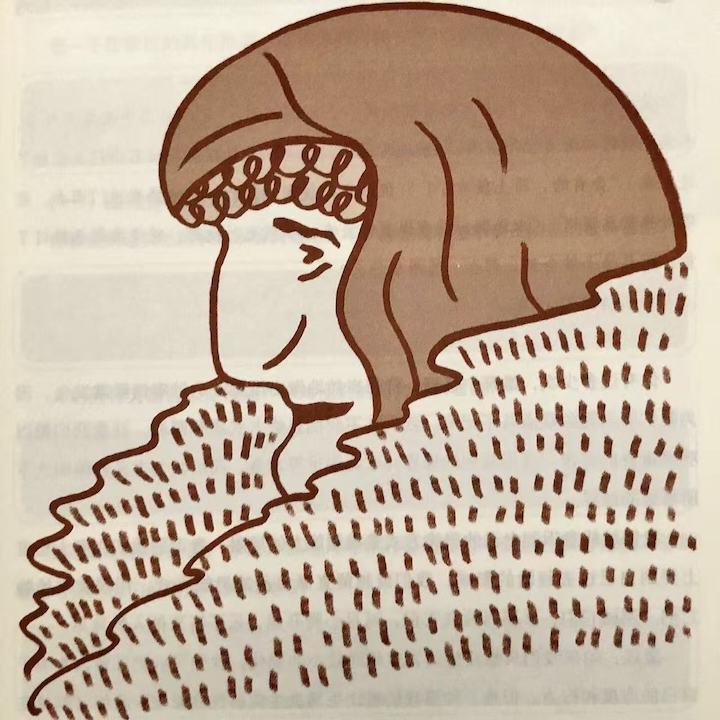

## 第一章 由内而外全面造就自己

品德成功论提醒人们，高效能的生活是有基本原则的。只有当人们学会并遵循这些原则，把它们融入到自己的品格中去，才能享受真正的成功与恒久的幸福。

---

> 没有正确的生活，就没有真正卓越的人生。——戴维·斯塔·乔丹（David Starr Jordan）| 美国生物学家及教育家

在 25 年的工作经历中，我与商界、大学和婚姻家庭各个领域的人共事。和其中一些外表看起来很成功的人深入接触后，我却发现他们常在与内心的渴望斗争，他们确实需要协调和高效，以及健康向上的人际关系。

我想从下面他们和我分享的这些例子中，你应该能找到共鸣：

- 我的事业十分成功，但却牺牲了个人生活和家庭生活。不但与妻儿形同陌路，甚至无法肯定自己是否真正了解自己，是否了解什么才是生命中最重要的。
- 我很忙，确实很忙，但有时候我自己也不清楚是否有价值。我希望生活得有意义，能对世界有所贡献。
- 我上过无数关于有效管理的课程，我对员工的期望值很高，也想尽办法善待他们，但就是感觉不到他们的忠心。我想如果我有一天生病在家，他们一定会无所事事，闲聊度日。为什么我无法把他们训练得独立而负责呢？为什么我总是找不到这样的员工呢？
- 要做的事太多了，我总是感到时间不够用，觉得压力沉重，终日忙忙碌碌，一周七天，天天如此。我参加过时间管理研讨班，也尝试过各种安排进度计划的工具。虽然也有点帮助，但我仍然觉得无法像我希望的那样，过上快乐、高效而平和的生活。
- 看到别人有所成就，或获得某种认可，表面上我会挤出微笑，热切地表示祝贺，可是，内心却难受得不得了。为什么我会有这种感觉？
- 我个性很强。几乎在任何交往中，我都能控制结果。多数情况下，我甚至可以设法影响他人通过我想要的决议。我仔细考虑了每种情况，并且坚信我的建议通常都是对大家最好的。但是我仍感到不安，我很想知道，他人对我的为人和建议到底是何态度。
- 我的婚姻已变得平淡无趣。我们并没有恶言相向，更没有大打出手，只是不再有爱的感觉。我们请教过婚姻顾问，也试过许多办法，但看起来就是无法重新燃起往日的爱情火花。
- 我那十来岁的儿子不听话，还打架。不管我怎么努力，他就是不听我的话，我该怎么办呢？
- 我想教育孩子懂得工作的价值。但每次要他们做点什么，都要时时刻刻在旁监督，还得忍受他们不时地抱怨，结果还不如自己动手来得简单。为什么孩子们就不能不要我提醒，快快乐乐地料理自己的事呢？
- 我又开始节食了——今年的第五次。我知道自己体重超标，也确实想有所改变。我阅读所有最新的资料，确定目标，并采取积极的态度激励自己，但我就是做不到，几周后就溃败了。看来我就是无法信守诺言。

这些都是我在任职咨询顾问和大学教师期间遇到的一些普遍而又深层次的问题，不是一两天就能解决的。

几年前，我和妻子桑德拉就为类似的问题大伤脑筋。我们的一个儿子学习成绩很差，甚至看不懂试卷上的问题。他与同学交往时也很不成熟，经常弄得周围的人很尴尬。他又瘦又小，动作也不协调。打棒球时，他往往在投手投球之前就挥动了球棒，招来他人的嘲笑。

我和桑德拉觉得，若要十全十美，首先要做完美的父母。于是我们尝试用积极的态度来激发他的自信心：“加油，孩子，你能办得到！我们知道你行！手握高一点，看着球，等球快到面前再挥棒。”只要他稍有进步，我们就大为夸奖一番以增强他的信心：“干得好，孩子，继续。”

尽管如此，还是引来了嘲笑，我们对此大加斥责：“别笑，他还在学习呢。”而这时我们的儿子却总是哭着说：“我永远也学不好，我根本就不喜欢棒球！”

所有的努力似乎都徒劳无功，那时我们真是心急如焚，看得出来这一切反而伤害了他的自尊心。开始我们总能对他加以肯定、鼓励和帮助，可是一再失败后，还是放弃了，只能试着从另一个角度来看待。

后来，在讲授有关沟通与认知的课程中，我对思维方式的形成、思维方式如何影响观点、观点又如何左右行为等问题深感兴趣，并进一步研究了期望理论（Expectancy Theory）、自我实现预言（Self-fulfilling Prophecy）和皮格马利翁效应（Pygmalion Effect）。从中我意识到，每个人的思维方式都是那么根深蒂固，仅仅研究世界是不够的，还要研究我们看世界时所戴的“透镜”，因为这透镜（即思维方式）往往左右着我们对世界的看法。

我跟桑德拉谈到这些想法，并借此分析我们的困境，终于认识到我们对儿子往往言不由衷。自省后我们承认，内心深处的确觉得儿子在某些方面“不如常人”。所以不论我们多么注意自己的态度与行为，其效果都是有限的，因为表面的言行终究掩饰不住其背后的信息，那就是：“你不幸，你需要父母的保护。”

此时我们才开始觉悟：要改变现状，首先要改变自己；要改变自己，先要改变我们对问题的看法。

### 品德与个人魅力孰重

当时我正潜心研究自 1776 年以来美国所有讨论成功因素的文献。我阅读或浏览过的论著不下数百，论题遍及自我完善、大众心理学以及自我帮助等等。对于爱好自由民主的美国人民所公认的赢得成功的种种关键因素，已算得上了如指掌。

从这 200 年来的作品中，我注意到一个令人诧异的趋势。前 150 年的论著强调“品德（Character Ethic）”为成功之本——如诚信、谦虚、忠诚、节欲、勇气、公正、耐心、勤勉、朴素和一些称得上是金科玉律的品德。本杰明·富兰克林（Benjamin Franklin）的自传就是这个时代的代表作，它主要描述一个人如何努力进行品德修养。

然而第一次世界大战后不久，人们对成功的基本观念改变了。由重视“品德”转而强调“个人魅力（Personality Ethic）”，即认为成功与否更多取决于性格、社会形象、行为态度、人际关系以及长袖善舞的圆熟技巧。这种思潮朝两大方向发展：一是注重人际关系与公关技巧；二是鼓吹盲目积极乐观（PMA）。由此衍生的行为和习惯，有些的确是金科玉律，例如“态度决定成败”、“微笑比皱眉更能赢得朋友”以及“预则立，不预则废”等等。但另一些却显然是玩弄手段，甚至是欺骗性的。例如运用技巧赢得好感，假装对他人感兴趣以套取情报，或虚张声势，甚至以威胁手段达到目的。

因此，近 50 年来讨论成功学的著作都很肤浅，谈的都是有关如何树立社会形象的技巧和如何成功的捷径。但这种用“阿司匹林”和“创可贴”来治疗心灵痛苦的方法，往往是头痛医头，脚痛医脚，治标而不治本。有时似乎取得了暂时的效果，但是深层次的问题没有解决，不时又会重新浮现。

我终于了解，过去我与桑德拉潜意识里都受到这种速成观念的影响，才会对儿子采取上述做法。在我们心目中，这个孩子有失颜面，我们重视成为模范父母，维持良好形象，更甚于对孩子的关切，这种心态也影响到了对孩子的看法。的确，在看待与处理这个问题时，我们偏重许多其他因素，反而忽略了孩子的幸福与快乐。

一方面，因为好面子，我们给予孩子的不是无条件的关爱，造成了他自我评价的低落。所以我们决定从自身下功夫，不再讲究技巧，而是着重调整内心的真正动机和对孩子的看法。我们不再设法改变他，转而从客观的角度去发现和了解他的特质、个性与价值。

另一方面，我们也自觉地改变了自己的动机，培育了内在的安全感，不再用孩子的表现来判断自己的价值。

一旦摆脱了过去对孩子的看法，培育了基于价值观的动机，我们顿时感到一种新气象——不必再拿孩子与旁人比较，不必把固定的社会模式强加在他身上，这样反而能够平心静气地欣赏他的优点。我们相信他有能力应付人生的种种挑战，也就不急于保护他免受外界的嘲笑。

可是孩子已习惯于接受保护，因此一开始表现得相当畏缩。他向我们求援，但我们只是认真聆听，不一定如他预期地回应。这无形中传达了一个信息：“父母不用保护你，你没问题！”

几个月过去了，他渐渐有了信心，也开始肯定自我价值，终于以自己的速度与步调发挥出了潜能。不论在学业方面、运动场还是社交场合，以一般社会标准来衡量，他的表现都是相当出色的。这一切都发生在转念之间，远远超过了所谓的自然发展速度。后来他还当选学生社团领导、州运动员，门门成绩优秀。另外，他还锻炼出了坦诚、热心的性格，走到哪儿都能与人融洽相处。

我和桑德拉都相信，这个孩子“出人头地”的成就中，自动自发因素的作用要多于外在影响。这是前所未有的经验，对我们教育子女及扮演其他角色很有启发作用，也使我们体验到凭借品德和个人魅力成功的天壤之别。赞美诗中唱得好：努力探寻你的心灵吧，因为生活源自于此。

### 光有技巧还不够

从教育儿子的经验，对人们认知过程的研究以及成功论著的阅读中，我顿悟了品德的强大影响力，也认清了自己从小所学并且深植于心的价值观，其实与现在流行的追求捷径的速成哲学相去甚远，而这种差异经常被有意地忽略。多年来我一直向他人传授七个习惯，自信十分有效，却总是发现这些知识与流行的思潮不同甚至相悖，现在终于对个中原因有了深一层的领会。

我并非暗示个人魅力论所强调的因素不具效用，比如个人成长、沟通技巧方面的训练，积极思维和影响力方面的教育等，有时确实是成功的要素，但只居于次要，而非主要地位。或许我们在前人的基础上施展个人魅力时，太过注重造就自己，却忽略了前人基础的支撑；也或许我们习惯坐享其成，遗忘了耕耘的必要。

即使我可以玩弄手段使他人投我所好，为我卖力，因我发奋，和我“惺惺相惜”，然而一旦我品德有缺陷——比如言不由衷、虚情假意，就无法获得长远的成功。因为言不由衷难免遭人怀疑，任何行事都会被视为别有用心，就算所谓的人际关系技巧也无济于事。任凭你巧舌如簧或动机纯良，只要没有或者缺乏信任感，就不要说什么永久的成功。只有心存善念，才能赋予人际关系技巧以生命。

只重技巧就好似考前临时抱佛脚，纵使有时顺利过关，甚至成绩还不错，但没有日积月累的付出，绝对无法学得精通。

试想，如果耕种也临时抱佛脚会有多荒谬。春天忘了播种，夏天忙着享乐，秋天能收获什么呢？耕种是一个自然体系，必须付出代价，一步一步完成。一分耕耘，一分收获，没有捷径可循。

人类行为和人际关系也是基于收获法则的自然系统。在暂时性的人际交往中，你或许精于世故，按“规矩”办事，暂时蒙混过关；你也可以凭借个人魅力八面玲珑，假扮他人知音，利用技巧赚取好感。但在长久的人际关系中，单凭这些次要优势是难有作为的。倘若没有根深蒂固的诚信和基本的品德力量，那么生活的挑战迟早会让你真正的动机暴露无遗，一时的成功就会被人际关系的破裂所替代。

许多人具备这些次要优势，是社会所认可的人才，但是缺乏基本的品德，长期来看，他们与同事、朋友、配偶或者孩子的关系早晚会出现问题。只有品德才是交流中最伶俐的“口齿”，正如美国诗人爱默生（Emerson）所说：“大声喧哗反而难以入耳。”

当然，也有品德有余却沟通技巧不足的人，但即使人际关系质量因此受到影响，也是瑕不掩瑜。

归根到底，我们的本质要比言行更具说服力，这个道理人人都懂。有些人是我们绝对信任的，因为我们了解他们的品德，不论他们是否能说会道、擅长交际，我们就是信任他们，而且能够与之合作顺畅。威廉姆·乔治·乔登（William George Jordan）曾说：人性可善可恶，冥冥中影响着我们的一生，而且总是如实反映出真正的自我，那是伪装不来的。

### 思维方式的力量

本书包含人类效能的许多原则，是基本而首要的，可通往成功与幸福，故放之四海皆准，不过，我们必须先了解人类的思维方式以及如何实现思维方式的转换，才能真正理解这七个习惯。

先前提到的品德成功论与个人魅力论就是两种典型的思维方式。“Paradigm（思维方式）”这个词来自希腊文，最初是一个科学名词，现在多用来指某种理论、模型、认知、假说或参考框架。但广义上是指我们“看”世界的方法，这种“看”和视觉无关，主要指我们的感知、理解与诠释。它是每个人看待世界的方式，未必与现实相符。它是一份地图，而非地域本身，是由每个人的成长背景、经验及选择打造而成，我会会透过它来窥探万事万物。

为了方便理解，我们可以把思维方式比作地图。我们都知道地图不代表地域，只是对地域的某些方面进行说明。思维方式就是这样，它是关于某种事物的理论、诠释或者模型。

假设你想去芝加哥中心区的某个地方，地图本应该帮助你到达目的地，但是由于印刷问题，你得到了一张标注为芝加哥，实际上却是底特律的地图。你能想象无法到达目的地的那种沮丧和无助吗？

你可以改变行为，比如更努力，更勤奋，更迅速，但是这种努力只会让你更快地到达错误地点。你还可以改变态度，不管到了哪里你都高兴。但关键是，你还是走错路了。根本问题不在于你的行为和态度，而在于那张错误的“地图”。

我们每个人脑中都有很多地图，可以分成两大类：一类是依据世界本来面目绘制的地图，反映现实情况；另一类是依据思维方式绘制的地图，反映个人价值观。我们用这些地图诠释所有的经验，从来都不怀疑地图的正确性，甚至意识不到它们的存在。我们理所当然地假定自己的所见所闻就是真实的世界。

我们的态度与行为源自这种假定，对事物的看法决定着我们的思想与行为。

现在来做一个智力和情感的小测验，请花几秒钟观察下面的图 1-1 和图 1-2，并仔细描述所看到的形象。

| 图 1-1                     | 图 1-2                     |
|---------------------------|---------------------------|
|  |  |

你是否看到了一位女士？她的年龄大约多大？长相如何？衣着如何？身份又如何？

或许你认为这位女士是位可爱的摩登女郎，鼻子小巧，时尚俏丽。

如果我说你看走眼了，这位女士已经六七十岁，而且面带愁容，绝非模特儿，或许过马路时还需要你扶她一把，你会有何反应？

如果我们能面对面地讨论，就可以互相交流自己看到的画像的样子，直到对方也看到了自己所看到的。

但是不行，所以只好请你看图 1-3（见文末），并将它与图 1-2 对照。现在你能看到老妇人了吗？一定要看到才能继续往下读，这很重要。

多年以前我在哈佛商学院就读时，首次知道这个实验。当年那位教授想借此说明不同的人对同一件事会有不同的看法，并且都很正确。这不属逻辑范畴，而是心理问题。

教授首先把两叠卡片分发给教室两边的同学，其中一叠是图 1-1 的少妇像，另一叠是图 1-3 的老妇像。他给我们十秒钟仔细看这些卡片，然后收回。接着用投影仪给我们看综合了二者特点的画像，即图 1-2，并要求全班来描述。结果，事先看过少妇像的，几乎一致认定这就是那位少妇；而先前看到老妇像的同学，也都认为这是位老妇人。

这时教授请一边的同学向另一边的同学讲述他所看到的并说明理由，双方各执一词：

“别开玩笑，我看她超不过 20 岁，怎么可能是个老太婆？”

“你才看玩笑，她少说也有 70 岁了。”

“她这么年轻、漂亮又可爱，我都想和她约会了。”

“可爱？她是个丑老太婆。”

你一言，我一语，双方始终争执不下，不肯认输。大多数人都早就知道另一种可能性的存在，只不过不愿意承认。只有少数同学从一开始就换了一个角度来观察画像。

正当大家僵持不下的时候，有位同学走上前去，指着画像上的一条线说：“这时少妇戴的项链。”另一位马上反驳：“不，这是老妇人的嘴。”就这样，大家开始逐一讨论画中的细节，在冷静而详细的讨论过程中，同学们渐渐看到了另一方眼中的画像。但只要把视线移开一下，再回头看时还是会认为那是自己最初看到的样子，即当时十秒钟之内看到的形象。

在后来的工作中，我常常借用这个有关感知的实验，因为它能使我们对人和人际关系的本质有更透彻的认识。首先，它充分说明了条件作用对人类认知和思维方式的强大影响力。连十秒钟都能产生如此这般的影响，更何况一生中的条件作用呢？家庭、学校、教堂、单位、朋友、同事以及流行思潮（如个人魅力论等），都在不知不觉中影响着我们，左右着我们的思维方式——我们的地图。

其次，这个实验还说明了思维方式是行为与态度的源头，脱离了这个源头的言行就是表里不一，言不由衷。以图 1-2 为例，如果你认为那是一位少妇，自然想不到扶她过街，因为你对她的态度和行为必定出自你对她的看法。

由此就凸显了个人魅力论的一个基本缺陷，即仅仅改变表面上的行为与态度，却忽略作为源头的思维方式，那么改变的成效一定有限。

这个实验还让我们体会到思维方式对人际交往的影响。以前我们总以为只有自己清楚而客观地看到了事务的本质，但这个实验却让我们开始认识到，别人的观点虽然有差异，但也是清楚而客观的。“立场决定观点。”

这并不是说没有事实存在。在实验中，起初看到不同画像的人，在图 1-2 中都看到了同样的白底黑线条，这是他们共同承认的事实。只不过每个人经验不同，诠释也不同，而一旦离开了诠释，事实也就失去了它的意义。

我们越是认识到思维方式以及经验在我们身上的影响力，就越是能够对自己的思维方式负责，懂得审视它，在现实中检验它，并乐于聆听和接受别人的看法，从而获得更广阔的视野和更客观的看法。

### 思维转换的力量

或许从这个实验中得到的最重要的启示因该是思维转换，即某人从另一角度看问题的顿悟感。第一印象的影响深远，顿悟的力量就越大，好比一瞬间万道光芒把内心照亮。

“思维转换（Paradigm Shift）”一词由托马斯·库恩（Thomas Kuhn）在他的经典之作《科学革命的结构》（_The Structure of Scientific Revolutions_）一书中最先提出。库恩在书中阐释，科学研究的每一项重大突破，几乎都是首先打破传统，打破旧思维、旧模式才得以成功。

- 古埃及天文学家托勒密认为地球是宇宙的中心，但哥白尼主张太阳才是宇宙的中心，因而激起思维转换。尽管后者曾招致强烈反对与迫害，但转眼间，人类对宇宙万物的诠释完全改观。
- 牛顿的物理学原理虽至今仍是现代工程学的基础，但是仍然不够完整。直到爱因斯坦相对论的提出，又为科学界带来一次革命，增添了前沿价值以及相关注解。
- 有关细菌的学说出现之前，许多母亲和孩子在分娩过程中死亡，对此没有人能解释清楚。军事战争中，许多士兵死于轻伤或是疾病，而非前线的致命攻击。直到细菌论的发展，带来了全新的思维方式，有助于更好、更全面地理解当时的情况，现代医学才发生了重大变革。
- 美国的今天也是思维转换的结果。君权神授、君主专制思想延续了几个世纪，直到建立一个民有、民治、民享的政府这一思想的出现，才打破传统思维。民主宪政由此孕育而生，释放了人类的天赋和才能，创立了生存、自由、民权的新规范，在世界上产生了历史上前所未有的影响力和希望。

但并非所有的思维转换都是积极的。例如我们前面提到的，人们由强调品德转为强调个人魅力，这种转换反而让我们偏离了通向成功与幸福的轨道。

不论思维转换的结果是否积极，过程是否渐进，都会让我们的世界观发生改变，而且改变的力度惊人。不论思维方式是否正确，都会决定我们的行为和态度，并最终影响到我们的人际关系。

我曾经体验过一次小小的思维转换。那是个周日的早晨，在纽约的地铁内，乘客都静静地坐着，或看报或沉思或小憩，眼前一幅平静安详的景象。这时候突然上来一名男子与几个小孩，孩子的喧闹声，破坏了整个气氛。那名男子坐在我旁边，任凭他的孩子如此撒野作怪，依旧无动于衷。这种情形谁看了都会生气，整个车厢的人似乎都十分不满，最后我终于忍无可忍对他说：“先生，你的孩子太闹了，可否请你管管他们？”

那人抬起眼看着我，如梦初醒般轻声说：“是啊，我是该管管他们。他们的母亲一小时前过世了，我们刚从医院出来。我手足无措，孩子们大概也一样吧。”

你能想象我当时的感觉吗？我的思维转换了，看此事的角度也瞬间改变，想法、感觉和行为都变了。我怒气全消，不需要再克制自己的态度和行为，因为他的痛苦已经让我感同身受，同情与怜悯之情油然而生。“原来您的太太刚刚过世？我感到很抱歉！您愿意和我谈谈吗？或者我能为您做些什么？”一切都变了。

许多人在生死关头也会大彻大悟，重新审视生命中的优先次序，同样的事情也会发生在人们突然接受一个新角色的时候，比如丈夫、妻子、父母、主管或领导。

如果我们只想让生活发生相对较小的变化，那么专注于自己的态度和行为即可，但是实质性的生活变化还是要靠思维的转换。

美国哲学家梭罗（Thoreau）曾经说过：“一棵邪恶的大树，砍它枝叶千斧，不如砍它根基一斧。”行为和态度就是枝叶，思维方式就是根基，抓住根本才能让生活出现实质性的进展。

### 身体力行

当然，并非所有的思维转换都是立即发生的，和我在地铁上的突然顿悟不同，我跟妻子桑德拉关于儿子的思维转换，就是一次缓慢、艰巨并且耗费心力的经历。我们对待他所采取的方法是基于多年的个人魅力论经验而做出的条件反射。这同时也是按照父母的标准要求子女的结果。直到我们改变了思维方式，以不同的角度看待问题，才长足地改变了自己和当时的情况。

为了能换一个角度看待我们的儿子，我和桑德拉必须改变。我们在个人的性格发展和成长中付出努力，新的思维方式也就应运而生。

思维方式与性格息息相关。从人类这个角度而言，你的观念会从为人中体现出来。我们对待事物的方式和性格紧密相关。如果不把性格和视角上的改变结合起来，是难有成效的。

即使是那天早上在地铁上，我的思维方式转换如此迅速，而视角的转变也依然会受到我的基本个性的局限。我敢肯定会有人即使突然明白发生了什么，也是宁愿坐在一个可怜迷惘的人身边，尴尬地沉默着，不会觉得有一丝丝悔恨或是自责。但是我同样肯定，一定会有人在第一时间就很敏锐，意识到可能有隐情，然后比我更早地给予帮助。

思维方式之所以强大，是因为这构成了我们观察世界的窗口。而思维转换的力量也正是定式改变必需的力量，无论这种转变是立即发生的，还是经过计划缓慢进行的。

### 以原则为中心的思维方式

品德成功论根植于一个基本信念之上，那就是人类效能都需要原则作指引，这是放之四海皆准的真理，和物理学中的万有引力法则一样，都是毋庸置疑、不容忽视的自然法则。

至于这些原则的真实性和影响力到底怎样，看看弗兰克·柯克（Frank Koch）在海军学院的杂志《过程》（_Proceedings_）中写到的思维转换经历就知道了。

两艘演习战舰在阴沉的天气中航行了数日，我就在打头的那艘旗舰上当班。当时天色已晚，我站在舰桥上瞭望，浓重的雾气使得能见度极低，因此船长也留在舰桥上压阵。

入夜后不久，舰桥一侧的瞭望员忽然报告：“右舷位置有灯光。”

船长问他光线的移动方向，他回答：“正逼近我们。”这意味着我们可能相撞，后果不堪设想。

船长命令信号兵通知对方：“我们正迎面驶来，建议你转向 20 度。”

对方说：“建议你转向 20 度。”

船长说：“发信号，告诉他我是上校，命令他转向 20 度。”

对方回答：“我是二等水手，你最好转向 20 度。”

这时候船长已经勃然大怒，大叫道：“告诉他，这是战舰，让他转向 20 度。”

对方的信号传来：“这是灯塔。”

结果，我们改变了航道。

我们随着这位船长经历了一次思维转换，结果整个情况都不同了。这位船长因为身处迷雾而看不清事实，但是看清事实在我们的日常生活中是极其关键的一环。

原则如灯塔，是不容动摇的自然法则。正如塞西尔·B.德米尔（Cecil B. deMille）在他执导的电影《十诫》（_The Ten Commandments_）中所揭示的：“我们不可能打破法则，只能在违背法则的时候让自己头破血流。”

有人根据自己的经历建立思维方式或绘制地图，然后借此观察自己的生活与人际关系。但是地图不等于地域本身，它只是一种“主观的事实”，是对某一地域的描述。

只有“灯塔”式指引人类成长和幸福的原则才是“客观的事实”，是地域本身。这一法则已经渗透到历史上所有的文明社会中，并成为家庭和机构繁荣持久的基础。

任何人只要对人类历史的盛衰兴替有深切了解，都会承认这些原则是颠扑不破、历久弥新的。国家社会的存亡与兴衰，往往就取决于是否能遵奉这些原则。

我所强调的这些原则，并非一些深奥玄妙的宗教哲理，也不属于任何特定的宗教或信仰。可以说世上各主要宗教、民族的伦理道德思想中，几乎都涵盖了它们。这些不辩自明的真理，任何人都可以心领神会，就好像人类与生俱来的良知，不分种族肤色，人人具备。即使被社会流俗或个人意见否定而隐晦不彰，却依然存在。

比如“公平”的原则，平等与正义的理念便由此而来。虽然每个社会对何谓公平以及如何维护公平的看法都有很大差异，但基本上都承认该原则的确存在。

“诚信”与“正直”的原则是人类相互信任的基础。有了信任，才有可能互助合作，实现个人与群体的持续成长。

“服务”的原则，即贡献自我，以及“讲求品质”或“追求卓越”的原则。

“潜能”原则是指人类可以不断成长、进步，释放潜能与施展才华。与此密切相关的是“成长”原则，即潜能得以释放，才华得以施展的过程。这一过程需要“耐心”、“教育”与“鼓励”等原则的配合。

原则不同于实践。实践是特定的行为或活动，在某一情况下适用的实践未必能在另一种情况下适用。就好比父母不能将教育第一个孩子的方法照搬到第二个孩子身上。

实践是个别的、具体的，而原则是深刻的、基本的和普遍的。原则适用于任何个人、婚姻、家庭以及公私机构。如果我们把原则内化为习惯，就能够用不同的实践方法应对任何局面。

原则不是价值观。一群盗匪可以有相同的价值观，但却违背了良善的原则。如果说原则是地域，那么价值观就是地图。唯有尊重正确原则，才能认清真相。

原则是人类行为的指南针，历经考验，长盛不衰，无可争议。要抓住它们的本质，最简捷的方法就是设想一下反其道而行之的后果，不会有人以为可以靠欺骗、不公、卑鄙、无能、平庸或者堕落来换得持久的幸福与成功。

一个人的思维方式越符合这些原则或者自然法则，就越能正确而高效地生活。比起为改变态度和行为所做出的努力，正确的思维方式对于个人和人际关系效能的影响要大得多。

### 成长和改变的原则

个人魅力论之所以让大家趋之若鹜，就是因为它号称能够让人们跨过事物成长的自然过程，迅速而轻松地实现个人效能与人际关系成果丰硕的圆满人生。

这种华而不实、“暴发户”式的论调，无异于鼓励不劳而获，即便获得了所谓的成功，也不过是昙花一现。

个人魅力论给人一种错觉和幻象，妄图一步登天，这就好比目的地是芝加哥，手上拿的却是底特律的地图。

心理学家艾瑞克·费洛姆（Erich Fromm）对于个人魅力论的根源和所谓成就有很深的见解。他说：

现在我们会遇到这样一种人，他们不了解也不理解自己，他们只知道别人眼中的自己应该是什么样子。他们不再健谈，取而代之的是闲聊；他们不再开怀大笑，取而代之的是挤出的笑容；他们抛却真切的痛苦，取而代之的是无聊的绝望。两句话概括：这种缺陷已经导致他们丧失了天性与个性；他们从本质上来说已经和其他人别无二致。

人的一生包含了许多成长和进步阶段，必须循序渐进，比如小孩要先学会翻身、坐立、爬行，然后才学会走路、跑步。每一步都十分重要，而且需要时间，不能跳过。

人类的成长历程莫不如此，无论是学钢琴还是与同事相处，无论是个人、家庭、婚姻还是社会，都要遵循这一原则。

我们通常能够在物质领域理解并接受“循序渐进”的原则，但在精神领域、人际关系，甚至个人品德方面，却很难做到这一点。即使理解了，也未必愿意接受或实践，结果妄图走捷径，想跳过关键步骤到达目的地的并不少见。

但是缩短自然成长与发展的过程，结果如何呢？假设你的网球技术一般，却想与高手较量，只为了给人深刻的印象，结局可想而知。难道只靠高昂的斗志就能帮助你击败职业高手？又假设你琴艺平平，却向亲朋吹嘘有开演奏会的实力，牛皮终有吹破的一天。

自然的成长过程不容违背、忽略或缩短，那只会让你平添失望和挫败感。

以 10 分为标准，假如我在各个方面都只能得 2 分，那么要达到 5 分，必须先向 3 分迈进，正所谓“千里之行，始于足下”，而且要一步一个脚印。

如果学生不肯发问，不肯暴露自己的无知，不肯让老师知道他的真正水平，那么绝对学不到东西，也就不能有长进。而且伪装实非长久之计，总有被拆穿的一天。承认自己的无知往往是求知的第一步。梭罗曾说：“如果我们时时忙着展现自己的知识，将何从忆起成长所需的无知？”

记得有一次，一位朋友的两个女儿向我哭诉，抱怨他们的父亲太严厉、不知体量。她们不敢向父母吐露，却迫切需要父母的爱、关怀与教导。

于是我去找朋友谈话，他只肯承认自己脾气不好，却不愿为自己的行为负责，也不愿意接受自己情商不足的事实，强烈的自尊心阻碍了他迈出改变的第一步。

与配偶、子女、朋友或同事相处一定要学会聆听，这需要情感力量的支撑。聆听需要耐心、坦诚与理解对方的愿望，属于品德的高级范畴。相比之下，以低投入的情感给出“高高在上”的建议要容易得多。

球技和琴艺如何，很容易判断，可品德和情感就不一样了。在陌生人或同事面前，我们可以伪装得很好，暂时蒙混过关，至少不会被当众拆穿，可能连自己都被骗了。但我相信，多数人都知道自己骨子里到底怎么样，而且与自己共同生活和工作的人也心知肚明。

我在企业界看过太多投机取巧的例子，那些主管试图通过激昂的演说、微笑训练、外界干预或是接管、收购以及善意或恶意的并购，来“购买”一种新的企业文化，从而达到提升生产力水平、质量水平、道德水平以及服务水平的目的，但却忽略了玩弄权术会让信任度降低的事实。一旦发现这些并不奏效，他们就转而求助于其他个人魅力的技巧，却从不尊重和遵循自然法则与成长历程，而这些恰恰是高度互信的企业文化的基础。

多年以前我也犯过同样的错误。我赶回家参加女儿三岁生日的派对，结果刚进门就发现女儿在前厅角落里，挑衅般地抓着所有的礼物，不让其他小朋友玩。我的第一反应是，在场那么多家长都在目睹女儿的自私表现，这让我十分难堪。再想到我本人就在大学里讲授人际关系，这种难堪情绪又多了一重。我很清楚，至少感觉得到这些家长们都在期待着什么。

当时的气氛十分紧张，所有的孩子都挤在女儿身边，伸手要玩他们刚刚送出的礼物，而女儿就是不肯答应。我对自己说：我真应该给女儿传授一下分享的理念，这可是最基本的价值观之一。

我先从简单的要求开始：“宝贝，把小朋友送的礼物分给大家一起玩好不好？”

“不！”她断然拒绝。

我的第二招是讲道理：“亲爱的，如果你肯在自己家里把玩具分给小朋友们玩，那么等你到他们家里时，他们也会把玩具分给你玩。”

她又说了一个“不”。

我感觉更尴尬了，很明显我管不了女儿。第三招就是，我轻声说：“宝贝，你把玩具分给小朋友们玩，爸爸就奖励你一片口香糖。”

她大叫：“我不要口香糖。”

我忍无可忍，第四招就只有恐吓和威胁了：“你再这样子，看我怎么罚你！”

女儿哭道：“我不管，我的东西不要分给别人玩！”

最后我只好采取强硬手段，从她手里抢过一些玩具分给其他小朋友：“孩子们，玩吧。”

或许女儿需要先经历拥有，然后才会付出。（事实上，我自己在未曾拥有的时候，又何曾付出？）她希望从我这个情感更加成熟的父亲身上得到这种经历。

可是我当时过于在意家长对我的看法，反而不够重视孩子的成长和我们的关系。我从一开始就认定了自己是对的，她的做法是错误的，她应当学会分享。

或许正是因为我不够成熟，所以才对女儿期望过高。我不能或者不愿付出爱心或理解，于是希望她能付出一些东西。为了弥补我的不足，我只好借助于自己的身份和权威来逼她就范。

这样反而危害到很多东西，比如：我以后会更加依赖外力来达到目的；女儿的成长受阻，独立判断能力和自律能力的发展受挫；我们的关系也遭到破坏。结果惧怕取代合作，双方都更加坚持己见，彼此防备。

如果你力量的来源——体型、力气、职位、权威、学历、地位、身份、外表或是过去的成就——发生变化甚至不复存在，那该怎么办呢？

如果我当年能成熟一些，就会依靠自己的力量——我自己对分享和成长的理解以及爱和养育的能力——让女儿自行决定要不要分享玩具。或许尝试过讲道理后，我可以带孩子们做个有趣的游戏，转移他们的注意力，也解除女儿的心理压力。现在我知道了，一旦孩子体会到了真正拥有的感觉，自然会乐于与他人分享。

经验告诉我，教导孩子也要因时而异。在关系和气氛紧张的时候，教导会被视为一种评判与否定；关系融洽的时候，在私下里对孩子循循善诱效果会加倍。可惜当年的我耐性和自控能力尚未成熟到这种程度。

或许只有真正经历过拥有，才会真正懂得分享。许多人在家庭或婚姻中只知机械式地付出，或者拒绝付出和分享，可能正是由于他们从未体验过拥有，而且缺乏自我认同和自尊。所以教育孩子应该要有充分的耐心让他们体会拥有的感觉，同时用足够的智慧告诉他们付出的价值，另外还要以身作则。

### 症结在于治标不治本

对于那些坚守原则的个人、家庭和团体，一旦有好事发生，总会让人好奇不已。

人们会羡慕他们的个人能力与成熟魅力，家人的团结合作，以及组织内部协同一致的企业文化。

一般人往往会立刻提出问题：“你们是怎么做到的？教我一些技巧吧。”这也反映出普通人的基本思维方式，其实他们真正想问的是，“有没有能快速让我脱离现状、摆脱痛苦的诀窍？”

这种人最终能找到满足他们需求和教会他们方法的人，短期来看，技巧和诀窍似乎很管用，实际作用却和阿司匹林、创口贴一样，只能缓解一时之痛。

然而，痼疾仍然存在，久而久之新的症状又会浮现。人们越是依赖立竿见影的解决方法，越是加剧了问题潜在的隐患。

解决问题的方式正是问题所在。

回顾一下本章开头提到的困扰和个人魅力论带来的影响：

- 我上过无数关于高效管理的训练课程，我对员工的期望值很高。因此我努力表现得友好并且善待他们，但就是感觉不到他们的忠心。我想要是我有一天生病在家，他们一定会无所事事，闲聊度日。为什么我无法把他们训练得独立又有责任感呢？我为什么找不到这样的员工呢？

针对这种情况，人格魅力论建议采取激烈的手段，重新整顿，重塑员工的观念，让他们对所拥有的一切心存感激然后认真工作。或者让员工接受相关培训，以提高工作热忱，甚至另聘工作能力更强的员工。

但是面对老板如此不忠的举动，员工们会质疑老板有没有为自己利益着想，他们会不会觉得被当做机器对待？这种想法并非空穴来风。

实际上，很多人都在用这种方式看待员工。有没有可能老板看待员工的方式就是管理不善的原因？

- 要做的事太多了，我总是感到时间不够用，觉得压力沉重，终日忙忙碌碌，一周 7 天，天天如此。我参加过时间管理研讨班，也尝试过各种安排进度计划的工具。虽然也有点帮助，但我仍然觉得无法像我希望的那样，过上快乐、高效而平和的生活。

个人魅力论认为一定有更有效率的办法解决这些问题，例如新的计划和培训班。

但有没有可能问题并不在于效率？以更短的时间完成更多的工作真的有用吗？抑或这只不过能让人对充斥于生活中的人与环境做出更快的反应？

是不是应该看得更深入、更透彻一些，比如那些足以影响对时间、生命和自我的看法的思维方式？

- 我的婚姻已变得平淡无趣。我们并没有恶言相向，更没有大打出手，只是不再有爱的感觉。我们请教过婚姻顾问，也试过许多办法，但看来就是无法重新燃起往日的爱火。

个人魅力论指出，一定有一些新书或者新的课程教人提高表达能力，可以让妻子更加了解丈夫；也可能这些都没用，还不如另筑爱巢。

但是有没有可能问题并不在于妻子？是丈夫纵容了妻子的缺点，结果自作自受？

是不是对配偶、婚姻和爱情的思维方式导致了这些问题？

现在你知道个人魅力论的思维方式是如何深刻地影响甚至决定我们看待问题和解决问题的方法了吧！

不论你是否察觉，总之已经有越来越多的人不再对个人魅力论的空洞承诺抱有幻想。在与全美各类组织合作的过程中，我发现那些高瞻远瞩的主管都对满足庸俗论调的所谓“励志”故事和演讲避而远之。

他们需要的是实质性的东西，需要过程，而不仅仅是“阿司匹林”和“创可贴”，他们希望铲除病根，只关注会带来长期效应的原则。

### 新的思想水平

爱因斯坦（Albert Einstein）曾说：“重大问题发生时，依我们当时的思想水平往往无法解决。”

里里外外地审视自己之后，我们发现那些在个人魅力论影响下产生的问题是如此地侵筋蚀骨，根本不可能再用个人魅力论里那些肤浅的方法解决。

我们需要新的、更深层次的思想水平，即基于原则的思维方式，它能正确引导我们实现高效能，改善人际关系，解决深层问题。

这种新的思想水平就是《高效能人士的七个习惯》要阐述的内容，它强调以原则为中心，以品德为基础，要求“由内而外”地实现个人效能和人际效能。

“由内而外”的意思是从自身做起，甚至更彻底一些，从自己的内心做起，包括自己的思维方式、品德操守和心理动机。

如果你想拥有美满的婚姻，那么就做一个能产生助力而非阻力的人，不要一味强求对方。如果你希望青春期的子女更听话，更讨人欢喜，那么先做个言行一致、充满爱心且懂得体谅的父母。如果你希望在工作上享有更多自由与自主，那么先做个更负责尽职的员工。如果你希望获得信任，那么先做个值得信任的人。如果你希望才华不被埋没，那么先修养自己的基本品德。

由内而外的观点认为个人领域的成功必须先于公众领域的成功；只有先信守对自己的承诺，才能信守对他人的承诺。把个人魅力置于品德之上，妄图在自我完善之前完善人际关系都将徒劳无功。

由内而外是一个持续的更新过程，以主宰人类成长和进步的自然法则为基础，是螺旋向上的，它让我们不断进步，直到实现独立自强与有效的互赖。

我曾有幸与许多才华横溢、卓越不凡的人共事，其中包括企业主管、大学生、宗教与民间组织、家庭成员和夫妇，他们都渴望幸福与成功，或在寻寻觅觅，或在个中煎熬。我的经验告诉我，采取由外而内的解决办法，获得的成功和幸福往往难以长久。

不但如此，由外而内的思维方式还会让人顾影自怜，固步自封，并将此归咎于别人和环境的缺陷。我见过一些婚姻不和谐的夫妇，两个人都想改造对方，不断列举对方的“罪状”以达到目的。我也见过一些劳资纠纷，双方耗费大量时间和精力订立规章制度，仿佛这样就能够找到信任的基础。

问题僵持不下的根源就在于社会上流行的由外而内的思维方式。每一方都认为问题在“那里”，在“对方”，如果对方“讲理”或者“自动退出”的话，问题就解决了。

由内而外的思维转换对很多人来说都堪称激烈，主要是由于个人魅力论已经成为社会流行的思维方式，其影响已经十分深入。

但就我个人及与人共事的经验，再加上我对历史上成功人士和社会经验的认真思考，我相信七个习惯中的许多原则早已深入人心，存在于我们的良知与常识中。但是要确认和开发这些原则以便加以利用，就必须改变观念，转换思维方式并将其提升到“由内而外”的新境界。

如果能够真诚地理解这些原则，并将其融入生活，相信我们一定能不断发现英国诗人艾略特（T. S. Eliot）这句话的真义：

我们必不可停止探索，而一切探索的尽头，就是重回起点，并对起点有如初见般的了解。

| 图 1-3                     |
|---------------------------|
|  |