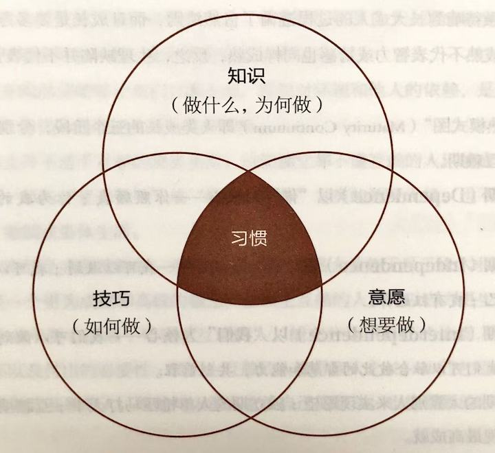
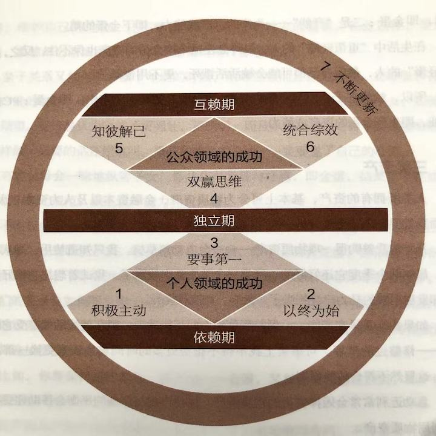

## 第二章 七个习惯概论

习惯对我们的生活有极大的影响，因为它是一贯的，在不知不觉中，经年累月影响着我们的品德，暴露出我们的本性，左右着我们的成败。

---

> 人的行为总是一再重复。因此卓越不是一时的行为，而是习惯。——亚里士多德（Aristotle）| 古希腊哲学家、文艺理论家

品德实质上是习惯的合成。俗语说：“思想决定行动，行动决定习惯，习惯决定品德，品德决定命运。”习惯对我们的生活有极大的影响，因为它是一贯的，在不知不觉中，经年累月影响着我们的品德，暴露出我们的本性，左右着我们的成败。

著名教育家霍勒斯·曼（Horace Mann）曾说：“习惯就仿佛一条缆绳，我们每天为它添上一股新索，很快它就会变得牢不可破。”这后半句我不敢苟同，我认为习惯是可以打破的，而且不能一蹴而就，需要坚持不懈的努力。

阿波罗 11 号的月球之旅，让我们亲眼目睹了人类第一次在月球上行走的奇观，令人叹为观止。但前提是宇宙飞船必须先摆脱强大的地球引力，为此在刚刚发射的几分钟，即刚升空时的几公里消耗的能量比之后几天几十万公里旅程消耗的能量还要多。

习惯也一样有极大的引力，只是许多人不加注意或不肯承认罢了。要根除做事拖沓，缺乏耐心，吹毛求疵或自私自利这些根深蒂固的不良习性，仅有一点点毅力，只做一点点改变是不够的。“起飞”需要极大的努力，然而一旦脱离了引力的束缚，就会迎来广阔的自由天地，创造出高效能生活所必需的凝聚力和秩序。

作为自然界的力量，万有引力不受控制，既会帮助人们也会阻碍人们。所以习惯的引力也许正在把你引向相反的方向。但正是引力，保持了地球的稳定，确保行星在轨道上运转，维护宇宙的秩序。万有引力确实强大，若是我们善加利用，可以利用习惯的“万有引力”让生活更有条理和秩序，这也是提高效率的必备条件。

### “习惯”的定义

本书将习惯定义为“知识”、“技巧”与“意愿”相互交织的结果。

知识是理论范畴，指点“做什么”及“为何做”；技巧告诉我们“如何做”；意愿促使“想要做”。要养成一种习惯，三者缺一不可。（见图 2-1）

| 图 2-1 高效能的习惯（内在原则及行为方式）                |
|----------------------------------------|
|  |

假设我与同事、配偶或儿女关系冷淡，原因是我只顾倾诉，不愿聆听，那么除非我找到人际交往的正确原则，否则可能根本就不“知道”我必须聆听。

即使知道需要聆听，也可能不知道“如何”聆听，不懂得深入聆听他人的技巧。

但是仅仅知道需要聆听和如何聆听也是不够的，我还要愿意聆听，才可能形成习惯。习惯的培养需要三方面的努力。

为人和观念的改变是螺旋式向上的过程——为人改变观念，观念反过来改变为人，如此反复循环，螺旋式向上成长。通过在知识、技巧和意愿三方面的努力，我们可以突破多年思维方式的伪保护，使个人和人际关系效能都更上一层楼。

改变习惯是一个痛苦的过程，因为有了更高的目标才能激发改变，面向未来牺牲当下的意愿才能促进改变。但是这又是幸福的源泉，是生活的目标和规划。从这个角度而言，幸福就是我们经过一番努力与牺牲得到的果实。

### 成熟模式图

七个习惯并非零落、分散的心理法则。它们符合成长规律，提供了开发个人和人际效能的渐进、连续和高度整合的方法，让我们依次经历“成熟模式”——由依赖到独立，再到互赖，不断进步。

幼年时我们完全依赖他人，需要他人的指引、养育和供给，否则最多存活几个小时或者几天。经年累月后，我们渐渐在身体、智力、情感和经济方面变得独立，直到有一天终于能够很好地照顾自己，能够自我管理和自力更生。

在不断成长与成熟的过程中，我们逐渐认识到自然界的互赖关系，生态学不但支配着自然界，也支配着人类社会。我们还会发现，人性的较高层次必须通过人际关系体现，人生也是互赖的。

从嗷嗷待哺到长大成人的过程遵循了自然法则，而且成长是要多方面衡量的。生理发育成熟不代表智力或情感也同样成熟，反之，生理缺陷并不代表智力或情感发育不足。

“成熟模式图”（Maturity Continuum）即人类成长的三个阶段，分别为依赖期、独立期、互赖期。

**依赖期（Dependence）以“你”为核心**——你照顾我；你为我的得失成败负责。

**独立期（Independence）以“我”为核心**——我可以做到；我可以负责；我可以靠自己；我有选择权。

**互赖期（InterDependence）以“我们”为核心**——我们可以做到；我们可以合作；我们可以融合彼此的智慧和能力，共创前程。

依赖期的人靠别人来实现愿望；独立期的人单枪匹马打天下；互赖期的人，群策群力实现最高成就。

生理上无法独立（残障）的人需要别人帮助；情感上不能独立的人，其价值和安全感都来自他人的看法，一旦无法取悦别人便会极度沮丧；智力上无法独立的人需要他人帮忙思考和解决生活中的大小问题。

相反地，生理上独立的人可以自食其力；智力上独立的人可以有自己的思想，兼具想象、思考、创造、分析、组织与表达的能力；情感上独立的人信心十足，能自我管理，不因他人好恶而影响自我价值评价。

显而易见，独立远比依赖要成熟，可谓人生的重大成就，但却不是最高成就。不过当前社会总是大力推崇人的独立性，许多个人和组织也堂而皇之地以此为目标。大多数励志类书刊都过分强调独立，仿佛人际沟通和团队精神并不重要。其实这多半是对依赖的矫枉过正，是为了避免被他人控制、摆布和利用。

至于互赖的概念则经常被人与依赖混为一谈，无怪乎我们总是见到有人明明是为了自私的理由抛弃妻子，却都假借独立的名义，逃避社会责任。

那些宣称要“摆脱桎梏”、“追求解放”、“坚持自我”、“我行我素”的人反而因此暴露了依赖心理——任由他人伤害自己的情感，或是把超出自己控制范围的人和事看作自己遭遇的罪魁祸首。这种心理是内在而非外在的，因此很难摆脱。

当然，我们所处的环境的确需要改进，但依赖问题源自个人的成熟度，与环境无关。即使身处较好的环境，也可能是扶不起的阿斗。

真正独立的品德能够让我们行事主动，摆脱对环境和他人的依赖，是值得追求的自由目标，但仍非高效能生活的终极目标。

只重独立并不适于互赖的现实生活。只知独立却不懂互赖的人只能成为独个的“生产标兵”，却与“优秀领导”或“最佳合作者”之类的称呼无缘，也不会拥有美满的家庭、婚姻或集体生活。

人生本来就是高度互赖的，想要单枪匹马实现最大效能无异于缘木求鱼。

互赖是一个更为成熟和高级的概念。生理上互赖的人，可以自力更生，但也明白合作会比单干更有成效；情感上互赖的人，能充分认识自己的价值，但也知道爱心、关怀以及付出的必要性；智力上互赖的人懂得取人之长，补己之短。

一个能做到互赖的人，既能与人深入交流自己的想法，也能看到他人的智慧和潜力。

但只有独立的人才能选择互赖，尚未摆脱依赖性的人则无此条件，因为他们无论在品德还是在自我把握方面都尚有欠缺。

因此，以下几章先讲述七个习惯中的前三个，着重于如何自我约束，由依赖进步到独立。这些习惯属于“个人领域的成功”范畴，是培养品德的基础，而后才能是“公众领域的成功”，就如同耕种与收获的次序无法颠倒一样，必须是由内而外依次实现。

真正独立之后，你就具备了有效互赖的基础，就可以开始致力于更为性格导向的“公众领域的成功”，即习惯四、五、六所讲授的团结、合作与沟通。

这并不意味着你必须要等完全掌握前三个习惯之后，才能开始后面的练习。如此安排顺序是为了让你进步得更快，我不建议你用几年的时间一门心思地修习前三个习惯，直到满意为止。

作为互赖世界的一部分，你每天都要与周遭打交道，只不过各种突发的问题经常掩盖了真正的症结所在。了解自己在互赖关系中的作用有助于你遵循自然法则，合理安排实践步骤。

第七个习惯涵盖了其它六个习惯，谈的是自我更新——在人生的四个层面上实现平衡而有规律的更新。它是不断改进、螺旋向上的成长过程，帮助我们将自我提升到一个新的水平，在此水平上我们将会更好地理解和实践其他几个习惯。

图 2-2 标示了七个习惯与三个成长阶段的关系，以下各章我们仍将沿用这个图示来讲授七个习惯的前后关联和相互之间的协作增效，比如它们如何增进彼此的价值，并借此衍生出新的形式。每个概念或习惯都会在后文中予以强调。

| 图 2-2 成熟模式图                 |
|-----------------------------|
|  |

### “效能”的定义

本书介绍的七个习惯都能产生高效能，因为它们基于原则，效果持久，是品德的基础，能帮助你更有效地解决问题、把握机会并通过不断学习和结合其它原则以实现螺旋向上的成长。

此外，它们以符合自然法则的思维方式为基础，我把这个自然法则称为“产出/产能平衡”（P/PC Balance）的原则。伊索寓言中有一则鹅生金蛋的故事，足以说明这个常遭违背的原则。

一个穷困的农夫，有一天在他的鹅圈里发现一个闪闪发光的金蛋。开始他以为这是个恶作剧，正准备把金蛋扔掉的时候，他转念一想决定拿去验证一下。

结果鹅蛋竟然是纯金的！农民简直不敢相信自己会有这样的好运。第二天他越发怀疑，跑到鹅圈一看，还是和昨天一样。此后他每天早上一睁眼，就去鹅圈拿金蛋。不就它就成了富翁，一切都那么不可思议。

可是财富却使他变得贪婪又急躁，已无法满足于每天一个金蛋，于是他异想天开地把鹅宰杀，想将鹅肚子里的金蛋全部取出。谁知打开一看，鹅肚子里并没有金蛋。鹅死了，再也无法得到金蛋。而毁掉这一切的，正是他自己。

这则寓言中蕴含了一个自然法则，即效能的基本定义。许多人都用金蛋模式来看待效能，即产出越多，效能越高。而真正的效能应该包含两个要素：一是“产出”，即金蛋；二是“产能”——生产的资产或能力，即下金蛋的鹅。

在生活中“重蛋轻鹅”的人，最终会连这个产金蛋的资产也保不住。反之，“重鹅轻蛋”的人，最后自己都可能会被活活饿死，更不用说鹅了。

所以，效能在于产出与产能的平衡。P 代表希望获得的产出，即金蛋；PC 代表产能，即生产金蛋的资产或能力。

### 三类资产

人类所拥有的资产，基本上可分为物质资产、金融资本以及人力资本三大类，下面我们要一个一个地分析。

几年前我曾购得一项物质资产——一台电动割草机。我只知道使用，却从不保养。最初两个季度它还好好的，到第三个季度就出故障了。我试着想把它修好，结果却发现引擎的马力已经损失了一大半，和废铁无异。

如果我能及早在产能——保养割草机方面花些功夫，现在就能继续享受它的产出——修整过的草坪。可事实上我不得不花费更多的时间和金钱来更换一部新机器，这显然不符合效能原则。

急功近利常常会毁掉宝贵的物质资产。保持产出与产能的平衡会帮助你更有效地利用物质资产。

金融资本的有效利用也是一样。有多少人本息不分，或者为了改善生活水平（获得更多的金蛋）而动用本金？本金与利息就相当于产能与产出，本金减少，产生利息的产能就减少，收入当然也会减少，财产缩水，最后连起码得生活水平都无法维持。

我们最宝贵的金融资本就是赚钱的能力。如果不能持续投资以增进自己的产能，眼光就会受到局限，只能在现有的职位上踏步，每天忙忙碌碌，就怕老板对自己的印象不佳，既在经济上受制于人，又担心职位不保。这同样称不上效能。

对人力资本而言，产出与产能之间的平衡更为重要，因为正是人控制着物质资产与金融资本。

假设夫妻双方都只想着拿到金蛋，享受权益，却不注意维护感情的纽带，即权益的来源，生活中毫无热情、体贴可言，全然不知哪怕一点点的关切和照顾也会对维系深厚感情产生重要作用；两个人一味地玩弄手段，操控对方，只顾满足自己的需要，维护自己的地位，还不断地列举证据证明对方的错误。长此以往，爱情、热情、柔情都会渐渐消退——会下金蛋的鹅日益虚弱。

亲子关系又如何呢？孩子年幼的时候，依赖性强而且极为脆弱，父母很容易忽略对产能的培养，比如教育、沟通和聆听，只知道利用地位优势来操控子女，实现自己的期望。父母总认为比孩子更强壮，更聪明，而且永远正确，有时干脆直接吩咐他们怎样做，必要的话还用吼叫、恐吓和威胁的方法，一定要遂了自己的心愿。

有的父母会一味地纵容子女，借此获得爱戴与好感，即金蛋，结果孩子在成长的过程中毫无规范，缺乏自律能力和责任感。

不论权威式还是放纵式的管教，都属于偏重金蛋的心态，或想让子女依自己的规划行事，或想取悦子女，唯独忽略了那只鹅，即子女的责任感、自律能力和自信心，而这些在若干年后对他们面临重大抉择和实现重要目标有非同寻常的意义。而且你们的关系会如何呢？到子女长到十几岁，他能否感到你愿意不妄加评判地聆听，真心地尊重和关怀他，值得他信赖呢？你们的关系是否好到足以让你顺利与他亲近、沟通并施加积极影响呢？

比如，你想保持房间整洁，即产出——金蛋，又想让女儿整理房间，即产能，女儿就是那只能产出金蛋的资产鹅。

在产出与产能平衡的情况下，女儿会心甘情愿地整理房间，不需要旁人催促。她是一项可贵的资产，一只会生金蛋的鹅。

但是如果你只关注房间整洁这个产出，总是用唠叨、威胁、吼叫等方法得到金蛋，那就等于牺牲了鹅的健康与幸福。

分享一下我与一个女儿有关感情产能的经历。

我很享受定期和每个孩子有一次单独的“私人约会”，我发现对这次约会的期待和最终达成一样令人心满意足。那时我和女儿正打算来这么一次。

我凑到女儿身边问她：“宝贝，今晚咱俩一起玩。你想做什么？”

“爸爸，干嘛都行。”女儿回答。

“别呀，说真的，你愿意做什么？”我追问。

“好吧，”她终于说，“我乐意做的你肯定不想做。”

“亲爱的，我什么都愿意。不管你选什么，我都做。”

“我想看《星球大战》，”她说，“但是我知道你不喜欢这电影，上次看的时候你从头到尾都在睡觉。你不喜欢科幻电影，我知道的，爸爸。”

“好孩子，只要是你想做的我都愿意陪你。”

“爸爸，没关系，我们用不着总这样出去玩。”她停顿了一下又说，“但是你知道你为什么不喜欢《星球大战》吗，因为你不了解训练绝地武士的智慧。”

“什么意思？”

“你了解你教的东西，是吧爸爸？其实和训练绝地武士的内容是一样的。”

“真的？那咱俩一起去看看吧。”

我们一起去看了电影，女儿坐在我旁边不时地讲解，我成了她的学生，向她学习。简直太美妙了。当我开始用一种新的视角看待绝地武士接受的训练时，我发现其中的哲学确实适用于很多场合。

这种效果并不是计划好的“产出经验”能实现的，而是一次“产能投入”后的意外收获。化解差异，加强了我们之间的纽带和维系，结果令人满意。我们收获金蛋，因为喂饱了亲子关系这只鹅。

### 团体的产能

一切正确原则的可贵之处就在于它们的有效性和适用性。本书提到的原则不仅适用于个人，也适用于包括家庭在内的团体。

如果一个团体的成员在利用物质资产时，不遵守产出与产能平衡的原则，便会降低整个团体的效能，最终导致鹅的死亡。

举例来说，某人负责管理一部机器，公司正值扩张阶段，升迁机会多多，他急于讨好领导，于是让机器日夜不停地急速运转，却从不维修保养，结果产量大幅提高，成本下降，利润激增。很快他就获得了晋升，得到了金蛋。

但是接替他职位的那个人得到的却是一只生病的鹅，它需要更多休息和保养。结果成本飞涨，利润锐减，这些损失自然会算到接替者的头上，而不是那个破坏了资产的前任，因为会计账簿上只会列出产量、成本与利润。

产出与产能平衡的原则对于一个团体运作人力资本——顾客与员工来说更为重要。

有一家以蛤蜊浓汤叫座的餐厅，每天午餐时间都门庭若市。后来餐厅转手，唯利是图的新老板开始在浓汤中掺水，第一个月的确大发横财，因为成本降低，顾客却没少。但是渐渐地顾客不再上当，失去了顾客信任的餐厅终于门可罗雀。此时老板使尽浑身解数，妄图收复失地，只可惜他已经失去了宝贵的资产——顾客的信任，会生金蛋的鹅已不复存在。

有些公司一方面大谈顾客至上，另一方面却完全忽略为顾客提供服务的员工。产出与产能平衡的原则告诉我们：你希望员工怎样对待顾客，就要怎样对待员工。

你可以买到员工的时间，却买不到他的心，而心才是忠诚与热忱的根源；你可以买到员工的体能，却买不到他的头脑，而头脑才是创造力与智慧的源泉。

产能要求像对待顾客一样对待员工，他们值得被视为珍宝，因为员工会贡献自己的精化——心和头脑。

在一次集体活动中有人问我：“怎样对付那些懒散、不称职的员工？”一位仁兄回答：“投几颗手榴弹！”有几个人颇附和这种霸权式的主张——“不好好干就走人。”

接着又有一个人问：“谁来收拾残局呢？”

“不会有残局。”

“那你怎么不这样对待顾客呢？‘不想买就滚蛋！’”

“那怎么行呢？”

“那这样对待员工就行吗？”

“因为他们是我雇来的。”

“原来如此。请问你的员工是否忠心耿耿？是否勤奋工作？人员流动率如何？”

“开什么玩笑？现在根本找不到得力助手，人人都想请假、兼职、跳槽，对公司毫不在乎。”

像这种只重金蛋的态度和思维方式，实在难以激发员工的热情和潜能。短期的盈利底线固然重要，但却不应凌驾于一切之上。

效能在于平衡。一味重视产出会导致糟糕的健康状况、耗损的机器设备、透支的银行存款或破裂的人际关系。而太过维护产能，就如同一个每天长跑三四个小时的人，宣称可以因此多活十年，却不知大好时光都在跑步中流逝。又好像那些只知念书，不肯生产的人，坐享别人的金蛋，自己永远不敢面对现实。

唯有在金蛋（产出）与鹅的健康和幸福（产能）之间取得平衡，才能实现真正的效能。虽然你常会因此面临两难选择，但这正是效能原则的精髓所在。它是短期利益与长期目标之间的平衡，是好分数与刻苦努力之间的平衡，是清洁的房间与良好的亲子关系之间的平衡。

日常生活中，你是否曾为了多收获几枚金蛋而废寝忘食地工作，结果弄得精疲力尽，无法继续工作？其实若能好好睡一觉，那么第二天就会精力充沛，完成更多的工作，更好地迎接这一天的挑战。

再比如，你强迫别人按你的意志行事，结果却发现你们的关系变得空洞无物；反过来，如果你能用时用心经营人际关系，就能赢得信任与合作，通过开诚布公地交流获得实质性的进展。

产出与产能平衡的原则是效能的精髓，放之四海而皆准。不管你是否遵从，它都会存在。它是指引人生的灯塔，是效能的定义和模式，是本书中七个习惯的基础。

### 如何使用本书

在正式讨论高效能人士的七个习惯之前，我想建议读者先树立两个新观念，有助于你在阅读本书时收获更多。

首先，我建议各位不要对本书浅尝辄止，大略读过便束之高阁。

当然，你不妨从头到尾浏览一遍，以了解全书梗概。不过我希望你在自我成长的过程中，能时时与本书相伴。内容编排方面，本书分成了几个循序渐进的章节，并在每个习惯的末尾都附上付诸行动，方便读者在实践时随时查阅，这样可以帮助你知行结合地对某一习惯进行系统学习。

当你有了更深的理解，能够更好地运用书中原则时，还是可以不时地翻阅，在实践中不断拓展知识、技巧和想法。

其次，我建议你改以老师的角色来阅读，除了吸收还要能复述。在阅读的过程中，应做好准备：在 48 小时之内与别人分享或讨论阅读心得。

举个例子，如果你知道将在 48 小时内，向别人讲解本书提到的产出/产能平衡原则（P/PC Balance Principle），你的阅读效果会不会有所不同？读的时候要想象将你此刻记忆最深刻的内容，讲给你的配偶、孩子、事业伙伴或者新老朋友听，注意此时你的精神和情绪上产生的变化。

我保证，采用这种方式阅读接下来的章节，可以增强记忆、加深体会、扩大视野，而且会使你有更强烈的动机去运用书中的原则。

同时，开诚布公地与人分享读书心得，你会惊讶地发现，人们以往对你的消极看法和贴在你身上的标签都会消失不见。听你分享心得的人会看到你的变化和成长，他们更加乐意帮助和支持你工作，也许还能一起帮你培养七个习惯。

### 你将收获什么

我要借用美国作家弗格森（Marilyn Ferguson）的一段话：

谁也无法说服他人改变，因为我们每个人都守着一扇只能从内开启的改变之门，不论动之以情或晓之以理，我们都不能替别人开门。

倘若你已决定打开“改变之门”，接纳本书所阐述的观点，那么我保证，你会得到以下的收获。首先你的成长过程虽是渐进的，效果却是革命性的。你将会认同，仅产出/产能平衡这一项原则，如果得到充分应用，就会使大多数个人和企业发生变化。前三个有关个人成功的习惯，可以大幅提高你的自信心。你将更能认清自己的本质、内心深处的价值观以及个人独特的才干与能耐。秉持自己的信念而活，就能产生自尊自重与自制力，并且内心平和。你会以内在的价值标准，而不是旁人的好恶或与别人比较的结果，来衡量自己。这时候，事情对错与别人是否发现无关。

你还会意外地发现，当你不再介意别人怎样看你时，反而会去关心别人对他们自身、他们所处环境以及与你关系的看法。你不再让别人影响情绪，反而更能接受改变，因为你发现支撑现实的内在规律是恒久不变的。

当你接受“公众成功”中的三个习惯时，修复和重建破裂的人际关系的意愿和能量将被激发。关系会更上一层楼，变得更加深厚、坚固，历久弥新且经得起考验。

习惯七可加强前面六个习惯，时时为你充电，达到真正的独立与成功的互赖。

不论你的现状如何，都请相信你与你的习惯是两码事，你有能力改变不良旧习，沐浴在新习惯的阳光里，过上高效、幸福和互信的新生活。

我真心地希望你能打开自己的“改变之门”，在学习这些习惯的过程中不断成长和进步。对自己的改变要有耐心，因为自我成长是神圣的，同时也是脆弱的，是人生中最大的投资。虽然这需要长时间下功夫，但是必定会有鼓舞人心的可喜成效。诚如美国建国初期政治思想家托马斯·佩因（Thomas Paine）所说：

得之太易者必不受珍惜。唯有付出代价，万物始有价值。上苍深知如何为其产品制订合理的价格。

### 七个习惯的简要定义

**习惯一：积极主动（BE PROACTIVE）**

积极主动即采取主动，为自己过去、现在及未来的行为负责，并依据原则及价值观，而非情绪或外在环境来下决定。积极主动的人是改变的催生者，他们摒弃被动的受害者角色，不怨天尤人，发挥了人类四项独特的禀赋——自我意识、良知、想象力和独立意志，同时以由内而外的方式来创造改变，积极面对一切。他们选择创造自己的人生，这也是每个人最基本的决定。

**习惯二：以终为始（BEGIN WITH THE END IN MIND）**

所有事物都经过两次的创造——先是在脑海里酝酿，其次才是实质的创造。个人、家庭、团队和组织在做任何计划时，均先拟出愿景和目标，并据此塑造未来，全心投入自己最重视的原则、价值观、关系及目标。对个人、家庭或组织而言，使命宣言可以说是愿景的最高形式，它是根本的决策，主宰了所有其它决定。领导工作的核心，就是基于共有的使命、愿景和价值观，创造出一个文化。

**习惯三：要事第一（PUT FIRST THINGS FIRST）**

要事第一即实质的创造，是梦想（你的目标、愿景、价值观及要事处理顺序）的组织与实践。次要的事不必摆在第一，要事也不能放在第二。无论迫切性如何，个人与组织均要更多聚焦要事，重点是，把要事放在第一位。

**习惯四：双赢思维（THINK WIN-WIN）**

双赢思维是一种基于互敬、寻求互惠的思考框架与心意，目的是分享更多的机会、财富及资源，而非敌对式竞争。双赢既非损人利己（赢输），亦非损己利人（输赢）。我们的工作伙伴及家庭成员要从互赖式的角度来思考（“我们”，而非“我”）。双赢思维鼓励我们解决问题，并协助个人找到互惠的解决办法，是一种资讯、力量、认可及报酬的分享。

**习惯五：知彼解己（SEEK FIRST TO UNDERSTAND, THEN TO BE UNDERSTOOD）**

当我们不再急切回答，改以诚心去了解、聆听别人，便能开启真正的沟通，增进彼此关系。对方获得理解后，会觉得受到尊重与认可，进而卸下心理防备，坦然交谈，双方对彼此的了解也就更顺畅自然。知彼需要仁慈心，解己需要勇气，能平衡两者，则可大幅提升沟通的效率。

**习惯六：统合综效（SYNERGIZE）**

统合综效谈的是创造第三种选择，即非按照我的方式，亦非遵循你的方式，而是创造第三种更好的办法。它是互相尊重的成果——不但了解了彼此，甚至还称赞彼此的差异，欣赏对方解决问题及把握机会的手法。个人的力量是团队和家庭统合综效的基础，能使整体获得一加一大于二的成效。实践统合综效的人际关系和团队会扬弃敌对的态度（1+1=1/2），不以妥协为目标（1+1=3/2），也不仅仅止于合作（1+1=2），他们要的是创造式的合作（1+1>2）。

**习惯七：不断更新（SHARPEN THE SAW）**

“不断更新”谈的是，如何在四个生活基本面（身体、精神、智力、社会/情感）中，不断更新自己。这个习惯提升了其它六个习惯的实施效率。对组织而言，习惯七提供了愿景、更新及不断地改善，使组织不至呈现老化及疲态，并迈向新的成长之路。对家庭而言，习惯七通过固定的个人及家庭活动，使家庭效能升级，就像建立传统，使家庭日新月异，即是一例。