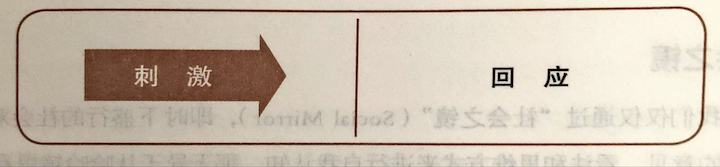
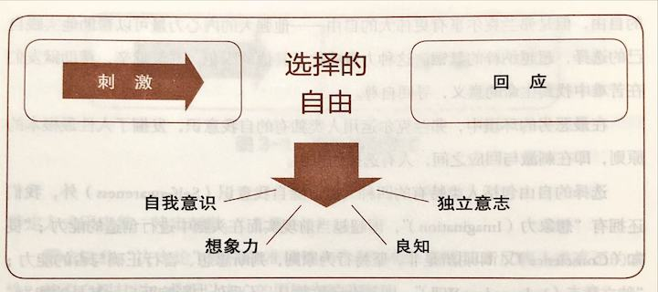
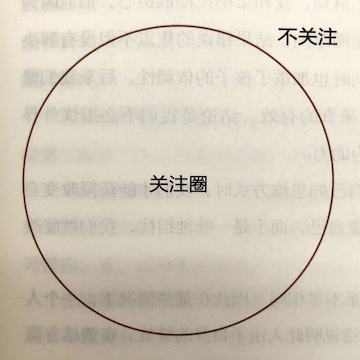
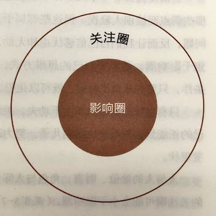
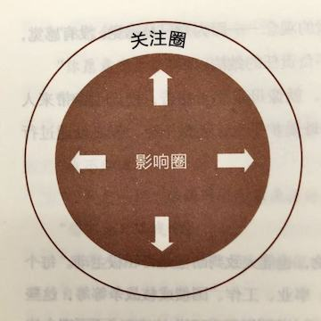
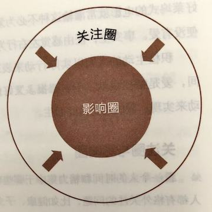
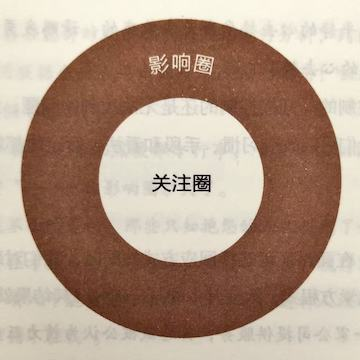

## 第三章 习惯一：积极主动——个人愿景的原则

人性的本质是主动而非被动的，人类不仅能针对特定环境选择回应方式，更能主动创造有利的环境。

采取主动不等于胆大妄为、惹是生非或滋事挑衅，而是要让人们充分认识到自己有责任创造条件。

---

> 最令人鼓舞的事实，莫过于人类确实能主动努力以提升生命价值。——亨利·戴维·梭罗（Henry David Thoreau）| 美国文学家及哲学家

下面请试着跳出自我的框框，把意识转移到屋子的某个角落，然后用心客观地审视自己，你能站在旁观者的角度观察自己吗？

再想一想，你现在的精神状态如何？你能认清心态吗？你准备怎样描述？

再花一分钟想想，你的头脑是怎样工作的，它反应灵敏吗？是不是正在为这个心理实验的目的感到困惑而且想理清头绪？

以上都是人类特有的精神活动，而动物则缺乏这种自我意识（Self-awareness）的能力，即思考自己的思维过程的能力。正因为如此，人类才能成为万物之灵，一代又一代在不断演化中实现进步。

这也是为什么我们能从自己和他人的经验中吸取教训，培养和改善习性。

我们不是自己的感觉、情绪甚至思想。正是因为我们可以思考，才能有别于事物和动物。凭借自我意识，我们可以客观地检讨我们是如何“看待”自己的——也就是我们的“自我思维”（Self-paradigm）。所有正确有益的观念都必须以这种“自我思维”为基础，它影响我们的行为态度以及如何看待别人，可以说是一张属于个人的人性地图。

事实上，我们如果不能客观地考虑看待自己的方式，也就不能理解他人感知他们自己和世界的方式。因此我们无意间就会把个人意愿强加在别人身上，内心却还觉得已经很客观了。

这将极大地限制个人的潜力和与别人交往的能力。幸好人类有自我意识，能够检讨自己的自我思维是基于现实和原则，还是受到社会的制约与环境的影响。

### 社会之镜

如果我们仅仅通过“社会之镜”（Social Mirror），即时下盛行的社会观点以及周围人群的意见、看法和思维方式来进行自我认知，那无异于从哈哈镜里看自己。

“你从不守时。”

“你怎么总是把东西弄乱？”

“你肯定是个艺术家！”

“你真能吃！”

“我不相信你会取胜！”

“这么简单的事你都弄不懂吗？”

然而，这些零星的评语不一定代表真正的你，与其说是影像，不如说是投影，反映的是说话者自身的想法或性格弱点。

时下盛行的社会观点认为，环境与条件对我们起着决定性的作用。我们不否认条件作用的影响巨大，但并不等于承认它凌驾于一切之上，甚至可以决定我们的命运。

实际上根据这种流行看法而绘制的社会地图一共可以分为三种，也可以说是已经被广泛接受的用来解释人性的三种“决定论”，有时单独使用，有时一起使用：

- 基因决定论（Generic Determinism）：认为人的本性是祖先遗传下来的。比如一个人的脾气不好，那是因为他先祖的 DNA 中就有坏脾气的因素，又借着基因被传承下来。
- 心理决定论（Psychic Determinism）：强调一个人的本性是由父母的言行决定的。比如你总是不敢在人前出头，每次犯错都内疚不已，那是与父母的教育方式和你的童年经历分不开的，因为你忘不了自己尚且稚嫩、柔弱和依赖他人时受到的心理创伤，忘不了小时候因为表现欠佳而遭遇的惩罚、排斥和与人比较的感受。
- 环境决定论（Environment Determinism）：主张环境决定人的本性。周遭的人与事，例如老板、配偶、叛逆期子女，或者经济状况乃至国家政策，都可能是影响因素。

这三种地图都以“刺激——回应”理论为基础，很容易让人联想到俄国生理学家巴甫洛夫所做的关于狗的实验。其基本观点就是认为我们会受条件左右，以某一特定方式回应某一特定刺激。（见图 3-1）

| 图 3-1 消极被动模式                |
|-----------------------------|
|  |

那么这些“决定论”地图的准确性和作用如何？能否清晰反映人类真正的本性？能否自圆其说？是否以内心的原则为基础呢？

### 刺激和回应之间选择的自由

出生于奥地利，20 世纪美国神经与精神病学教授维克多·弗兰克尔的感人事迹可以帮助我们回答上述疑问。

弗兰克尔是一位深受弗洛伊德心理学影响的决定论者。该学派认为一个人的幼年经历会造就他的品德和性格，进而决定他的一生。

身为犹太人，弗兰克尔曾在“二战”期间被关进纳粹德国的死亡集中营，其父母、妻子与兄弟都死于纳粹魔掌，只剩下一个妹妹。他本人也饱受凌辱，历尽酷刑，过着朝不保夕的生活。

有一天，他赤身独处于狭小的囚室，忽然有一种全新的感受，后来他称之为“人类终极的自由”。虽然纳粹能控制他的生存环境，摧残他的肉体，但他的自我意识却是独立的，能够超脱肉体的束缚，以旁观者的身份审视自己的遭遇。他可以决定外界刺激对自己的影响程度，或者说，在遭遇（刺激）与对遭遇的回应之间，他有选择回应方式的自由或能力。

这期间他设想了各式各样的状况，比如想象他从死亡营获释后，站在讲台上给学生讲授自己从这段痛苦遭遇中学得的宝贵教训，告诉他们如何用心灵的眼睛看待自己的经历。

凭着想象与记忆，他不断修行心灵、头脑和道德的自律能力，将内心的自由种子培育得日益成熟，直到超脱纳粹的禁锢。对于物质环境，纳粹享有决定权和一定的自由，但是弗兰克尔享有更伟大的自由——他强大的内心力量可以帮助他实践自己的选择，超越纳粹的禁锢。这种力量感化了其他的囚犯，甚至狱卒，帮助狱友们在苦难中找到生命的意义，寻回自尊。

在最恶劣的环境中，弗兰克尔运用人类独有的自我意识，发掘了人性最根本的原则，即在刺激与回应之间，人有选择的自由。

选择的自由包括人类特有的四种天赋。除自我意识（Self-awareness）外，我们还拥有“想象力（Imagination）”，即超越当前现实而在头脑中进行创造的能力；“良知（Conscience）”，即明辨是非，坚持行为原则，判断思想、言行正确与否的能力；“独立意志（Independent Will）”，即基于自我意识、不受外力影响而自行其是的能力。

但是由于人类特殊的天赋，用计算机程序打个比方，人类可以自创程序，完全不受本能和平日训练的制约，因此动物的能力有限，人类却永无止境。但是如果人类也活得像动物一样，听命于本能和后天环境，凭借着集体意识行动，最终也会受到限制。

环境决定论的主要来源是对动物的研究，比如老鼠、猴子、鸽子和狗，以及精神错乱的人。这种实验因为可以掌控和预测，某种程度上满足了一些调查的标准。但是人类的历史和自我意识却告诉我们：这种人性地图根本就没有如实反映原貌！

人类独特的能力将我们与动物完全区分。对这些能力加以开发和锻炼，将会在不同程度上实现我们独具的人类潜能。在刺激与回应之间自由选择就是我们最大的能力。

### “积极主动”的定义

弗兰克尔在狱中发现了人性的这个基本原则，并用其绘成了一幅精准无误的地图（见图 3-2），由此发展出高效能人士在任何环境中都应具备的、首要的，也是最基本的习惯——“积极主动（Be Proactive）”。

| 图 3-2 积极主动模式                |
|-----------------------------|
|  |

积极主动不仅指行事的态度，还意味着人一定要对自己的人生负责。个人行为取决于自身的抉择，而不是外在的环境，人类应该有营造有利的外在环境的积极性和责任感。

责任感（Responsible），从构词法来说是能够回应（Response-able）的意思，即选择回应的能力。所有积极主动的人都深谙其道，因此不会把自己的行为归咎于环境、外界条件或他人的影响。他们根据价值观，有意识地选择待人接物的方式，不会因为外界因素或一时情绪而冲动行事。

积极主动是人类的天性，即使生活受到了外界条件的制约，那也是因为我们有意或无意地选择了被外界条件控制，这种选择称为消极被动（Reactive）这样的人很容易被天气状况所影响，比如风和日丽的时候就兴高采烈，阴云密布的时候就无精打采。而积极主动的人则心中自有一片天地，无论天气是阴雨绵绵还是晴空万里，都不会对他们产生影响，只有自己的价值观才是关键因素。如果认定了工作第一，那么即使天气再坏，敬业精神依旧不改。

消极被动的人还会受到“社会天气”的影响。别人以礼相待，他们就笑脸相迎，反之则摆出一副自卫的姿态。心情好坏全都取决于他人的言行，任由别人的弱点控制自己。

积极主动的人理智胜于冲动，他们能够慎重思考，选定价值观并将其作为自己行为的内在动力；而消极被动的人则截然相反，他们感情用事，易受环境或条件作用的驱使。

但这并不意味着积极主动的人对外界刺激毫无感应，只不过他们会有意无意地根据自己的价值观来选择对外界物质、心理与社会刺激的回应方式。

已故罗斯福总统夫人埃莉诺·罗斯福曾说：“除非你愿意，否则没人能伤害你。”圣雄甘地（Gandhi）也曾经说过类似的话：“除非拱手相让，否则没人能剥夺我们的自尊。”可见最刻骨铭心的伤害并非悲惨遭遇本身，而是我们竟然会放任这些伤害戳在我们心上。

在感情上，这个说法一时很难让人接受，惯于怨天尤人者尤其如此，但只有真正接受了“我昨日的选择决定了今日的我”的观念，才可能说“我有权另做选择”。

有一次，我做一个主题为“积极主动”的演讲。讲到一半时，一位女听众突然站起来大声喧哗，引起不少人侧目。她自觉不好意思，才勉强坐回座位。可是依旧按捺不住，又向周围的人大发议论，神情相当愉快。我不禁想一探究竟，于是问她是否愿意与大家分享心得，这让她有了一吐为快的机会：

“你们绝对想象不到我的经历！我是一个护士，曾经看护过一个算得上世界上最挑剔、最难伺候的病人。我做什么他都觉得不够好，不但从来没有一句感谢地话，而且还处处找茬，与我作对，结果我每天都过得十分痛苦，然后又不由自主地把痛苦发泄在家人身上。其他护士也有同感，我们简直就希望他早点死掉。”

“可是刚才你却在台上大谈积极主动，说什么除非我自愿，否则没有什么事可以伤害到我，我的痛苦都是我自找的！这实在让我接受不了。”

“可是后来我又反复思考了这番话，从内心深处问自己：我真有能力选择自己的回应方式吗？”

“结果居然发现我的确有这个能力。当我囫囵吞枣般咽下这苦口良药，并承认是自己选择了痛苦之后，我渐渐认识到我的确可以选择不痛苦。”

“所以那一刻我站了起来，感觉自己像是个重生的犯人，有种向全世界狂呼的欲望：‘我自由了！我摆脱了牢笼！不再受制于别人对待我的方式。’”

因此，伤害我们的并非悲惨遭遇本身，而是我们对于悲惨遭遇的回应。尽管这些事的确会让人身心受创或者经济受损，但是品德和本性完全可以不受影响。事实上越痛苦的经历，越能磨炼意志，开发潜能，提升自如应对困境的能力，甚至还可能感召他人争取同样的自由。

前面提到的弗兰克尔就是一个在逆境中追求个人自由进而激励他人的很好的例子。此外，许多越南战俘的自传也形象地描述了这种终极自由的无穷力量，而这种自由的积极回应对战俘营文化和战俘们的影响延续至今。

我们也可能有幸认识这样一些人，他们身处困境——或罹患重病，或严重残障——却始终顽强拼搏，令人钦佩，发人深省。他们超越了痛苦和环境，让生命价值得以体现和升华，并对他人产生了震撼，以及长久而深远的影响。

我和妻子桑德拉最鼓舞人心的一次经历，历时四年，发生在我们的一位名叫卡萝的朋友身上，她患有癌症。卡萝是桑德拉的伴娘，她俩的友情已经超过 25 年。

卡萝癌症晚期的时候，桑德拉一直陪在她床边，帮她完成一部回忆录。当桑德拉看到卡萝面对那些耗时费力的任务表现出的勇气时，简直惊呆了。卡萝想在孩子人生的不同阶段都留下建议与警示，这种愿望令人钦佩。

卡萝尽量不使用止痛药，这样才能时刻保持清醒，控制情绪。卡萝对着录音机小声说话，或者直接让桑德拉写下来。卡萝积极主动，充满勇气，关爱身边每一个人，这种精神极大地激励了所有人。

我永远忘不了卡萝过世的前一天，我凝望着她的双眼，从她生命无限的价值中，我感受到了无法控制的痛苦。但是透过她的双眼，我看到了她一生的精彩与奉献，她贡献了自己的能量、关爱与感激。

多年来，我常常问人们，他们中有多少见证过一个垂死之人表现出来的高尚情操，以及在生命尽头表现的无以伦比的博爱之情。几乎每次，都有 1/4 的观众予以肯定。我接着问他们中有多少人永远不会忘记这些逝者，甚至因为他们被彻底转变，至少在那一瞬间，受到他们勇气的鼓舞，被深深打动，向往付出同情心和更高尚地服务他人。人们纷纷表示同意。

弗兰克尔曾指出人生有三种主要的价值观：一是经验价值观（Experiential Value），来自自身经历；二是创造价值观（Creative Value），源于个人独创；三是态度价值观（Attitudinal Value），即面临绝症等困境时的回应。这三种价值观中，境界最高的是态度价值观。我多年的经验证明，这种说法的确有道理。

逆境往往能激发思维转换，使人以全新的观点看待世界、自己与他人，审视生命的意义，进而思考应该如何回应，这种更宽广的视角反映的就是可以提升和激励所有人的态度价值观。

### 采取主动

人性的本质是主动的。人类不仅能针对特定环境选择回应方式，更能主动创造有利环境。但这不等于胆大妄为、惹是生非或滋事挑衅，而是要让人们充分认识到自己有责任创造条件。

我经常建议有意跳槽的人采取更多主动，不妨做几个关于兴趣和能力的测验，研究自己心仪行业的状况，甚至思考自己的求职单位正面临何种难题，然后以有效的表达方式，向对方证明自己能够协助他们解决问题。这就是“解决方案式的推销（自己）”（Solution Selling），是事业成功的重要诀窍之一。

前来咨询的人通常都不否认这种做法的确有助于求职或晋升，但是又常常以各种借口拒绝采取必要步骤来实践这种主动。

“我不知道该到哪儿去做关于兴趣和能力的测验。”

“如何知道某行业或者某公司面临的难题呢？谁能帮我？”

“我不知道该如何有效表达自己的想法。”

太多人只是坐等命运的安排活贵人相助，事实上，好工作都是靠自己争取来的。找到好工作的人往往积极主动解决问题，而不是坐享其成。他们只要有必要就会立即行动，并且一以贯之地遵照正确的原则，确保顺利完成工作。

在我家，任何人都别想推卸责任，让别人替他设法收拾残局。即使孩子年纪还小，我照样要求他们：“自己想办法。”而家人也已习惯这种作风。

要求责任感并非贬抑。主动是人的天性，虽然主动性有时处于沉睡状态，但只要经过唤醒就会重新焕发活力。通过尊重他人这种天性，至少可提供对方一面社会之镜，让他们在镜中清晰而又不失真地照出自我。

由于个人的成熟 度不同，对尚处于情绪依赖阶段的人，不必期望太高。但至少可以创造有利的气氛，逐渐培养他的责任感。

### 变被动为主动

积极主动与消极被动有天壤之别，尤其再加上聪明才智，差别就更大了。积极主动与消极被动之间的差别可不仅仅是提高 20%~50% 的效率，如果积极主动的人在智力、意识和敏感度方面技高一筹，那么差别就更大。

采取主动是实现人生产能与产出平衡的必要条件，对于培养七个习惯来说也不例外。本书的其余六个习惯，都以积极主动为根基，而每个习惯又都会激励你采取主动，但是如果你甘于被动，就会受制于人，面临截然不同的发展与机遇。

我曾经与一群家装行业的人共事。来自不同厂商的 20 多位代表聚在一起，他们可以尽情共享季度报表和面临的问题。

当时正值经济衰退，这个行业所受的打击更甚。因此会议一开始，各厂商的士气都很低落。

第一天的主题是该行业的现状，“到底发生了什么？引发问题的缘由是什么？”发生了太多事情，外部压力越来越大，失业率不断升高。大家表示，不得不裁掉熟识的员工以维持企业的生存。结果会后，每个人比之前更加灰心。

第二天讨论该行业的未来，“今后将会如何？”大家一起按照一种消极的假设，研究了行业发展趋势和左右其发展的因素。结束时，气氛更加沮丧，人人都认为事情会更加恶化。

到了第三天，大家决定换个角度，着重于积极主动的做法：“我们将如何应对？有何策略与计划？如何主动出击？”于是早上商讨加强管理与降低成本，下午则筹划如何开拓市场。以脑力激荡方式，找出若干切实可行的途径，再认真讨论。结果为期三天的会议结束时，人人都士气高昂，信心十足。

这次会议的结论是：

1. 本行业现状并不好，可以预测短期内还会更加恶化。
2. 但我们可以采取正确的对策，改进管理，降低成本，提高市场占有率。
3. 这个行业的状况会比过去都好。

要是换做消极思维会是怎样的呢，“得了吧，面对现实。你的乐观想法和自我安慰也就能撑到现在。你迟早得面对现实。”

积极行动不同于积极思考。我们不但需要面对现实，还要面对未来。但真正的现实是，我们有能力以积极态度应对现状和未来，逃避这一现实，就只能被动地让环境和条件决定一切。

包括企业、家庭和各级社会团体在内的任何组织都可以采取积极的态度，将其与创造力结合起来，在内部营造积极主动的企业文化氛围，不必坐等上苍的恩赐，而是通过集思广益，主动培育团队的共同价值观和目标。

### 聆听自己的语言

思维意识会决定行为和态度，如果有意识仔细检查，我们会发现这些都会在我们的人格地图上体现出来。比如我们的语言，就是我们是否积极处世的真实写照。

消极被动的人，言语中往往会暴露出推卸责任的意图，例如：

“我就是这样做事的。”（我天生这样，这辈子改不掉了。）

“他把我气疯了！”（责任不在我，是外界因素控制了我的情绪。）

“我根本没时间做。”（又是外界因素——时间控制了我。）

“要是我妻子能更耐心一点就好了。”（别人的行为会影响我的效能。）

“我只能这样做。”（意味着受迫于环境或他人。）

| 消极被动的语言  | 积极主动的语言       |
|----------|---------------|
| 我已无能为力。  | 试试看有没有其它可能性。  |
| 我就是这样。   | 我可以选择不同的作风。   |
| 他把我气疯了！  | 我可以控制自己的情绪。   |
| 他们不会答应的。 | 我可以想出有效的表达方式。 |
| 我只能这样做。  | 我能选择恰当的回应。    |
| 我不能……    | 我选择……         |
| 我不得不……   | 我更愿意……        |
| 要是……就好了。 | 我打算……         |

左边一栏的语言源于决定论的思维方式，其本质就是推卸责任。我负不了责任，我无法自由选择回应的方式。

曾经有一位学生这样向我请假：“请您准我的假，我必须随网球队到外地比赛。”

我问他：“你是自愿，还是不得不去？”

“我真的不得不去。”

“不去会有什么后果？”

“他们会把我从校队中开除。”

“你愿意发生这种结果吗？”

“不愿意。”

“换句话说，为了待在校队，你选择请假，可是缺课的后果又如何呢？”

“我不知道。”

“仔细想一想，缺课的自然后果是什么？”

“您不会开除我吧？”

“那是人为的社会结果，而不能留在网球队，就不能打球，那是自然后果。缺课的自然后果是什么呢？”

“我想大概是失去了学习这堂课的机会。”

“不错，所以你必须权衡后再做出选择。如果换成是我，我知道我也会选择网球巡回比赛，但千万不要说你是被迫这么做的。”

最后这个学生当然还是参加比赛，但却是出于自己的选择。

推卸责任的言语往往会强化宿命论。说者一遍遍被自己洗脑，变得更加自怨自艾，怪罪别人和环境，甚至把星座也扯了进去。

我曾碰到这么一位男士，他说：“你讲得很有道理，可是每个人的状况不同。我们的婚姻真是让我忧心忡忡，我和太太已经失去了往日的感觉，我猜我们都已经不再爱对方了。该怎么办呢？”

“爱她。”我回答。

“我告诉过你，我已经没有那种感觉了。”

“那就去爱她。”

“你还没理解，我是说我已经没有了爱的感觉。”

“就是因为你已经没有了爱的感觉，所以才要去爱她。”

“可是没有爱，你让我怎么去爱呢？”

“老兄，爱是一个动词，爱的感觉是爱的行动所带来的成果，所以请你爱她，为她服务，为她牺牲，聆听她心里的话，设身处地为她着想，欣赏她，肯定她。你愿意吗？”

在所有进步的社会中，爱都是代表动作，但消极被动的人却把爱当作一种感觉。好莱坞式的电影就常灌输这种不必为爱负责的观念——因为爱只是感觉，没有感觉，便没有爱。事实上，任由感觉左右行为是不负责任的做法。

积极主动的人则以实际行动来表现爱。就像母亲忍受痛苦，把新生命带来人间，爱是牺牲奉献，不求回报。又好像父母爱护子女，无微不至，爱必须通过行动来实现，爱的感觉由此而生。

### 关注圈与影响圈

看一个人的时间和精力集中于哪些事物，也能大致判断他是否积极主动。每个人都有格外关注的问题，比如健康、子女、事业、工作、国债或核战争等等，这些都可以被归入“关注圈”（Circle of Concern），以区别于自己没有兴趣或不愿理会的事物。（见图 3-3）

| 图 3-3                |
|----------------------|
|  |

关注圈内的事物，有些可以被掌控，有些则超出个人能力范围，前者可以被圈成一个较小的“影响圈”（Circle of Influence，见图 3-4）。观察一个人的时间和精力集中于哪个圈，就可以判断他是否积极主动。

| 图 3-4                |
|----------------------|
|  |

积极主动的人专注于“影响圈”，他们专心做自己力所能及的事，他们的能量是积极的，能够使影响圈不断扩大。（见图 3-5）

| 图 3-5 积极主动者的焦点（积极能量扩大了影响圈）                |
|-------------------------------------------|
|  |

反之，消极被动的人则全神贯注于“关注圈”，紧盯他人弱点、环境问题以及超出个人能力范围的事不放，结果越来越怨天尤人，一味把自己当作受害者，并不断为自己的消极行为寻找借口。错误的焦点产生了消极能量，再加上对力所能及之事的忽略，就造成了影响圈日益缩小。（见图 3-6）

| 图 3-6 消极被动者的焦点（消极能量缩小了影响圈）                |
|-------------------------------------------|
|  |

只要我们的焦点在关注圈，就等于是允许自己受制于外界条件，自然就不会主动采取必要措施来推动积极变化。

前面提到我有一个儿子在学校里遇到了麻烦，我和桑德拉都很担心，怕他因为那些弱点而被别人轻视。但这些都属于关注圈范围，结果错误的焦点不但没有解决问题，反而让我们自己倍感忧虑和无助，同时也加重了孩子的依赖性。后来我们聚焦于影响圈，着眼于自己的思维方式，结果真的有效。结论是我们不必担忧外界条件，只要先从自己做起，就可以化阻力为助力。

只有当我们在影响圈上下功夫、关注自己的思维方式时，我们才能获得改变自己的正能量，并最终也影响儿子。努力改变自己，而不是一味地担忧，我们就能改变现状。

人与人的地位、财富、角色与人际关系不尽相同，因此在某些情况下，一个人的关注圈可能会小于影响圈。（见图 3-7）这说明此人由于自身的缘故，在情感方面缺乏远见和判断力，消极而又自私，全部精力都放在关注圈内。

| 图 3-7                |
|----------------------|
|  |

积极主动的人虽然更看重自己的影响力，但他们的关注圈往往不小于影响圈，这样才能有效发挥影响力。

### 直接控制、间接控制和无法控制

我们面对的问题可以分为三类：可直接控制的（问题与自身的行为有关），可间接控制的（问题与他人的行为有关）和无法控制的（我们无能为力的问题，例如我们的过去或现实的环境）。对于这三类问题，积极主动的人都是由影响圈着手，加以解决。

**可直接控制的问题**：可以通过培养正确习惯来解决，这显然在影响圈范围内，本书第二部分“个人领域的成功”中讨论到的习惯一、二、三即属于这一类。

**可间接控制的问题**：可以通过改进施加影响的方法来解决，例如采取移情方式而不是针锋相对，以身作则而不是口头游说。这在第三部分“公众领域的成功”的习惯四、五、六中有所论述。

**无法控制的问题**：我们要做的就是改变面部曲线，以微笑、真诚与平和来接受现实。纵使有再多不满，也要学着泰然处之，这样才不至于被问题左右。匿名戒酒组织鼓励成员的祷词是这样的：

上帝啊，请赐我平静的心去接受我无法改变的，请赐我勇敢的心去改变我能够改变的，请赐我智慧的心去辨别它们。

不论是能直接控制的、间接控制的还是无法控制的问题。解决的第一步都掌握在我们自己手里。我们可以改变习惯、手段和看法，而这些都属于影响圈范围。

### 扩大影响圈

令人鼓舞的是，在面对环境选择回应方式的同时，我们对环境的影响力也得到增强。这就像一个化学方程式，改变其中的某一部分，其结果就会跟着改变。

几年前我曾为一家公司提供服务，其总裁被公认为精力旺盛，目光敏锐，能洞悉行业发展趋势，而且才华横溢，精明干练。但是他在管理方面却独断专行，对部属总是颐指气使，就好像他们毫无判断能力一样。

这几乎让所有主管人心涣散，一有机会便聚在走廊上大发牢骚。乍听之下，他们的抱怨不但言之有理，而且用心良苦，仿佛确实在为公司着想，但实际上他们没完没了的抱怨无非是在以上司的缺点作为推卸责任的借口。

有一位主管说：“那天我把所有事情都安排好了，他却突然跑来下了一通完全不同的指示，几句话就把我这几个月的所有努力一笔勾销。我真不知道该如何做下去，他还有多久才退休啊？”

有人答道：“他才 59 岁，你想你还能再熬 6 年吗？”

“不知道，不过他这种人大概是不会主动退休的。”

但是有一位主管却十分积极主动，他是依据客观价值行事，而并非主观感受。经过预估、重点划分、形势判断后，他就会采取行动。他并非不了解顶头上司的缺点，但他的回应不是批评，而是设法弥补这些缺失。上司颐指气使，他就加以缓冲，减轻属下的压力，又设法配合上司的远见、才能、创造力。

这位主管的工作重点是影响圈。他的职务可能就是办事员，却能够做得更多，因为他会站在上司的角度考虑需求，以及带着同理心理解上司潜在的忧虑，所以他不只是汇报工作，还会分析并且提出建议。

有一天我以顾问的身份与这位总裁交谈，他大为夸赞这位主管。“史蒂芬，这个主管的工作太出色了。他不仅能完成交代的工作，还能提供额外的信息，而且正是我们所需要的。他甚至能针对我最棘手的问题进行分析，列出一张意见清单。”

“那些建议是他用数据分析后得出的结果。精彩绝伦！但凡他经手的工作都不需要操心，这帮我减轻了负担。”

以后再开会时，其他主管依然被命令行事，唯有那位积极主动的主管会被征询：“你的意见如何？”——他的影响圈扩大了。

这在办公室造成不小的震动，那些只知抱怨的人又找到了新的攻击目标。对他们而言，唯有推卸责任才能立于不败之地，因为肯负责，就得不怕失败，为了免于为自己的错误负责，有人干脆把责任推得一干二净。这种人以尽量挑剔别人的错误为能事，借此证明“错不在我”。

幸好这位主管对同事的批评不以为意，仍以平常心待之。久而久之，他对同事的影响力也增加了。后来，公司里任何重大决策必经他的参与及认可，总裁也对他极为倚重。但总裁并未因他的出色表现而感到威胁，因为他们两人正可取长补短，相辅相成，产生互补的效果。

这位主管并非依靠客观的条件而成功，是正确的抉择造就了他。有许多人与他处境相同，但未必人人都会注重扩大个人的影响圈。

有人误以为“积极主动”就是胆大妄为、滋事挑衅或目中无人，其实不然，积极处世者只是更为机敏，更重视价值观，能够切乎实际，并掌握问题的症结所在。

圣雄甘地就曾受到印度议员的抨击，因为他不肯随声附和，和他们一起谴责大英帝国对印度人民的奴役，而是亲自下乡，在田间与农民同甘共苦，从点滴做起，一步步扩大了在劳苦大众中的影响力，最后终于赢得全国人民的支持和信任。他一介布衣，却凭着热忱和勇气，通过绝食抗议和道德说服的途径使英国人屈服，让三亿人民摆脱了殖民统治，由此充分显现了他能将影响圈扩大到极致的力量。

### “如果”和“我可以”

一个人的关注圈与影响圈可以从他的言谈中看出端倪，与关注圈相关的语句多半带有假设性质：

“要是我的房屋贷款付清了，我就没这么烦心了。”

“如果我的老板不这么独断专行……”

“如果孩子肯听话……”

“如果我学历更高……”

“如果我有更多属于自己的时间……”

而与影响圈相关的语句则多半体现了这个人的品德修养，例如“我可以更耐心、更明智、更体贴……”

把外在环境视作问题症结的想法本身就成问题，应该说是我们给了外部环境控制自己的权力，这种“由外而内”求变的思维方式就是以外在环境改变作为个人改变的先决条件。

积极的做法应该是“由内而外”地改变，即先改变个人行为，让自己变得更充实，更具创造力，然后再去施加影响，改变环境。

《旧约》里有段约瑟（Joseph）的故事。约瑟 17 岁就被兄弟卖到埃及，成为埃及法老的护卫长波提乏（Potiphar）的奴隶。面对这样的遭遇，任何人都难免自怨自艾，并对出卖和奴役自己的人满腔怨愤，但是约瑟却能够积极处世，专心磨练自己，不久便倍受信任，帮助主人打理家事，掌管财产。

后来他遭人诬陷，身陷囹圄达 13 年之久，皆因他坚持不肯出卖自己的良心。即便身处这样的困境，他积极的态度依然不改，他从自身做起，时刻想着“我可以”而不是“如果”，化悲愤为动力，没多久就掌管了整座监狱，后来又掌管了整个埃及，成为一人（法老）之下、万人之上的大人物。

我知道这种激烈的思维转换并非人人能及，毕竟让他人或外界条件作替罪羊要容易得多。但是人人都应该对自己的人生负责，应该为自己营造有利环境，而不是坐等好运或噩运的降临。

婚姻出现裂痕的时候，只顾着揭发对方的过错不但于事无补，而且这种强调“错不在我”的做法本身就证明了你是个连自己都无法保护的受害者，自然更谈不上影响对方。不断的指责不但无法使人改过迁善，反而会令人恼羞成怒。

真正有效的策略是从自身能控制的方面着手，也就是改进自己的缺失，努力成为模范妻子或丈夫，给予对方无条件的爱与支持。我们当然也盼望对方也能感受这份苦心，进而改善自己的行为。不过对方的反应如何，并非重点所在。

除了好丈夫、好妻子，我们不妨试着做个好学生或好职员。如果遇上实在无能为力的状况，保持乐观进取的心态仍是上上策，不管快乐或不快乐，同样积极主动。有些事物不是人力所能控制，比方说天气，但我们仍可保持内心的愉悦或外在环境的愉悦气氛。对力所不能及之事处之泰然，对能够改变的则全力以赴。

### 硬币的另一面——面对错误的选择

在把生活中心由关注圈移至影响圈之前，有两件关注圈内的事值得深思，那就是自由选择的后果及错误。

每个人都可以选择自己的行为与回应，但后果仍由自然法则决定，非人力所能左右。比如我们可以选择一步跨到高速行驶的火车的正前方，但是与火车冲撞的后果却在影响圈外。又比如有些经商者喜欢玩弄手段，瞒天过海，由此产生的社会后果取决于事情是否败露，然而人格污点却无论如何都难以消除。

原则制约我们的行为，顺之则产生积极效果，逆之则导致消极后果。所以说我们在享有选择的自由的同时，也必须承担随之而来的后果，就好像“抬起手杖的一头，也就抬起了手杖的另一头”。

人的一生中，错误的选择在所难免，其后果让人悔不当初，却又无能为力，于是想象着如果再有一次机会，必会另作他选，这是值得我们深思的第二件事。

对于已经无法挽回的错误，积极主动的人不是悔恨不已，而是承认往日错误已属关注圈的事实，那是人力无法企及的范畴，既不能从头来过，也不能改变必然后果。

我有一个儿子是校橄榄球队的四分卫，他已经学会把过去的错误丢到脑后。每当他或队友犯了重大错误，他都会“吧嗒”一声打开表带，然后再扣上——以示相关记忆已被清除出脑海，从此轻装上阵，不让这个错误影响到后面的决策和比赛。

对待错误的积极态度应是马上承认，改正并从中吸取教训，这样才能真正反败为胜。正如俗语所说，“失败是成功之母。”

如果犯了错却不肯承认和改正，也不从中吸取教训，等于错上加错，自欺欺人。文过饰非、强词夺理无异于一错再错，结果是越描越黑，给自己带来更深的伤害。

实际上伤我们最深的，既不是别人的所作所为，也不是自己所犯的错误，而是我们对错误的回应。就仿佛被毒蛇咬后，一心忙着抓蛇只会让毒性发作更快，倒不如尽快设法排出毒液。

我们对任何错误的回应都会影响到人生的下一刻，所以一定要立刻承认并加以改正，避免殃及未来，这样我们也会重获力量。

### 做出承诺，信守诺言

影响圈的核心就是做出承诺与信守诺言的能力。积极主动的本质和最清晰的表现就是对自己或别人有所承诺，然后从不食言。

承诺也是成长的精髓。自我意识与良知的天赋让我们能够自我检讨，发现有待改进的地方、有待发挥的潜能以及有待克服的缺点，然后想象力与独立意志的天赋会配合自我意识，帮我们做出承诺，确立目标，矢志达成。

由此就找到了两种能够直接掌控人生的途径：一是做出承诺，并信守诺言；二是确立目标并付诸实践。即便只是承诺一件小事，只要有勇气迈出第一步，也有助于培育内心的诚信，这表示我们有足够的自制能力、勇气和实力承担更多的责任。一次次做出承诺，一次次信守诺言，终有一天我们会克服情绪的掣肘，获得人生的尊严。

做出承诺与信守诺言正是培养高效能习惯的根本力量。知识、技巧和意愿都位于影响圈内，改善其中任何一项都会改善三者之间的平衡，三者的交集越大，就说明我们对于习惯及其原则的修养越完善，就越能够以崇高的品德实现平衡而高效能的生活。

### 积极主动：为期 30 天的试验

我们不一定非要像弗兰克尔那样，在经历了死亡集中营的遭遇以后才开始认识并培养积极主动的精神，日常生活的种种琐事同样可以训练我们养成积极主动的习惯，以应付人生的巨大压力。具体表现在我们如何做出和信守承诺，如何面对交通堵塞，如何应对顾客的无理要求或是孩子的叛逆行为，如何看待自己的问题，把精力集中在哪些事情上以及使用什么样的语言。

各位不妨用 30 天的时间亲身实践积极主动的原则，看看成效如何。这期间请把全部精力投放到影响圈内，从各种小事开始，许下承诺并予以兑现。学会做照亮他人的蜡烛，而不是评判对错的法官；以身作则，而不是吹毛求疵；解决问题，而不是制造事端。

在婚姻、家庭和工作中，都可以试行这个原则。不要总是怨天尤人或文过饰非，犯了错误，就要诚心悔悟并从中吸取教训，致力于影响圈内的事情，从自我做起。

对于别人的缺点，不要一味指责。别人是否履行职责并不重要，重要的是自己的态度。如果你一直认为问题“存在于外部”，那么请马上打住，因为这种想法本身就是问题。

如果能对选择的自由加以善用，那么假以时日，自由的范围会越来越大，反之就会越来越小，直到只能够“被动生存”，即按照他人——父母、同事和社会——的意志生活。

我们要对独立意志的天赋善加利用，对自己的效能和幸福负责，对身边的环境负责，这是后面每一个习惯的基础。

英国作家塞缪尔·约翰逊曾说：满意源自内心，那些对人性一无所知的人总是妄图通过改变外在而不是内在性情来追求幸福，结果必是徒劳无功，而本来想摆脱的痛苦却会与日俱增。

知道自己应该具备责任感并且能负起责任，对于高效生活至关重要，这也是我们接下来探讨的高效能习惯的基础。

---

**行动建议**

1. 花一整天，听听你自己和周围人的语言，你使用“但愿”、“我办不到”、“我不得不”等消极回答的频率有多高？
2. 根据以往的经历，想象一下将来遇到什么会让你变得消极。假如你关注的是影响圈，再考虑一下这个场景，你能怎样积极回应？用几分钟时间，在头脑里鲜活地描绘那个场景，设想你用一种积极方式进行回应。你只需要随时提醒自己被动刺激和主动回应之间的区别，不要忘记有自由选择的权利。
3. 找出一个在工作或生活中令你倍感挫折的问题，判断它属于直接控制、间接控制还是无法控制的问题，然后在影响圈内找出解决问题的第一个步骤，并付诸行动。
4. 试行“积极主动”原则 30 天，写下自己的影响圈有何变化。