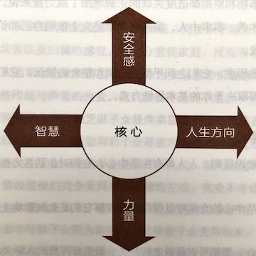
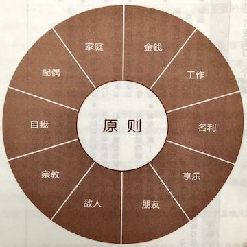

## 第四章 习惯二：以终为始——自我领导的原则

太多人成功之后，反而感到空虚；得到名利之后，却发现牺牲了更宝贵的东西。因此，我们务必固守真正重要的愿景，然后勇往直前坚持到底，使生活充满意义。

---

> 和内在力量相比，身外之物显得微不足道。——奥利弗·温德尔·霍姆斯（Oliver Wendell Holmes）| 美国最高法院前大法官

阅读下面的内容，请找个僻静的角落，抛开一切杂念，敞开心扉，跟着我走过这段心灵之旅。

假设你正在前往殡仪馆的路上，去参加一位至亲的丧礼。想象你开着车抵达教堂，找到车位后走下车。走进教堂，花香伴随着风琴音乐，一路上你见到好多亲友。看着他们的面孔，你能体会失去至亲的痛苦，感受这种心情，你能分享他们曾经的欢乐。

到达前厅，看到棺木时，你赫然发现亲朋好友齐聚一堂，是为了向你告别，你在参加自己的葬礼。也许这是三五年，甚至许久之后的事，但是姑且假定这时亲族代表、友人、同事和社团伙伴，即将上台追述你的生平。

你找到一个座位，阅读手上的葬礼程序说明，等待仪式开始。一共有四位发言嘉宾。第一位是你的亲戚，可能是你的子女、兄弟姐妹、祖父母这样的近亲，也有可能是表侄、表姐妹、叔叔婶婶等远道而来的亲戚。第二位是你的挚友，这个朋友总会使你了解自己。第三位是你的同事。第四位是牧师或者来自你曾参加的社团组织。

现在请认真想一想，你希望人们对你以及你的生活有什么样的评价？你是个称职的丈夫、妻子、父母、子女或亲友吗？你是个令人怀念的同事或伙伴吗？你希望他们怎样评价你的品格？你希望他们回忆起你的哪些成就和贡献？你希望对周围人的生活施加过什么样的影响？

在继续阅读之前，请大致记下你的回答和感受，这有助于你对习惯二的理解。

### “以终为始”的定义

如果你认真走过了前述心灵之旅，那你已经短暂触及了内心深处的某些基本价值观，也和位于影响圈核心的内心指导体系建立了联系。

请思考英国作家约瑟夫·爱迪生（Joseph Addison）的话：

当我面对伟大人物的墓地，妒忌之心荡然无存；当我阅读历代佳丽的碑文，贪婪的欲望顿然消失；当我在墓碑旁遇见泣不成声的父母，禁不住悲从中来；当我看到父母的坟墓，忍不住感到为那些自己即将追随的人而体味的痛苦是如此地空虚；当我看到王者与其废黜者的墓碑并肩而立，生前为不同观点唇枪舌战的文人墨客的遗体相邻而居，不禁感到那些内讧、派系斗争、人间是非常的渺小。再查看墓碑上的日期，发现有些就在昨日，有些却可追溯到 600 年前，于是不禁想到当最后审判日那天来临，我们都将同样接受上帝的审判。

虽然习惯二适用于不同的环境和生活层面，但最基本的应用，还是应该从现在开始，以你的人生目标作为衡量一切的标准，你的一言一行，一举一动，无论发生在何时，都必须遵循这一原则，即由个人最重视的期许或价值观来决定一切。牢记自己的目标或者使命，就能确信日常的所作所为并非与之南辕北辙，并且每天都向着这个目标努力，不敢懈怠。

以终为始说明在做任何事之前，都要先认清方向。这样不但可以对目前处境了如指掌，而且不至于在追求目标的过程中误入歧途，白费工夫。毕竟人生旅途的岔路很多，一不小心就会走冤枉路。许多人拼命埋头苦干，到头来却发现追求成功的梯子搭错了墙，但是为时已晚，所以说忙碌的人未必出成果。

很多人功成名就之后，反而感到空虚，发现自己牺牲了许多更宝贵的东西。上至达官显贵、富豪巨贾，下至平头百姓、凡夫俗子，无不在追求更多的财富、更大的势力或更高的声望，可是却常常被名利蒙蔽了良知，为成功付出昂贵的代价。所以明确真正的目标很重要，然后才好勇往直前，坚持到底，践行使命。

当我们了解生命中最重要的事情时，生活将会不同。头脑中要时刻牢记：每天希望自己成为什么样的人，当务之急是什么。如果通往成功的梯子一直搭错墙，那每一次行动无疑加快了失败的步伐。我们也许会很忙，也会很有效率，但是唯有心中牢记以终为始，才会成为高效能人士。

你希望在盖棺定论时获得的评价，才是你心目中真正渴望的成功。这样看来，我们梦寐以求的名利、成就和财富可能根本就不是我们想要的。

若能先定目标，你的洞察力会大大改善。有这么一则小故事，葬礼上有人问死者的朋友：“他留下了多少遗产？”对方回答：“他什么也没带走。”

### 任何事物都需要两次创造

“以终为始”的一个原则基础是“任何事物都是两次创造而成”。我们做任何事都是先在头脑中构思，即智力上的或第一次的创造（Mental/First Creation），然后付诸实践，即体力上的或第二次的创造（Physical/Second Creation）。

以建筑为例，在拿起工具建造之前，必须先有详尽的设计图纸；而绘出设计图纸之前，须先在脑海中构思每一细节。有了设计图纸，然后有施工计划，这样按部就班，才能完成建筑。假使设计稍有缺失，弥补起来，可能就会事倍功半。设计蓝图代表愿景，整个建筑过程均以它为准绳，因此宁可事先追求尽善尽美，也不要亡羊补牢。

创办企业也是如此，要想成功，必须先明确目标，根据目标来确定企业的产品或服务，然后整合资金、研发、生产、营销、人事、厂房、设备等各方面的资源，朝既定目标奋力前行。“以终为始”往往是企业成功的关键，许多企业都败在第一次创造上——事先缺乏明确目标，以致资金不足、规划不周或对市场的解读有误。

教育子女也要先定目标，才可能培养出既自律又有责任感的子女，在日常相处中牢记这个目标，不要做出任何有损他们自律或自尊的举动。

以终为始的原则适用范围极广。比如旅行前，你会先想好目的地然后规划最佳路线。建造花园之前，你会在脑海中或是纸上勾勒蓝图。演讲前先写下演讲词，整理院子前先计划，裁剪衣服前先设计等等。

当我们理解两次创造的原则，并肩负起践行它们的责任，影响圈就会日益扩大。如果我们不按照原则行事，对精神创造不闻不问，影响圈则会缩小。

### 主动设计还是被动接受

“任何事物都是两次创造而成”是个客观原则，但“第一次的创造”未必都经过有意识的设计。有些人自我意识薄弱，不愿主动设计自己的生活，结果就让影响圈外的人或事控制了自己，其生活轨迹屈从于家庭、同事、朋友或环境的压力。如果说人生是一出戏，那么这些人的人生剧本就源于早年的经历、所接受的教育或外界条件的制约。

这类剧本大多源自个人喜好，不符合客观原则，之所以会被接受，那是因为某些人内心脆弱，依赖心理过重，渴望被接纳和获得归属感，向往他人的关怀和爱护，而且一定要让别人来肯定自己的价值和重要性。

无论你是否意识到，是否能够控制，生活的各个层面都存在第一次的创造。每个人的人生都是第二次的创造，或者是自己主动设计的，或者是外部环境、他人安排、旧有习惯限定的。自我意识、良知和想象力这些人类的独特天赋让我们能够审视各种第一次的创造，并掌控自己的那一部分，即自己撰写自己的剧本。换句话说，习惯一谈的是“你是创造者”，习惯二谈的是“第一次创造”。

### 领导与管理：两次创造

习惯二“以终为始”的另一个原则基础是自我领导，但领导（Leadership）不同于管理（Management）。领导是第一次的创造，必须先于管理；管理是第二次的创造，具体会在习惯三中谈到。

领导与管理就好比思想与行为。管理关注基层，思考的是“怎样才能有效地把事情做好”；领导关注高层，思考的是“我想成就的是什么事业”。用彼得·德鲁克（Peter Drucker）和华伦·贝尼斯（Warren Bennis）的话来说就是：“管理是正确地做事，领导则是做正确的事。”管理是有效地顺着成功的梯子往上爬，领导则判断这个梯子是否搭在了正确的墙上。

要理解两者间的这一区别并不难。想象一下，一群工人在丛林里清除矮灌木。他们是生产者，解决的是实际的问题。管理者在他们后面拟定政策，引进技术，确定工作进度和补贴计划。领导者则爬上最高那棵树，巡视全貌，然后大声嚷道：“不是这块丛林！”

而忙碌的生产者和管理者会怎样回答呢？“别嚷啦，我们正干得起劲呢。”

很多个人、团队和企业都是这样埋头猛干，却意识不到他们要砍伐的并非这片丛林。当今世界日新月异，更突出了有效领导的重要性，无论你身处在独立期还是互赖期。与路线图相比，我们更加迫切需要的是一个愿景或目的地以及指路的罗盘（一套原则或指导方针）。世事难料，没人可以预见未来，一切都要靠自己的判断，而内心的罗盘则能够使你判断正确。

成功，甚至求生的关键并不在于你流了多少血汗，而在于你努力的方向是否正确，因此无论在哪个行业，领导都重于管理。

对企业来说，市场瞬息万变，几年前符合消费者需求和品位的产品可能瞬间就会过时。积极的领导者必须紧盯商业环境的变化，特别是消费者购买习惯和购买心理以及员工队伍的变化，以便整合企业资源，拨正企业的发展方向。

影响商业市场环境的重大变化包括，民航业放松管制和医疗成本的飞涨，进口汽车质量更好、数量也在增长。如果企业不理会外部环境、工作队伍，以及领导方向，再成功的管理也无法避免企业的失败。

如果缺乏有效的领导，即便是高效的管理，也只不过像在“泰坦尼克号沉没之前拉开躺椅”一样徒劳无功。再成功的管理也无法弥补领导的失败，而领导难就难在常常陷入管理的思维方式难以自拔。

记得我曾在西雅图负责一个为期一年的主管进修课程，在最后一堂课上，一家石油公司的总裁跟我谈到他个人的学习心得：

“史蒂芬，你在第二个月指出领导与管理的差异之后，我就立即检讨了自己的角色，结果发现我根本不曾领导，而是每天都忙着管理，搞得焦头烂额，于是我决定把管理工作交给别人，自己则退出来，专心把握公司方向。”

“这实在不容易！放下那些迫在眉睫的公务让我十分痛苦，因为解决紧急事务更能给我一种成就感。相比之下，苦思如何领导公司，如何建立企业文化，如何把握先机以及深入分析问题真是让我头疼。我手下的管理人员也很不习惯，他们无法再把难题推给我，所以日子更难过了。不过我决心坚持到底，因为我认定了自己必须做个领导者。现在我做到了，整个公司也脱胎换骨，我们更能适应环境变化，公司的营业额翻了一番，利润则增长了四倍，我真正发挥了领导的力量。”

我相信为人父母者也难免会走入类似的管理误区，只想到规矩、效率和控制，忽略了目的、方向与亲情。

个人生活中的领导意识则更为匮乏，很多人连自己的价值观都没有搞清楚，就忙于提高效率，制定目标或完成任务。

### 改写人生剧本：成为自己的第一次创造者

正如前面所说，人类的自我意识天赋是积极处世的基础，另两项天赋，想象力和良知，则使我们能在生活中发扬积极精神，施行自我领导。

想象力能让我们在心里演练那些尚未释放的潜能；良知能让我们遵循自然法则或原则，发挥自己的独特才智，选择合适的贡献方式，再有就是确定自己的指导方针以便将上述能力付诸实践；而想象力、良知、自我意识的结合则能让我们编写自己的人生剧本。

每个人在成长过程中都承袭了许多来自他人的“人生剧本”，因此更确切一点说，我们是改写，而不是编写人生剧本，即对已有思维的转换。当我们认识到人生剧本的低劣以及思维方式的低效，就会积极地加以改写。

已故埃及总统萨达特（Anwar Sadat）的自传，讲述了一个最令人振奋的改写人生剧本的故事。萨达特是在仇恨以色列的环境中长大成人的，一度以仇恨以色列来调动民众的意志。这个剧本有很强的独立性和浓重的民族主义，但它也是愚蠢的，忽视了当今世界相互依存的事实。萨达特也知道这一点。

于是，萨达特决定改写自己的人生剧本。因为参与推翻法鲁克国王，年轻的萨达特被关入开罗中央监狱的一间单人牢房。在那里，他学会了理清思绪，并且判断他之前写下的剧本是否明智、恰当。他学会了从旁观者的角度观察自己，自创冥想体系，用圣经和祷告重写剧本。

萨达特说他甚至都不愿离开监狱，因为他在那里学会了真正的成功是战胜自我。成功不是获取财富，不是掌握权力，而是赢得与自己的较量。

埃及总统纳赛尔执政时，萨达特重新受到任命。这出乎人们的意料，因为大家猜想他早被打垮了。人们任意地想象着萨达特的生活，却不知道，他争取到了属于自己的时间。

萨达特利用他的独立意志、想象力和良知进行自我领导，改写了自己的“人生剧本”，影响了数百万人的生活。

当我们因袭的“人生剧本”有违我们的生活目标时，如果我们能够利用想象力和创造力书写新的剧本，它将更为符合我们内在的价值观。

假设我是一位严厉的父亲，每当子女做出令我反感的行为，立刻会火冒三丈，把教训子女的真正目的抛诸脑后，拿出做父亲的权威，迫使子女屈服。在眼前的冲突中我固然得胜，亲子关系却出现裂痕。孩子表面顺从，但口服心不服，受到压抑的情绪，日后会以更糟的形式表现出来。

让我们再回到本章一开始提到的实验。在我的丧礼上，子女齐集一堂，表达孝思。我期望他们个个都很有教养，满怀对父亲的爱，而不是与父亲起冲突的创痛。但愿他们心中充盈的是往日美好的回忆，记得老爸曾与他们同甘共苦过。我所以有这些期望，因为我重视子女、爱护子女，以做他们的父亲为傲。

但在实际生活中，却不一定能牢记这些，我完全被一些厚此薄彼的琐事困住了。真正要紧的事情被紧迫的难题、当务之急和举止问题层层覆盖。我每天和孩子们相处的方式却没有表现出我内心对他们真正的情感。

幸好自我意识、想象力和良知帮助我审视价值观。我的生活和价值取向并不一致，因为我并没有按照积极主动的方式生活，而是努力适应环境和别人的想法。我能够改变，不是靠记忆而是按照理想而活，我把自己的无限潜力和有限的过去分开，我要成为自己的第一创造者。

以终为始意味着要带着清晰的方向和价值观来扮演自己的家长角色或其他角色，要为自己人生的第一次创造负责，为改写自己的人生剧本负责，从而使决定行为和态度的思维方式真正符合自己的价值观和正确原则。

它还意味着我们每天都要牢记这些价值观，因为这会让我们保持积极主动的态度，以价值观为行动准则，一旦生活有变，就可以根据个人价值观决定因应之道，无须受制于情绪或外界环境。

### 个人使命宣言

以终为始最有效的方法，就是撰写一份个人使命宣言，即人生哲学或基本信念。宣言主要说明自己想成为怎样的人（品德），成就什么样的事业（贡献和成就）及为此奠基的价值观和原则。宣言的内容与形式可以因人而异，以我朋友罗尔夫·科尔（Rolfe Kerr）的为例：

- 家庭第一。
- 借重宗教的力量。
- 在诚信问题上绝不妥协。
- 念及相关的每一个人。
- 未听取双方意见，不妄下断语。
- 征求他人意见。
- 维护不在场的人。
- 诚恳但立场坚定。
- 每年掌握一种新技能。
- 今天计划明天的工作。
- 利用等待的空闲时间。
- 态度积极。
- 保持幽默感。
- 生活与工作有条不紊。
- 别怕犯错，怕的是不能吸取教训。
- 协助属下成功。
- 多请教别人。
- 专注于当前的工作，不为下一次任务或晋升瞎担心。

另一位兼顾家庭与事业的女性的个人使命宣言则不同：

- 我努力兼顾事业与家庭，因为两者对我来说都很重要。
- 家庭是平安、祥和与幸福的地方，我要以智慧来创造整洁温馨的环境，衣食住行要巧安排，特别重要的是要教导子女善良、进取与乐观，还要培养他们的特长。
- 珍惜民主社会的权利、自由和责任，我要成为关心社会的市民，参与政治和选举以表达自己的意见。
- 自强自立，积极处世，追求人生目标；主动抓住机遇、应对环境，而不是消极被动。
- 避免养成恶习，不断完善自己，提高自己的能力。
- 金钱是人的奴隶而非主人。我要逐步实现经济独立，量入为出，除了车、房的长期贷款，不为日常消费品借贷，还要定期储蓄或利用部分收入做投资。
- 我愿意参与志愿服务和慈善捐款，奉献金钱、才智以改善他人的生活。

你可以把个人使命宣言称为个人宪法。对于个人来说，基于正确原则的个人使命宣言也同样是评价一切的标准，成为我们以不变应万变的力量源泉。它既是做出任何关键抉择的基础，也是在千变万化的环境和情绪下做出日常决策的基础。

《美国宪法》是制定美国所有法律的标准，是美国总统就职时宣誓要捍卫和守护的文件，是人们获准成为合格公民的条件，是根基更是权威中心，是评价一切和指导工作的书面规定。

宪法之所以能延续至今仍然行使着最重要的使命，原因就在于它基于正确原则以及《独立宣言》中不言自明的真理。原则让宪法即使处于社会转型和迷茫时期，仍具有永不褪色的优势。无怪乎托马斯·杰斐逊曾言：“我们独一无二的保障就是《宪法》。”

只要心中秉持着恒久不变的真理，就能屹立于动荡的环境中。因为一个人的应变能力取决于他对自己的本性、人生目标以及价值观的不变信念。

确立了个人使命宣言之后，我们就能随机应变，不必带着成见或偏见来对事态妄加推断，也不必因循守旧地给各种事务定性分类，这样自然能保持一份安全感。

我们的个人环境也在以前所未有的速度发生变化，快得让许多人都难以适应，只好选择退缩或放弃，坐等好运降临。

其实大可不必如此。弗兰克尔在纳粹死亡集中营里，不仅领悟到积极主动的原则，还体会到了目标和生命意义的重要性。后来他倡导了一种“标记疗法”（Logotherapy），基本原理就是：许多心智或情感疾病都是由于失落感或空虚感作祟，而标记疗法可以帮助病人找回生命的意义与使命感，以祛除这些感觉。

有了使命感，你就抓住了积极主动的实质，有了用以指导生活的愿景和价值观，并在这些根本指引的基础上设立长期和短期目标。使命感还有助于你制定基于正确原则的个人书面宪法，让你能够据此高效地利用时间、精力和才能。

### 核心区

制订个人使命宣言必须从影响圈的核心开始，基本的思维方式就在这里，即我们用来观察世界的“透镜”。

我们要在此处确立自己的愿景和价值观；利用自我意识检查我们的地图或思维方式是否符合实际，是否基于正确的原则；利用良知作为罗盘来审视我们独特的聪明才智和贡献手段；利用想象力制定我们所渴求的人生目标，确定奋斗的方向和目的，搜罗使命宣言的素材。

当我们专注于这个核心并取得丰硕成果的时候，影响圈就会被扩大，这是最高水平的产能，会有力提高我们在生活各领域的效能。

这个核心还是安全感、人生方向、智慧与力量的源泉。（见图 4-1）

| 图 4-1 一切思想观念的根源                |
|--------------------------------|
|  |

**“安全感”（Security）** 代表价值观、认同、情感的归属、自尊自重与拥有个人的基本能力。

**“人生方向”（Guidance）** 是“地图”和内心的准绳，人类以此为解释外界事物的理据以及决策与行为的原则和内在标准。

**“智慧”（Wisdom）** 是人类对生命的认知、对平衡的感知和对事物间联系的理解，包括判断力、洞察力和理解力，是这些能力的统一体。

**“力量”（Power）** 则指采取行动、达成目标的能力，它是做出抉择的关键性力量，也包括培育更有效的习惯以替代顽固旧习的能力。

它们相辅相成——安全感与明确的人生方向可以带来真正的智慧，智慧则能激发力量。若四者全面均衡，且协调发展，便能培养高尚的人格、平和的性格与完美的个体。

一个人的安全感一定介于极度不安全和极度安全之间，前者说明你的生活总是被变化莫测的外力所干扰和左右，后者说明你对于自己的真正价值有着清晰而深刻的认识；人生方向也有两个极端，一个是以“社会之镜”及其他不确定的变化性因素为基础，一个是以坚实的内在方向为基础；智慧则一端是完全扭曲事实的错误地图，一端是所有事物和原则都适度关联的正确地图；就力量来说，最低层次是成为别人手中的提线木偶，事事由人，最高层次就是完全依照自己的价值观行事，不受外人和外界的干扰。

这四者的成熟程度，它们之间平衡、协调和整合的情况，它们对生活各方面的积极影响与否，都取决于你的基本思维方式。

### 各种生活中心

不论你是否意识得到，人人都有生活中心，它们对生活各方面的强烈影响毋庸置疑。

下面几种生活中心的介绍可以帮助我们理解它们是如何影响上述四个因素和我们的生活的。

**以配偶为中心** 婚姻可说是最亲密持久、最美好可贵的人际关系，因此以丈夫或妻子为生活重心，再自然不过了。

但是根据我多年来担任婚姻顾问的经验，事情却向着另一个方向发展。很多以配偶为中心却即将破碎的婚姻都源于一条导火索，那就是情感过度依赖。

如果我们获取情感价值的主要来源是婚姻，这段关系会成为我们的支柱。太重视婚姻，会使人的情感异常脆弱，配偶的态度举止、新生儿降生或经济窘迫、工作晋升等变化都会成为沉重的打击。

婚姻会带来更多的责任与压力，一般人通常根据以往所受的教育来应对。然而两个背景不同的人，思想必定有差异，于是理财、教养子女、婆家或岳家的问题，都会引发争执。若再加上其中一方情感难以独立，这桩婚姻便岌岌可危。

如果我们一方在情感上依赖对方，一方面又与对方有争执，就极易陷入爱恨交织、进退无常的矛盾中。出现争执时，为了能向伴侣表明自己的立场或是证实自己的观点，就更加容易借助以往的经历，这无疑会加剧矛盾。

为了保护自己，便更加退缩及排斥对方，于是，冷嘲热讽代替了真实的感受。一方总在等待对方采取主动，如果自己没有等到预期的结果，则会确信之前的指责是合理的。

这种关系似乎保住了安全感，实则不然。感情用事的结果是失去了方向、智慧与力量。

**以家庭为中心** 以家庭为重的现象也十分普遍，而且似乎理所当然。家的确带来爱与被爱、同甘共苦以及归属的感觉，但过分重视家庭，反而有害家庭生活。

以家庭为重的人通常会把家族传统和荣誉作为安全感和价值观的来源。因此一旦出现可能影响这些传统与声誉的改变，他们就变得脆弱不堪。

这样的父母在养育子女时，缺乏以子女最终幸福为目标的情感自由和力量。假设他们的安全感来自家庭，那么希望得到子女尊重的渴望就会超过给孩子的成长投资。或者，他们只会关注子女一时的举止是否符合礼仪，但凡出现不当行为，他们马上会感到不安。紧接着他们完全受到当下情绪的左右，完全不考虑对子女成长带来的影响，下意识地大喊或是训斥，还可能反应过度进而粗暴惩罚。他们的爱往往是有条件的，结果若非导致子女更为依赖，就是导致子女变得叛逆。

**以金钱为中心** 谁也无法否认金钱的重要性，经济上的安全感也是人类最基本的需求之一。人类的需求等级中，生存基本需要和经济安全感排在第一，如果得不到满足，那么人类的其他需要便难以实现。

大多数人有经济负担，外界环境的种种因素会导致经济状况恶化，带来的后果就是我们潜意识里会觉得忧虑和担心。

有时赚钱被冠以一个冠冕堂皇的理由，比如养家糊口。其中的重要性不可否认，但是假如以金钱为中心，劣势也会浮现。

从安全感（Security）、人生方向（Guidance）、智慧（Wisdom）和力量（Power）这四个支撑人生的要素考虑，假设我主要从酬劳和薪水中获得安全感，势必寝食难安，因为影响财富的变数太多，任何一个闪失都难以承受。如果我凭借工资的多少衡量我的人生价值，那一旦工资出现变化我将不能认可自己。工作和薪水本身，只能提供有限的力量和安全感，却无法带来方向和智慧。这些要说明的是，以金钱为中心会给我和我爱的人带来危机。

有人为了逐利，不惜将家庭及其他重要事物摆在一边，而且以为别人都认同这种做法。我认识一位可敬的父亲，准备带子女出游时，忽然接到公司要求加班的电话，但是他回绝了，因为“工作还会再来，童年却只有一次”。这一幕深深印在子女的脑海里，一生难忘。

**以工作为中心** 只知埋头苦干的“工作狂”，即使牺牲健康、婚姻、家庭与人际关系也在所不惜。他的生命价值只在于他的职业或工作——医生、作家或演员……

正因为他们的自我认同和自我价值观都以工作为基础，所以一旦无法工作，便失去了生活的意义。任何妨碍工作的因素都很容易影响到他们的安全感；他们的人生方向取决于工作需要；而智慧和力量也只限于工作领域，无益于其他生活领域。

**以名利为中心** 许多人深受占有欲驱使，不仅想把汽车、豪宅、游艇、珠宝、华服等这些有形的物质据为己有，对于那些无形的名誉、荣光与社会地位也不肯放过。很多人都从亲身经历中知道名利并不可靠，很可能会瞬间落空，同时受诸多因素影响。

必须靠名利与物质来肯定自我的那些人，必定终日忧心忡忡，患得患失。面对名气、地位或者条件好过自己的人就觉得相形见绌，面对稍逊自己的人又趾高气扬。自我评价和自我认识如此飘忽不定，起落频繁，却还要固执地守住自己的资产、所有物、有价证券、地位和名誉不放。难怪有人会在股票大跌或政坛失意后一死了之。

**以享乐为中心** 与名利紧密相关的享乐也可能成为生活的中心，这在享乐之风盛行的速成主义世界里不足为奇。电视与电影向人们展示了另外一些人的财富和安逸生活，从而激发了人们的渴望。

然而银幕上的浮华生活对于人格、效能和人际关系的影响却远不如表面看起来那么美好。

适度娱乐可使人身心舒畅，有利于家庭及其他人际关系的改善，但是短暂的娱乐和刺激并不能给人持久的快乐与满足。贪图享乐的人很快就会厌烦已有的刺激，渴望追求更高层次的刺激和快感。长期沉溺于此，就会以是否能够享乐来评价一切。

休太长的假，看太多的电影或电视，打太多的电子游戏，长期无所事事，都等于浪费生命，无益于增长智慧，激发潜能，增进安全感或指引人生，只不过制造更多的空虚而已。

马尔科姆·马格里奇（Malcolm Muggeridge）在《20 世纪见证》（_A Twentieth-Century Testimony_）中写道：

回忆往昔，对我触动最大的是，当时看上去至关重要、妙趣横生的事，现在看来竟是微不足道，甚至有些荒谬。比如看似耀眼的成就、名望和赞许，得到金钱或异性后的快乐，像撒旦一样游走于世界各地，经历“名利场”里的一切。

现在回想起来，所有这些自我满足都不过是海市蜃楼、黄粱一梦。

**以敌人或朋友为中心** 青少年尤其容易以朋友为重，为了被同龄人的团体所接纳，他们愿付出一切代价，对于这个团体内流行的价值观也照单全收。他们对团体极度依赖，易受他人的感觉、态度、行为或情绪的影响。

以朋友为中心和以配偶为中心类似，都是感情上过分依赖某个人，因此也容易出现“需要——冲突”的恶性循环和不良后果。

以敌人为中心的情况似乎闻所未闻，实则相当普遍，只是往往本人不易觉察罢了。当一个人觉得遭到某个在社会或情感层面十分重要的人物（如主管）的不公平待遇后，很容易对其耿耿于怀，并处处作对，这就是以敌人为生活中心。

我有一位朋友在大学教书，与行政主管关系恶劣，整天都把对方看作假想敌，几乎走火入魔，家庭生活与工作也都大受影响，最后不得不选择离开，另谋职业。

于是我问他：“如果不是那个家伙，你还是愿意留下来的，是吗？”

他回答：“是的，可是只要他在一天，我就不得安宁，只好跳槽。”

“你为什么让他成了你生活的中心？”

朋友被问住了，矢口否认这个事实。但是我指出他就是在听任别人控制自己的生活，削弱自己的信心并危害到自己重要的人际关系。

最后朋友承认行政主管的确对他影响很大，但否认是他咎由自取，将责任全部推给那位行政主管，认为错在对方，而自己是无辜的。

深谈之后，他终于认识到了自己的部分责任，正因为没有正确对待自己的责任，才成了一个不负责任的人。

有些离婚的人也对与前任配偶的过节念念不忘，心里放不下对对方的怨愤，需要不断谴责对方的缺点来证明自己的无辜。

有些子女成年后，仍为父母当年的忽视、偏心或辱骂而在公开场合或私下里愤愤不平，消极地抱怨自己不幸的人生剧本，这些也都是以敌人为中心的表现。

以朋友或敌人为中心的人没有内在的安全感，自我价值变化无常，受制于他人的情绪和行为；人生方向也取决于他人的回应，时时揣摩如何反击；他们的智慧受限于以敌人为中心的偏执心理；毫无力量可言，总是被别人牵着鼻子走。

**以宗教为中心** 我相信任何有宗教信仰的人都知道，经常去教堂的人不一定有崇高的精神世界。有些人热衷于宗教活动，却无视周围人的紧急求助，违反了自己标榜的信仰；而另一些不那么热衷于宗教活动，甚至没有宗教信仰的人，言行却更合乎宗教劝人向善的宗旨。

以宗教为中心的人，往往关注个人形象或出席活动，戴着伪善的面具，其安全感和内在价值也因此受到影响。他们的人生方向并非来自良知，而是随波逐流。他们喜欢给别人贴标签，比如说这些人是“积极的”，是“自由派”，那些人是“消极的”，是“保守派”。

由于宗教是有自己的政策、计划、活动和成员的正式组织，因此本身并无法赋予任何人以持久的安全感或内在价值，只有遵循教堂所倡导的原则才能赋予一个人以安全感。

宗教也不能长期为人指引人生方向。以宗教为中心的人在礼拜日和工作日的思考或行为方式完全不同，这种不完善的人格会威胁到他们的安全感，需要进一步给别人贴标签和给自己辩护。

把宗教当作目标而不是实现目标的手段会削弱智慧和平衡感。虽然宗教宣称能通过教导赐人力量，但也只是传递上帝神圣力量的媒介，并未断言自己就是力量本身。

**以自我为中心** 时下最常见的恐怕就是以自我为中心的人，他们最明显的特征就是自私自利，与多数人的价值观背道而驰。然而市面上盛行的个人成功术无一不是以个人为中心，鼓吹只索取、不付出，却不知狭隘的自我中心观会使人缺乏安全感和人生方向，也不会有智慧及行动力量。这就像是以色列的死海，只有流入，没有流出，于是变得死水一潭。唯有以造福人群、无私奉献为目的的追求自我成长，才能在这四方面不断长进。

以上只是比较常见的人生中心。和当局者迷的道理一样，看清他人的生活重心会相对容易。你会察觉有人挣钱第一，有人在一段无望的关系里垂死挣扎，只要仔细观察，你就能透过行为的表象看清中心所在。

### 识别自己的生活中心

你现在的状况如何？什么是你的生活中心？有时并不容易回答。也许最好的办法就是详细考察支撑自己人生的因素。如果你能在表 4-1 中认出一种或几种行为，你就能追踪到导致这些行为的生活中心——一个限制效能的生活中心。

**表 4-1 各种生活中心的特征**

| 中心类别      | 安全感                                                                                                              | 人生方向                                                                  | 智慧                                          | 力量                                                    |
|-----------|------------------------------------------------------------------------------------------------------------------|-----------------------------------------------------------------------|---------------------------------------------|-------------------------------------------------------|
| 如果你以配偶为中心 | <ul><li>感情和安全感建立在配偶对你的态度上。<li>极易受配偶情绪的影响。<li>与配偶意见不合或对方不能满足你的期望时你会极度失望，以致心灰意冷或发生冲突。<li>凡是可能不利于婚姻关系的，均被视为威胁。</ul> | <ul><li>根据个人与配偶的需求决定人生方向。<li>取舍一切事物的标准在于是否对婚姻或配偶有利，或以配偶的偏好与意见为主。</ul> | <ul><li>对周围事物的看法依其对配偶或婚姻关系的有利（不利）影响而定。</ul> | <ul><li>行动力量由于个人或配偶的弱点而受到制约。</ul>                     |
| 如果你以家庭为中心 | <ul><li>安全感建立在家人的接纳与实现家庭的期望上。<li>个人安全感随家庭起伏。<li>家庭声望决定自我价值。</ul>                                                 | <ul><li>对行为与态度的是非观念来自家庭灌输。<li>决策的基础是家族利益或家人需要。</ul>                   | <ul><li>完全以家庭的角度看待一切，以致眼界狭窄，过分依赖家庭。</ul>    | <ul><li>行动受限于家族模式与家族传统。</ul>                          |
| 如果你以金钱为中心 | <ul><li>个人价值由手中财富决定。<li>对任何可能危及经济安全的事都充满戒心。</ul>                                                                 | <ul><li>“利益”是决定一切的准则。</ul>                                            | <ul><li>“以赚钱为人生目标”，自然难有正确判断。</ul>           | <ul><li>力量被财富能发挥作用的范围所局限，目光狭隘。</ul>                   |
| 如果你以工作为中心 | <ul><li>根据职业角色来认定自我价值。<li>只有工作时才感觉自在。</ul>                                                                       | <ul><li>以工作需要与工作成就衡量一切。</ul>                                          | <ul><li>只扮演与工作有关的角色。<li>把工作视如生命。</ul>       | <ul><li>行动受限于工作模式、行业机遇、组织约束、老板的想法以及在某时刻对某事的能力欠缺。</ul> |
| 如果你以名利为中心 | <ul><li>安全感来自个人名誉、社会地位或个人财产。<li>好与他人攀比。</ul>                                                                     | <ul><li>以是否能保障、增加或彰显自己的财产来衡量一切。</ul>                                  | <ul><li>通过比较经济实力与社会关系来看待世界。</ul>            | <ul><li>行动受限于个人购买能力或势力范围。</ul>                        |
| 如果你以享乐为中心 | <ul><li>唯有“乐”到极致才能产生安全感。<li>安全感为环境所左右，稍纵即逝，如同麻醉一般。</ul>                                                          | <ul><li>任何决定都以是否能带来极致享乐为依据。</ul>                                      | <ul><li>只关注世界能带给自己多少享乐。</ul>                | <ul><li>几乎毫无力量。</ul>                                  |
| 如果你以朋友为中心 | <ul><li>安全感来自“社会之镜”。<li>极其仰赖他人意见。</ul>                                                                           | <ul><li>决策的依据是“别人怎么想？”<li>容易感到难堪。</ul>                                | <ul><li>以社会流行的观点看世界。</ul>                   | <ul><li>行动局限在让你感到自在的社交圈内。<li>你的行为和你的观点一样无常。</ul>      |
| 如果你以敌人为中心 | <ul><li>安全感起伏不定，依敌人行动而变化。<li>时刻警惕敌人的行动。<li>寻求“志同道合”者的认同。</ul>                                                    | <ul><li>受敌人行动影响，缺乏自主性。<li>任何决策都是为了与敌人作对。</ul>                         | <ul><li>见解偏颇，判断有误。<li>保护自己，反应过度，常陷入偏执。</ul> | <ul><li>力量有限，且只来自愤怒、妒忌、厌恶与报复心理——只有破坏，没有建设。</ul>       |
| 如果你以宗教为中心 | <ul><li>安全感来自教会活动及教会领袖的评价。<li>自我肯定和安全感来自所属教派与其他教派的比较。</ul>                                                       | <ul><li>以他人根据教会的教导和期望对自己做出的评价为行动指导。</ul>                              | <ul><li>认为世人只有信徒与非信徒之分。</ul>                | <ul><li>行动力量取决于自己在教会的地位或角色。</ul>                      |
| 如果你以自我为中心 | <ul><li>安全感变化不定。</ul>                                                                                            | <ul><li>以个人需求、欲望、感觉与利益决定一切。</ul>                                      | <ul><li>只重视外在事件、环境或决策对自己的影响。</ul>           | <ul><li>只能单枪匹马施展力量，无法与他人合作。</ul>                      |

一般说来，我们的生活中心是以上某几种中心的混合体，依环境不同而有所变化。大多数人的生活受到多种因素的影响，可能今天以朋友为中心，明天又变为以配偶为中心。

生活中心如此摇摆不定，情绪上难免起起落落。一会儿意气风发，一会儿颓唐沮丧；一会儿斗志昂扬，一会儿又落魄消沉。缺乏固定的人生方向，没有持久的智慧，也没有稳定的力量或自我评价。

所以，最理想的状况还是建立清晰明确的生活中心，由此才能产生高度的安全感、人生方向、智慧和力量，使人生更积极、更和谐。

### 以原则为中心

以正确原则为生活中心可以为发展前述四个支撑人生的因素奠定坚实的基础。

认识到这一点，我们就有了安全感。原则是恒久不变、历久弥新的，不像其他中心那样多变，所以值得信赖，可以给我们高度的安全感。原则是理性而非感性的，因此能让我们充满信心，配偶和密友都可能离我们而去，但原则不会。原则不会怂恿你投机取巧，不劳而获，其有效性不取决于环境、他人行为或流行风尚。原则是永生的，不会毁于火灾、地震或偷盗，也不会今天在这儿，明天又到了那儿。

原则是深刻的、实在的、经典的真理，是人类共有的财富。它们准确无误，始终如一，完美无瑕，强而有力，贯穿生活的方方面面。

即使某事某地某人无视原则的存在，我们也无须忧心，因为原则可以超越时空的限制。几千年的历史一次又一次地见证了原则的胜利，而更重要的是，我们能在自己的生活和经验中证实这些原则。

当然，我们也并非无所不知。我们对正确原则的认识和理解受限于我们对自己和世界本质的了解，也受到时下流行的与原则相背离的哲学和理论的影响。但是这些哲学和理论跟它们的“前辈”一样，都有风光的时候，却难逃被抛弃的命运，不能持久，原因就是它们的基础是虚幻的。

我们的局限性是可以逐步改善的。理解成长的原则可以让我们在寻找正确原则的时候充满自信，相信学得越多，就越能以正确的视角更清楚地观察世界。原则不会改变，但我们对原则的理解可以改变。

如果以原则为生活中心，智慧和人生方向的来源就是正确的地图，反映事物的真实历史和现状。正确的地图让我们能够清晰了解自己的目标以及实现途径，能够基于正确的资料做出更有意义、更易执行的决策。（见表 4-2）

**表 4-2 以原则为中心的特征**

| 中心类别      | 安全感                                                                                                                                                                              | 人生方向                                                                                                                                                      | 智慧                                                                                                                                                                   | 力量                                                                                                                                                                        |
|-----------|----------------------------------------------------------------------------------------------------------------------------------------------------------------------------------|-----------------------------------------------------------------------------------------------------------------------------------------------------------|----------------------------------------------------------------------------------------------------------------------------------------------------------------------|---------------------------------------------------------------------------------------------------------------------------------------------------------------------------|
| 如果你以原则为中心 | <ul><li>安全感基于原则，不会随环境而变化。<li>你知道原则可以在生活经历中得到验证。<li>原则是准确、一贯、完美和有力的，是自我改善的有利工具。<li>正确原则帮你理解自己的成长，让你更加自信，相信通过学习能增加对客观世界的理解和认识。<li>这样的安全感来源为你提供了一个稳定不变的核心，使你能够认清形势变化并抓住机遇做出贡献。</ul> | <ul><li>有内心罗盘的指引，能看清自己的目标和实现方法。<li>能基于正确的资料做出更有意义、更易执行的决策。<li>能超脱情绪和环境的影响，冷静观察客观现实，任何抉择都将短期目标、长期目标及其他因素考虑在内。<li>在各种境遇下，你都能按照被原则指引的良知行动，主动、自觉地选择最佳方案。</ul> | <ul><li>你的判断既考虑了长期后果，又照顾到各方面的平衡，拥有平和的自信。<li>与处世消极的人相比，你的见解不同凡响，思想与行为也独具一格。<li>你的基本思维方式是卓有成效的。<li>你的处世态度是造福人群，贡献社会。<li>你积极处世，提供服务，成就他人。<li>你向生活学习，把生活看作学习和奉献的课堂。</ul> | <ul><li>你的局限性仅仅在于对自然法则和正确原则的理解，力量的唯一制约是原则本身的必然后果。<li>你的力量来自自我意识、知识和积极的心态，因而能够摆脱环境及他人态度和行为的制约。<li>你的行动能力超越了自己所掌握的资源，能帮助你达到高度互赖的阶段。<li>你的抉择和行动不受当前经济状况或其他条件的影响，有互赖的自由。</ul> |

而力量来自自我意识、知识和积极的心态，因而能够摆脱环境及他人态度和行为的制约。

唯一能制约力量的是原则本身的必然后果。前面说过，我们可以自由选择行动，但无法选择行动的后果——“抬起手杖的一头，也就抬起了手杖的另一头”。

任何原则都有必然后果。遵从原则，后果就是积极的；忽视原则，后果就是消极的。原则具有广泛适用性，无论是否为人所知，这种制约都是普遍存在的。越了解正确的原则，明智行动的自由度就越大。

以永恒不变的原则作为生活中心，就能建立高效能的思维方式，也就能正确审视所有其他的生活中心。（见图 4-2）

| 图 4-2 以原则为生活中心                |
|-------------------------------|
|  |

一个人的思维方式能决定他的态度和行为，就好像“透镜”能影响一个人对世界的观察一样。生活中心不同，产生的观念也就各异。下面先通过一个实例来看看不同的思维方式（生活中心）会让人有怎样不同的回应。

现在假定你已经买好票，准备晚上与配偶一起去听音乐会，对方兴奋不已，满怀期待。

可是下午四点钟，老板突然来电话要你晚上加班，理由是第二天上午九点钟有一个重要会议。

- 对以家庭或配偶为中心的人而言，当然是优先考虑配偶的感受，为了不让他（她）失望，你很可能会委婉地拒绝老板。即使为了保住工作而勉强留下来加班，心里也一定十分不情愿，担心着配偶的反应，想着用什么合理的理由来安抚他（她）的失望与不满。
- 以金钱为中心的人则看重加班费或加班对于老板调薪决定的影响，于是理直气壮地告诉配偶自己要加班，并理所当然地认为对方应该谅解，毕竟经济利益高于一切。
- 以工作为中心的人会觉得正中下怀，因为加班既可以让自己增加经验，又是一个很好的表现机会，有利晋升，所以不论是否需要，都会自动延长加班时间，并想当然地以为配偶会以此为荣，不会为爽约一事小题大做。
- 以名利为中心的人，会算计一下加班费能买到什么，或者考虑一下加班对个人形象有何助益，比如赢得一个为工作而牺牲自己的美誉。
- 以享乐为中心的人，即使配偶并不介意，也还是会撇下工作赴约，因为实在需要犒劳自己一下。
- 以朋友为中心的人，则根据是否有朋友同行，或其他工作伙伴是否也加班来做决定。
- 以敌人为中心的人，会乐于留下，因为这可能是一个打击对手的良机——在对手悠哉游哉的时候拼命工作，连他的任务也一并完成，牺牲自己的一时快乐来证明自己对公司的贡献比对手更大。
- 以宗教为中心的人则会考虑其他教友的计划，考虑办公室是否有其他教友或者音乐会是否与宗教相关——宗教音乐就比摇滚乐吸引力要大，由此决定取舍。此外，你认为优秀教友会怎么做，加班的目的是奉献还是追求物质利益等也会影响你的决定。
- 以自我为中心的人只关心哪一样对个人的好处更大：是听音乐会，还是让老板增加好感更有利？两种选择给自己带来的后果有何不同会是考虑的主要因素。

我们共同面对同一件事情时，各自会有完全不同的看法，是不是很奇怪呢？正如前面所做的观察少妇/老妇的画像实验，你能看出来这是由于看问题的中心不同造成的吗？中心会直接决定动机、日常决策、行为（多数情况还包括回应）以及对事物的理解，不难想象为何掌握中心如此重要了。如果目前你的中心不足以让你变得积极主动，那么当务之急是转换思维并找到一个类似的中心。

以原则为中心的人会保持冷静和客观，不受情绪或其他因素的干扰，综观全局——工作需要、家庭需要、其他相关因素以及不同决定的可能后果，深思熟虑后才做出正确的选择。

拥有其他生活中心的人可能和以原则为中心的人做出的选择一样，都是赴约或者都是加班，但是后者的选择会有以下几项特征：

首先，这是主动的选择，没有受到环境或他人的影响，是通盘考虑后选择的最佳方案，是有意识地明智选择。

其次，这是根据原则所做出的选择，能提高自身的价值。为了报复他人而决定加班或者为了公司利益而加班的结果虽然相同，但意义却大相径庭。践行这个决定的过程有助于从整体上提升你的生活质量和意义。

再次，若平时已与配偶和老板建立了良好的相互依赖关系，此时就不难向他们解释如此决定的理由，而且也会得到体谅。因为已经实现了独立，所以可以选择有效的相互依赖，可以授权他人完成部分任务，剩下的等自己第二天一早来完成。

最后，对自己的选择胸有成竹，无论结果怎样，都能专注于此，并且心安理得，内心没有羁绊。

以原则为生活中心的人总是见解不凡，思想与行为也独具一格，而坚实、稳定的内在核心赐予他们的高度安全感、人生方向、智慧和力量，会让他们度过积极而充实的一生。

### 撰写使命宣言并付诸实践

随着对自身了解的不断加深，会逐渐让思维与正确原则融为一体，与此同时，一个高效强大的生活中心一并产生。透过这个中心审视世界，思路将会变得更清晰，这样做也会让每一个人关注自己在世上的独特作用。

弗兰克尔说：“我们是发现而不是发明自己的人生使命。”这么说的确再恰当不过了。凡是人都具备良知与理智，足以发现个人的特长与使命。

在实现这种独特目标的过程中，我们会再次注意到积极主动和专注于影响圈的重要性。如果只把心思放在关注圈内，沉溺于寻求生命的抽象意义，那就等于放弃自己的责任，听任环境或他人来主宰自己的命运。

弗兰克尔说得好：

每个人都有特殊的职责或使命，他人无法越俎代庖。生命只有一次，所以实现人生目标的机会也仅止于一次……追根究底，其实不是你询问生命的意义何在，而是生命正提出质疑，要求你回答存在的意义为何。换言之，人必须对自己的生命负责。

个人责任感和主动性对于精神创造来说至关重要。再以计算机作比喻。前一章曾提到，你是自己的人生程序设计员。本章则要求你写出属于个人的程序，也就是个人使命宣言。只有你真正意识到肩上的责任，并且认可自己的身份，才会动手撰写这个程序。

一个积极主动的人，能说出想成为什么人，想做什么。能够写出使命宣言，甚至人生宪法。

这件工作并非一蹴而就，而是必须经过深思熟虑，几经删改，才可以定稿。其间可能耗费数周，甚至数月的时间，而且即使定稿，仍须不时修正。因为随着时过境迁，人的想法也会改变。

无论如何，使命宣言是个人的根本大法、基本人生观，也是衡量一切利弊得失的基准。撰写使命宣言的过程，重要性不亚于最后的结论。为了形诸文字，你势必要彻底监视自己真正的理想——最珍贵的人生目标。随着思想脉络日益清晰，相随心转，你会有耳目一新的感觉。

最近我又一次回顾了自己的人生使命宣言，这是日常生活的一部分。坐在沙滩上，或是一次骑车远足的末尾，我都会拿出记事本修修改改一番。有时会耗费几个小时，但之后我会觉得神清气爽，生活变得有条理、目标清晰，一种释然和自由的感觉油然而生。

这个过程和制造产品一样重要，制定并回顾使命宣言至关重要，因为在这当中你会认真仔细检查要事，让行为符合信念。你的做法会让周围的人感到，你不是被动地受外界影响行事，而是对自己要做和感兴趣的事情充满使命感。

### 善用整个大脑

自我意识让我们能审视自己的思想，这特别有助于撰写个人使命宣言。撰写过程中需要发挥作用的两项人类天赋——想象力和良知——是右脑的主要职责。知道怎样开发右脑功能能够大大增强设计人生的能力。

研究结果显示，人的大脑可分为左右两部分，左脑主思逻辑思考与语言能力，右脑指掌创造力与直觉。左脑处理文字，右脑擅长图像；左脑重局部与分析，右脑重整体与整合。

最理想的状况是左右脑均衡发展，并能随时切换，这样遇到问题时就可以先判断需要哪个半脑出面应对，然后加以调用即可。但实际上，每个人或多或少都是某半边大脑比较发达，面对问题时也倾向于用较发达的一边做出应对。

用美国心理学家亚伯拉罕·马斯洛的话说就是：“善用榔头的人往往认为所有东西都是钉子。”所以前面的实验中才会有关于少妇或老妇的不同意见。善用右脑和善用左脑的人看事物往往是不同的。

当今世界基本上是崇尚左脑的，语言文字、逻辑推理等被奉为重要才能，而感官直觉、艺术创造总是居于从属地位，难怪很少有人习惯于发挥右脑功能。

### 开发右脑的两个途径

理解了左右脑的这种分工，就不难明白善于创造的右脑对于第一次创造的成功来说影响巨大。我们越是开发右脑的功能，就越能通过心灵演练和综合能力，跨越时空障碍对人生目标做全盘考量与规划。拓宽思路和心灵演练就是开发右脑的两个途径。

**拓宽思路** 有时，人会因为意外打击而在瞬间从左脑思维变成右脑思维，比如亲人离世、罹患重病、经济危机或陷入困境的时候，我们会扪心自问：“到底什么才是真正重要的？我究竟在追求什么？”

积极主动者不需要这种刺激就能拓宽思路，自觉转换思维方式。

方法有很多，比如本章开篇处，想象参加自己的葬礼就是其中之一。现在请试着写下给自己的悼词，越具体越好。

你也不妨在脑海里描绘银魂及金婚纪念日的情景，邀请配偶与你一起来畅想。两人共同的理想婚姻关系应当怎样，怎样通过日常活动来付诸实施？

你也可以想象退休后的情形，希望那时候自己有怎样的贡献和成就，退休后又有什么计划，是否想二次创业？

开动脑筋，想象每一个细节，尽量投入自己的热情与情感。

我曾在大学课堂上做过类似的实验，我对学生说：“假设你只剩下一学期的生命了，那么该如何把握这最后的学习机会呢？请想象自己将怎样度过这个学期。”

突然换了一种思路后，学生们发现了很多新的价值观。

我要求他们用一周的时间，以这个思路来检讨自己，并每天记下心得。

结果，有人开始给父母写信，表达对父母的爱和赞美，有人则与情感不和的手足或朋友重归于好，所有这一切都发人深省。

学生们行动的中心和主导的原则都是爱心。一旦想到自己的生命只有短暂的几个月，吵架、仇恨、羞辱和责骂就都变得微不足道了，而原则和价值观却变得无比清晰。

人人都能够运用想象力来挖掘内心深处真正的价值观，虽然技巧各异，但效果相同。只要肯用心探究、探求人生目标，就能以一颗虔诚的心对待生命，把思路拓宽，把目光放远。

**心灵演练与确认** 施行自我领导不是只要撰写一个使命宣言就成了，它是一个确立愿景和价值观，并让自己的生活遵从这些重要原则的过程。右脑会在这个过程中帮助你进行心灵演练（Visualization），并对正确行为加以确认（Affirmation）。这会让你的生活更符合使命宣言，也是“以终为始”的另一种应用。

确认应该包括五个基本要素：个人、积极、果断、可视、情感。例如，“发现子女行为不当时，我（个人）能以智慧、爱心、坚定的立场与自制力（积极）及时应对（果断），结果让我深感欣慰（情感）。”

这个过程是可视的，可以进行心灵演练。我每天都可以抽出几分钟，在身心完全放松的情况下，想象孩子们可能做出的各种不当行为，以及自己的反应。我尽量设想每一个细节，想象的细节越生动，脑海中的影像越清晰，就越能深刻体会到那种感觉，仿佛身临其境。

有一次，我看到了女儿的不当行为，要在平常，这一定会让我心跳加剧，脾气失控，但是，这一次我在脑海中看到自己在关爱和自律的作用下做出了正确反应，于是加以“确认”。我能够按照自己的价值观和使命宣言来撰写程序，改写人生剧本。

如能每天如此，我的行为就会在潜移默化中逐渐转变，直到能完全控制情绪，冷静应变。从此我的人生剧本将以我的价值观为依据，而不是外界环境。

我的儿子肖恩是高中橄榄球队的四分卫，我曾帮助并鼓励他广泛应用“确认”的方法，直到他学会独立运用。

我教他如何通过深呼吸和肌肉松弛技巧来放松自己，达到完全平和的心态。然后帮他在心里演练自己如何应对最艰苦的比赛。

有一次，他抱怨在球赛时常常会莫名地紧张。细谈之后，我发现那是因为他脑海中总是浮现出千钧一发的时刻。于是我教他在压力最大时通过心灵演练来放松自己，保持心平气和。我们发现心灵演练内容的正确与否非常重要，如果演练的是错误的事情，那么收获的也是错误。

查尔斯·加菲尔德（Charles Garfield）博士曾经研究过很多竞技运动和企业界的佼佼者，还研究过航天员上天之前在地面进行的模拟演练。尽管他已经是数学博士，为了更好地研究竞技运动者的心理状态，仍然决定攻读心理学博士。

结果他发现他们中的很多人（包括一流运动员）都擅长这种心灵演练。在商务谈判、上台表演、日常挑战或困难冲突到来之前，不妨参照以上范例多加演练，直到能够胸有成竹，感同身受，无所畏惧。

在生活的各种情景下都能进行心灵演练，包括表演、销售展示、解决矛盾、实现会议目标，坚持不懈地不断练习，你会完成得清晰明确。内心会产生“熟悉感”，面对这样的场景时就不会觉得陌生、害怕。

就撰写和实践使命宣言来说，执掌创造力与直觉的右脑是我们最有用的资产。

针对心灵演练所需要的可视化和确认步骤，有一个包括书面材料、有声书、视频在内的完整体系。该领域的最新研究成果有：阈下意识、神经语言、放松和自我谈话疗程。以上内容包括对第一次创造基本原则的解释、运用和分类。

我认真研究过成功学著作之后，以这个主题出了上百本书。虽然我的论述多数基于祖先训诫而不是科学研究，但是我相信参阅的材料十分可靠，其中很大一部分是人类对《圣经》最早的研究成果。

事实上，有效的个人领导、心灵演练和确认方法都源于对人生目标和原则的深思熟虑，并在改写人生剧本、深入理解人生目标和基本原则方面有无穷力量。我相信所有久经考验的宗教的核心也是这些原则和实践，只是使用的语言稍有出入，比如静坐、祈祷、圣餐礼、神圣誓约、经文研究等，都与良知和想象力相关。

尽管心灵演练威力无穷，但也必须以品德和原则，而不是以性格魅力为基础才行，否则就会被误用或滥用，尤其容易被用来谋取个人名利。

心灵演练和确认也是设计人生的手段，但必须注意不要违背自己的生活中心，更不能源于金钱、自我或其他远离正确原则的生活中心。

想象力可以帮助人们达到追名逐利的目的，但却不能长久。我相信脚踏实地的想象力若能与良知共同发挥作用，将有助于超越自我，并实现基于独特目标和原则的高效能生活。

### 确定角色和目标

撰写使命宣言的时候，分管语言和逻辑的左脑就会从语言神经中枢联合右脑描绘图像和感受。正如吐纳练习会连接身体和思想，写作也是神经肌肉练习，能够让意识和潜意识融合。写作会让想法凝练、清晰，还能化整体为部分。

人生在世，扮演着各式各样的角色——为人父母、妻子、丈夫、主管、职员、亲友，同时也担负不同的责任。因此，在追求完满人生的过程中，如何兼顾全局，就成了最大的考验。顾此失彼，在所难免；因小失大，更是司空见惯。

考虑到这一点，在撰写使命宣言时，不妨分开不同的角色领域，一一订立目标。在事业上，你可能扮演业务员、管理人员、产品开发人员的角色。在生活中，你或许是妻子、母亲、丈夫、邻居、朋友。有关政治、信仰方面的种种角色，也都各有不同的期待与价值标准。

人们想提高工作效率时，常会遇到的问题之一是思路不够宽广，他们失去了高效生活必需的区分轻重缓急的能力、平衡以及自然的生态。埋头工作忽视健康，或者事业成功，但是忽略宝贵的人际关系。

如果你按照生活中扮演的不同角色以及目标对使命宣言重新划分，你会发现它更平衡也更好执行。首先考虑职业，你可能是销售人员、经理、产品开发人员，你工作时该考虑什么？应该被什么价值取向引导？其次考虑生活角色，丈夫、妻子、父亲、母亲、邻居还是朋友？你充当不同角色时该考虑什么？什么比较重要？最后考虑社会角色，政治领域、公共服务、志愿者活动等。

下面这位企业主管就将角色和目标这两个理念引入了他的使命宣言：

我的使命是堂堂正正地生活，并且对他人有所影响，对社会有所贡献。

为完成这一使命，我会要求自己：

有慈悲心——亲近人群，不分贵贱，热爱每一个人。

甘愿牺牲——为人生使命奉献时间、才智和金钱。

激励他人——以身作则，证明人为万物之长，可以克服一切困难。

施加影响——用实际行动改善他人的生活。

为了完成人生使命，我将优先考虑以下角色：

丈夫——妻子是我这一生中最重要的人，我们同甘共苦，携手前行。

父亲——我要帮助子女体验乐趣无穷的人生。

儿子/兄弟——我不忘父子、手足的亲情，随时对他们施以援手。

基督徒——我信守对上帝的誓言，并为他的子民服务。

邻居——我要学习像耶稣一样爱和善待他人。

变革者——我能激发和催化团队成员的优异表现。

学者——我每天都学习很多重要的新知识。

按照重要的角色写就的使命宣言会维持生活的平衡、和谐，而且会让每个角色清晰地摆在面前。这样在你常常检查宣言时，便会确保你不是只重视一个角色却完全忽略了其他同样重要的角色。

一旦确定了主要的人生角色，你就能清楚地掌握全局。接着，还要订立每个角色的长期目标，这些目标必须反映你真正的价值观、独特的才干与使命感。

认清方向是以结果为重，而非日常活动。因此你就能辨别目的地，还能明确身处何方。这样为你抵达终点提供信息、时间。你所有的能量和努力汇聚于此，你能从中发现日常活动的意义和目的，因此会变得积极主动。掌控人生，实现每日目标，随之践行使命宣言。

角色与目标能赋予人生完整的架构与方向，假若你还缺少这么一份个人使命宣言，现在正是开始撰写的最佳时机。开始习惯三之前，先详述一下短期目标。关于这点首先要看清和宣言有关的角色以及长期目标。运用习惯三“要事第一”进行个人管理时，这些角色和目标是有效实现短期目标的基础。

### 家庭的使命宣言

除了个人以外，家庭也可凭借共同的目标来促进和谐。有不少家庭处理人际关系没有原则，全凭一时兴起及个人好恶，缺乏长久之计。因此，每当压力陡增，家人便乱了分寸，出现冷言相向、冷嘲热讽或沉默抗议等消极反应。在这种环境下长大的孩子，必然以为解决问题的方法只有冲突或逃避。

其实，每个家庭都有共同的价值观及理念作为生活的中心，撰写家庭使命宣言正可凸显这个生活中心。家庭使命宣言有如宪法，可当作衡量一切利弊得失的标准，以及重大决定的依据，并使全家人在共同的目标下团结一心。

家人共同撰写宣言，从起草到反馈，再加以修改以及采纳家庭成员的建议，这个过程能让一家人聚在一起商量重大事件。如果全家人秉承互相尊重的理念，各抒己见同时携手合作，那么最终成果将大于一己之力，写出来的宣言便是最好的。适时回顾宣言，调整重点和方向，使用与时俱进的语句替代已经过时的，这样有助于让一家人团结在共同的价值观和目标之中。

家庭宣言是思考和管理家庭的框架。一旦出现问题和危机，它就会提醒全家人什么罪重要，并基于正确的原则提供解决问题的办法和决策。

当我和家人制定家庭目标和活动时，我们考虑：基于原则我们该做什么；完成目标实现价值需要什么行动计划。我家墙上便贴有这么一份使命宣言，记载着全家共同定下的原则，包括互助合作、维持整洁、用言语表达感情、培养专长与欣赏家人的才华等等。每年 6 月与 9 月，即学年结束与开始之际，我们都会加以修订，使之更符合实际情况。

### 组织的使命宣言

对于成功企业来说，使命宣言同样至关重要。身为企业顾问，我的主要任务之一，就是协助企业制定可行的长期目标。这类目标必须由所有成员共同拟定，不能由少数高层决策者包办。这里再次强调，参与过程与书面成果同样重要，而且还是付诸实践的关键。

每次到国际商用机器公司（IBM）参与员工培训，我都感触良多。IBM 主管时时不忘向员工强调该公司的三大原则：个人尊严、卓越与服务。

它们代表了 IBM 的信仰，因此不论世事如何变化，IBM 从上到下的每一个人都始终信守这三大原则，无一例外。

记得有一次在纽约训练一批 IBM 员工，班上人数不多，约 20 人。不幸有位来自加州的学员生病，需要特殊治疗。IBM 作为训练主办方，原想安排他就近住院治疗，但为体量他妻子的心情，便决定送他回家由家庭医生诊治。为了争取时间，无法等待普通班机，公司居然租直升机送他到机场。还包专机，千里迢迢送回加州。

虽然确切花费不详，但我相信这笔开销不下数千美元。为了秉持个人尊严的原则，IBM 宁愿付出这些代价。这对在场的每个人都是最好的教育机会，也给我留下了深刻的印象。

还有一次，我负责培训某个酒店里购物中心的 175 名经理。那里的服务水平让我赞叹。这里的服务不是浮于表面，显然在所有层次，这里的服务都是在无人监管的情况下自发完成。

我到达的时候已经比较晚了，办理入住的时候我询问是否还有客房服务。前台的男士回答说：“没有了，柯维先生，但是如果你需要，我可以给你准备一份三明治或者沙拉，或者其他我们厨房里你想要的食物。”他的态度绝对是真诚关注我的舒适和满意度。“您想看一下会议室吗？”他继续问，“您需要的东西都有了吗？我还能为您做些什么？我会在这里为您服务。”

那里没有管理者监督，这个服务人员非常真诚。

第二天演讲进行到一半，我发现没有准备我所有需要的彩色马克笔，因此在间歇休息的时候我走进大厅，发现了一个正在朝另一个会议室奔跑的门童。“我遇到了一个问题，”我说，“我正在培训一些经理，现在是中间休息，我需要更多彩笔。”

他猛地转身才注意到我。扫了一眼我的名牌，他说：“柯维先生，我来解决您的问题。”

他没有说“不知道该去哪儿找”或者“你可以去问问前台”，他让我感觉到这是他的职责所在。

后来我来到侧边的大厅，参观艺术展品。酒店的工作人员过来说：“柯维先生，您需要介绍本店艺术展品的宣传册吗？”多么细致周到，完全是以服务为中心！

接下来我观察了在大厅蹬在梯子上清理窗户的员工。从他的角度正好看到一位花园里遇到困难的女士，好像她的拐杖有些问题。这位女士有人陪伴所以并没有摔倒。但是酒店员工还是从梯子上下来，出去帮助这位女士走进了大厅，并且仔细查看她有没有得到良好的照看。然后他走回去继续清理窗户。

我想查清楚为什么这个组织能够创建这样的文化，所有员工都深刻认识到为顾客服务的价值。我采访了酒店的管家、服务员、门童，最后发现这种态度深深印刻在每一个员工的头脑里、心思中和态度里。

我从后门走进厨房，看到核心价值：“绝不打折的人性化服务”。我最后才找到经理，告诉他：“我的任务是帮助企业建立强大的集体特征和团队文化。我很惊叹，你们已经拥有这一切。”

“您想知道真正的关键吗？”他问我。接着他拿出了整个酒店系统的使命宣言。

读完之后，我感慨说：“真是让人惊叹的服务宣言。但是我知道很多企业都有完备的使命宣言。”

“您想看看仅为我们酒店打造的宣言吗？”

“你们为自己的酒店专门制定了一份？”

“是的。”

“跟连锁酒店的不一样吗？”

“是的，我们这一份融合了整个集团的内容，但是又更加适用于我们的状况、环境和时间。”他递给我另一份文件。

“是谁研发了这份使命宣言？”我问。

“每个人。”他回答。

“每个人？真的吗？每一个人？”

“是的。”

“包括管家？”

“是的。”

“服务员？”

“是的。”

“前台服务员？”

“是的。您想看看昨天晚上给您服务的人员写的使命宣言吗？”他拿出了他们自己亲手写的使命宣言，这些使命宣言跟其他的宣言放在一起。所有级别的每一个员工都参与其中。

这个酒店的使命宣言就是车轮的轴心。它凝结了这一群特别的员工所具备的细致周到的服务态度和更加具体的任务使命。它是每一个决策制定的标准，清楚地表明每一类人代表着什么，他们如何与客人沟通，如何与彼此沟通。这份宣言影响着经理和高层的管理风格，影响着薪酬体系，影响着他们会雇佣哪一类人，如何培训和培养这些人。整个企业的方方面面，从本质上而言都是这个轴心——使命宣言的功能部分。

后来我又去了这个连锁酒店的另一家店，办理入住后我的第一个问题就是看看他们有没有使命宣言，他们很快递给我一份。在这家酒店，我似乎更加明白他们的座右铭“绝不打折的人性化服务”。

三天的时间，我观察了每一处需要服务的情况。我发现所有的服务都是以令人惊叹和杰出的方式呈现。同时又很人性化。比如，在游泳池我问服务人员饮水台在哪里。他带我走过去。

但是令我印象最深刻的还是看到一个员工，主动向老板承认错误。我们叫了客房服务，然后得知会直接送到房间。送到房间的过程中，服务人员打翻了热巧克力，又花了几分钟回去换了台子上的桌布并换了新的饮料。因此客房服务比规定时间晚了 15 分钟，其实对我们来说真的不重要。

但是第二天早上，客房服务经理专门致电道歉，并免费提供一份自助早餐或客房服务早餐，这是酒店的补偿，以此弥补造成的不便。

这是一种何等的企业文化，在所有人都不知道的情况下，一位员工主动向经理承认自己的错误，只为了给客人提供更好的服务！

我告诉我第一次拜访的酒店经历，我知道有很多企业都有令人印象深刻的企业宣言。但是这些宣言之间真的有不同之处，企业里的每个员工都参与创作的使命宣言和仅有几位高层参与制定的使命宣言，它们之间的效能有很大的不同。

企业和家庭中的根本问题之一，就是人们不会对别人生活中的决定投入和付出。人们不会轻易买账。

我跟企业合作时，很多次都发现员工的目标和企业目标完全不同。我经常看到奖励系统和声明的价值体系完全不同。

当合作的企业开始研制类似使命宣言的文件时，我问他们：“有多少人知道你们有使命宣言？有多少人知道里面的内容是什么？有多少人参与创作？有多少人认可这份宣言，在做决策时会使用这份宣言里的任务框架？”

没有参与，就不会投入。记下来，画上星标符号，圈起来，下划线提醒自己。

### 唯有参与 才有认同

现在，在早期阶段，当有新人加入公司，或者家庭里的孩子还小的时候，你能非常明确地给他们制定目标，尤其是如果你们的关系、目标和训练十分理想的情况下，他们会听从指令。

但是如果人们变得更加成熟，他们的生活已经有别的意义时，他们会想要参与，而且会想要很大程度参与其中。如果没有参与，就根本不会认可。那么你将会面临很严重的动机问题，如果仅仅是立足于这个问题的思考是无法解决的。

这就是为什么创造一份企业使命宣言需要时间、耐心、参与、技巧和同理心。因此，这不是一蹴而就的事情。这需要时间、诚心、正确的原则、勇气和廉洁，要和体系、结构、有共同愿景和价值观的管理风格相一致。但是一定要基于正确的原则才能生效。

一份企业使命宣言要真正地反映企业里每个人最大程度的共同愿景和价值，要创造一个伟大的集体和员工巨大的投入。员工的心里和头脑里会有一套参考框架，一套标准或者指导原则，他们就可以自我管理。他们不需要别人的指导、控制、批评或者鄙视。他们已经完全认可企业不变的核心。

---

**行动建议**

1. 花时间纪录一下你在本章开头进行参加葬礼心灵演练时的感想。使用下面的表格进行整理。

   |社交圈| 性格 | 贡献 | 成就 |
   |---|----|----|----|
   |家庭| | | |
   |朋友| | | |
   |工作| | | |
   |教会/公共服务| | | |

2. 写下你在生活中扮演的角色以及对此的想法。你对自己的表现满意吗？
3. 为自己专门安排一些时间，不去处理日常事务，专心于个人使命宣言。
4. 阅读本书前文所列的各种生活中心，看看你的行为符合其中哪个类型。你的日常行为是否因此有了一定依据？你是否满意？
5. 从现在开始收集、记录并引用你想用作使命宣言的材料。
6. 设想近期内可能会从事的某个项目，用智力创造的原则，写下你希望获得的结果与应采取的步骤。
7. 向家人或者同事讲述本章的精化，并建议大家共同拟定家庭或者团队的使命宣言。