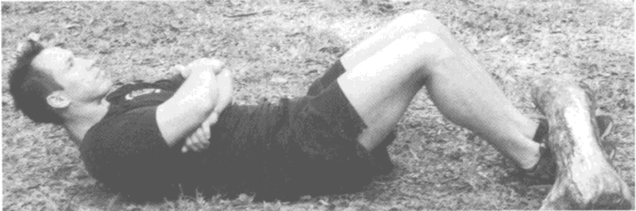
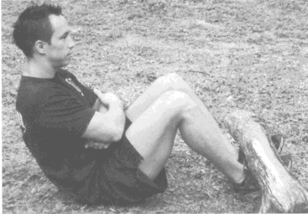

## 无器械健身：用自身体重锻炼

本书提供了一种方法，让你可以在任何时间、任何地点进行独自锻炼。

这套训练方法，节省时间且有效。

127 个训练系统。

本书认为力量训练有效，有氧运动不太有效。即本书认为力量训练应为核心项目。但有氧运动也并非一无是处，其适合在提高某种特定运动项目的熟练度时使用。

### 目标：结实、强壮、自信

这是个抽象的目标。对于每个健身的人来说，这个目标不够具体。

这里提供一个具体的目标样例：

- 俯卧撑：50 个
- 深蹲：100 个
- ...

### 术语

- 间隔力量训练：做一定时间的高强度练习后休息一定时间，如此反复进行就是间隔训练。

### 体能

本书的训练计划旨在全面发展各项身体素质：

- 肌肉力量：在一个给定距离上施加力的能力，可以通过完成的动作的难度来测定。
- 爆发力：在给定时间内施加的力。
- 肌肉耐力：持续施加一定大小的力的时间长短。
- 心肺耐力：在长时间运动中，身体给肌肉提供氧气的能力。
- 速度：快速做一系列动作的能力。
- 协调性：把几个动作组合为一个复杂动作的能力。
- 平衡能力：控制身体重心的能力。
- 柔韧性：动作幅度。

这几项应是我们训练的关注点。

### 营养

- 吃得健康并不意味着吃得可怜，健康的饮食应当使你感到愉悦，而不是痛苦。
- 观点：多餐少食。

### 锻炼方法
推理、拉力、核心区、腿部。

- 肩部（8~12 组）
- 肱三头肌（6~9 组）
- 胸部（8~12 组）
- 背部（8~12 组）
- 肱二头肌和前臂（6~9 组）
- 核心区（6~9 组）
- 大腿（8~12 组）
- 小腿（8~12 组）

### 原则

- 让你的肌肉保持新鲜感就是让它们持续增长的办法。
- 我们最终明白，无论我们感到多么疲惫、僵硬和没精神，只要再次经过热身，我们其实都没问题。
- 全身心投入是要义所在，投入等于成功。

---

- 健身的成功也必将使你在生活其他方面也获得成功，工作和娱乐都将如此。
- 变化乃是生活的情趣。
- 一个成功的团队是由那些能够为团体的目标而将个人利益置于一边的人组成的。
- 成功在于你——只是你——把一切与你的目标不符的东西都放下。

### 练习

- 推力练习：俯卧撑
- 拉力练习：引体向上
- 腿部和臀部练习：深蹲
- 核心区练习：卷腹
  - 

### 训练计划