## 解析极限编程：拥抱变化（原书第 2 版）

### 第 1 章 极限编程定义

极限编程（Extreme Programming，XP）和社会性的变革（social change）相关。过去适用的一些习惯和模式在今天可能会妨碍我们做到最好，XP 要求我们放弃这些习惯和模式，放弃那些妨碍生产率但保护我们自己的防御行为。虽然这可能会使我们感觉到自己失去了掩蔽。

XP 要求我们坦诚自己有能力做什么，然后去做这些能力所及的事情。同时允许并希望其他人也这样做。放弃我们不成熟的自负——“我比其他人都懂得多，我需要的就是让我独立行事，成为最棒的。” XP 要求我们在更大的范围内，在包括商业/工作领域的团体中找到我们正确的位置；XP 是关于每个人是如何成为最好的自己，如何成为自己所能成为的最好的开发者的过程。XP 探讨了如何才能写出伟大的、对业务真正有益的代码。

好的合作关系是做好事情的保证。除了编码和其他活动，我们在工作场所的人际关系也会影响到生产率和自信心。成功既需要技术又需要好的合作关系，极限编程致力于同时解决这两个问题。

为成功做好准备。不要因为踌躇退缩而与成功失之交臂。尽力而为，然后处理其结果，这就是极限（Extreme）的含义。暴露自己，对有些人来说，这不可思议，而对其他人却习以为常。这就是为什么人们对极限编程的反应会两极分化。

XP 是一种软件开发的风格，专注于编程技术、清晰沟通还有团队协作的精彩实践，这些将帮助我们完成以前几乎不可想象的事情。XP 包括：

- 一种软件开发的哲学，基于沟通、反馈、简约、勇气和尊重的价值观。
- 一整套被证明在软件开发中有用的实践。这些实践相辅相成，相互增强。我们将它们作为以上价值观的表达形式。
- 一系列用来将以上价值观投入实践的、辅助的原则和智能技术。当缺乏对应你的独特难题的现成实践时，它会起作用。
- 一个共享这些价值观和实践的社区。

XP 是一条可以使得一起开发软件的人们共同进步直至卓越的途径。它和其他方法的区别有：

- 开发周期短，提供及早的、具体的、持续的反馈。
- 增量计划方法。迅速地提出一个总体计划，并在项目生命周期中不断演化。
- 能够灵活安排功能的实现，以对变化的业务需求做出反应。
- 使用由程序员、客户和测试人员编写的自动测试来监控开发进度，支持系统的演化，并尽早发现缺陷。
- 通过口头沟通、测试和源代码沟通系统结构和意图。
- 演化的设计过程贯穿整个系统生命周期。
- 依赖于能力普通但能积极参与的程序员之间的紧密协作。
- 各种实践兼顾项目成员的短期直觉以及项目的长期利益。

《解析极限编程：拥抱变化（Extreme Programming Explained：Embrace Change）》第 1 版中对 XP 有一个清楚的定义：“XP 是一种轻量级方法论，适用于中小规模团队在开发软件过程中面对模糊或者快速变化的需求的时候。” 这个定义介绍了 XP 的起源和目的，但它并不完整。第 1 版出版五年来，XP 比初始定义增加了很多内容。现在，XP 可以表述为：

- 在 XP 中你只需要做能够为客户创造价值的事情，带着很多包袱是不可能快速前进的。但同时，没有什么软件过程是一成不变的，成为一个杰出的开发团队，需要大量的技术知识，并且需要不断学习新的知识。
- XP 是一种方法论，它建立于解决软件开发方法中的约束之上。它不解决项目投资管理、财务、执行、市场和销售的问题。XP 在所有这些领域都有潜在作用，但并不直接解决这些领域中的问题。方法论常常解释为“一组用来确保成功的规则。”方法论不像程序那样工作，人也不是计算机。不同的团队应用 XP 是不同的，成功程度也各不相同。
- XP 对任何规模的团队都起作用。5 年前，我不想宣称太多。那以后，其他人已经在很多项目中应用了 XP，在大规模和小规模的项目和团队中都取得了成功。XP 背后的价值观和原则在任何尺度都是可行的，其实践则需要在人员增加后做相应的增强或改变。
- XP 适合模糊或者快速变化的需求。幸运的是，XP 现在仍然适合这种情形，因为需求需要改变来适应现代商业世界中的快速变迁。然而，很多团队同样已经在需求不太变化的情形（比如项目移植）中应用 XP 并取得了成功。

XP 是我在自己的软件开发实践中协调人性和生产率并共享这个协调的一个尝试。我已经开始注意到，我越是有人情味地对待自己和别人，我们大家的生产率就越高。成功的关键不在于自我禁欲，而在于承认我们是人，我们生活在人与人之间交往的环境中。

技术同样重要。我们是工作于技术领域的技术人员。工作方式有好坏之分，对卓越技术的追求在开发型组织中是非常重要的。技术支持信任关系的建立。如果你能准确地评估你的工作，第一时间提交有质量的工作，建立快速的反馈循环，你就能成为一个可以信赖的搭档。XP 需要参与者学会高层次的技术，为团队的目标服务。

XP 意味着放弃过去的工作习惯而采用适合现实的新方法。我们过去的习惯、态度和价值观曾经有效，但可能不是我们在当前环境下团队软件开发的最好选择。良好的、安全的社会交往和优秀的技术技能对成功的 XP 开发都是必不可少的。

一个例子是“不设防才是真正的安全”的观念。隐瞒一些事情来保持安全的旧习惯并不能真正起作用。隐瞒 20% 工作量并不能保护我，当项目失败的时候，没有尽全力的事实并不会真的让我感觉好一点，也无法消除不能让项目运作所带来的失败感。如果我尽了全力写程序而人们不喜欢，我仍然可以自我感觉很好，因为我尽力了。这种态度才让我感到安全，不管在什么环境下。如果我感觉如何的基础在于我是否尽力，我就能够通过尽全力而使自己感觉良好。

XP 团队竭尽全力去取胜而且勇于承担后果。如果自尊没有跟项目联系起来，在任何情况下我们都会尽全力做到最好。在 XP 中我们不为失败做准备。在人际关系上保持一点距离、通过偷懒或加班来隐瞒工作量、拖延反馈导致又一次责任扩散，所有这些行为在 XP 团队中都没有存在的空间。

你可能有足够的时间、资金或团队技能，也可能没有。但不论如何，如果你认为自己将会有足够的资源，在这种状态下就会有最好的表现。人类学家 Colin Turnbull 在《山里人（The Mountain People）》和《丛林中的人们（The Forest People）》两书中对这种“满足心理”有动人的描述。他对比了两种社会：资源紧张而导致的撒谎者、欺骗害人者的部落和资源富足产生的协作互爱的部落。我经常问处于窘境中的开发人员一个问题：“如果有足够的时间，你会怎么做？”即使受到某些条件的约束，你也可以做到最好。对这些约束的过分忧虑会使你偏离目标。不论这些约束是什么，你自己都可以做到最好。

如果你有 6 周时间去完成一个项目，你唯一能够控制的是你自己的行为。你会完成 6 周的活还是少干一点呢？你不能控制别人的期望，但你可以告诉他们你所知道的关于项目的所有事情，这样他们的期望才有跟现实匹配的可能性。当我知道了这一点，我对最后期限的恐惧就消失了。“管理”其他人的期望不是我的工作，而是他们自己需要操心的，我要做的就是尽可能沟通清楚。

XP 是一个致力于解决软件开发过程中所有层次上的风险的软件开发科学。同时 XP 也高效产出高质量的软件，并且在 XP 的执行中也有许多乐趣。那么，XP 如何解决开发过程中的风险呢？

- 进度延迟——XP 提倡短发布周期。一个发布周期最多几个月，这样，任何延迟的范围都是有限的。在一个发布周期内，XP 使用客户要求的功能的每周迭代来形成关于进度的详细反馈。在一个迭代内，XP 计划许多小的任务以保证团队可以在该周期内解决问题。最后，XP 还提倡优先实现高优先级的功能，这样可以保证在发布版本中错过的功能的价值比较低。
- 项目取消——XP 中的小发布必须是满足最大商业意义的部分，这些功能的选择工作由团队中面向商业的成员来承担。这样，在部署之前出错的可能就会较少，同时也保证了软件的价值最大。
- 系统恶化——XP 中创建并维护一整套自动测试，每次系统发生改变后都要运行（一天好几次）这些测试，以确保质量基线。XP 总是保证系统处于可部署的状态，而不允许出现问题的积累。
- 缺陷率——XP 中既包括了程序员书写的每个函数（function）的测试，也包括了客户书写的对每个程序特性（program-feature）的测试。
- 业务误解——XP 提倡业务人员成为团队成员。项目规约（specification）在开发过程中不断改进，因此客户和团队的知识都能反映在软件中。
- 业务变更——XP 缩短了发布周期，因此在一个单独的发布周期中几乎没什么变化。在一个发布周期中，客户可以随意用新的功能替代没有完成的功能。开发团队甚至不会注意到他们是在开发一个新发现的功能还是几年前就定义的特性。
- 错误特性太多——XP 坚持只解决最高优先级的任务。
- 人员流动——XP 要求程序员估算自己工作所需时间并完成工作。同时 XP 也将这些工作的实际完成时间反馈给程序员，帮助他们改善估算的准确性，从而使估算的结果得到尊重。在 XP 中，谁能做出估算，谁能改变估算都很清楚，因此程序员几乎不会因为被要求去完成明显不可能完成的任务而感到沮丧。XP 同样鼓励团队中的相互沟通，来减少孤独感，因为这常常是工作不满的主要原因。最后，XP 中有一个关于人员流动的清晰模型。鼓励新成员逐渐承担越来越多的责任，新成员之间互相帮助，同时老成员也为新成员提供帮助。

XP 假设你把自己看成团队的一部分，一个具有清晰目标和执行计划的理想个体。XP 假设你想与别人一起工作。XP 假设可以经济地应付变化。XP 假设你希望成长、改善自己的技能，改善人际关系。XP 假设你愿意做出改变来达成这些目标。

现在我准备回答本章提出的问题：什么是 XP？

- XP 是放弃旧的、低效的技术和习惯而采用新的有效的技术和习惯。
- XP 是因为你今天的竭尽全力而充分欣赏自己。
- XP 是努力在明天做得更好。
- XP 是要你按照对团队共同目标做出的贡献来评价自己。
- XP 是让你的一些人性需求在软件开发中得到满足。

本书的其余部分探讨了实现这些改变需要做的事情，从个人和经济角度思考了为什么它们会起作用。本书分为两部分。第一部分是实践，描述了从事和思考软件开发的一种方式，这种方式假设并满足人性需要，包括对人际关系的需要。第二部分涵盖了 XP 的哲学和历史根源并将 XP 放在今天的时代背景下。

阅读本书以及应用 XP 有许多种方式，就像在大热天进入一个清凉的水池一样，你可以小心翼翼地入水，也可以沿台阶稳步走下去，还可以像炮弹一样冲下去，或者像跳水比赛那样跳下去。总之，它们都达到了入水这个目的。你的选择也许基于风格、速度、效率或者恐惧。只有你能决定哪个是适合你的。我希望在阅读和应用这本书时，你能逐渐深入理解为什么你会参与软件开发以及如何从这个工作中找到成就感。

### 第 2 章 学习开车

我清楚地记得我第一次学开车的情形。我和母亲在靠近加利福尼亚州 Chico 的 5 号州际公路上行驶，高速公路笔直而平摊，一直延伸到天边。妈妈要我从副驾驶座位上探身过来抓住方向盘。她先让我感觉方向盘的运动如何影响汽车的方向。然后告诉我：“这样来开：让汽车沿着车道的中线跑，一直向前。”

我非常小心地斜眼盯着延伸的公路。我把车正好保持在车道中间，笔直地指向公路中间。我干的很棒。然后我有点心不在焉了……

当汽车压到路边的石头上我才回过神来。妈妈（现在看来她当时的大胆真令我吃惊）逐渐将汽车开回到正路上。我的心扑通扑通地跳。然后她才真正教我开车。“开车并不是简单地把车开对方向。开车是要保持注意力集中，这样调整一下，再那样调整一下。”

这正是 XP 的范式（paradigm）：保持清醒、适应、变化。

软件中的所有东西都在变。需求在变，设计在变，业务在变，技术在变，团队在变，团队成员也在变。问题不在于变化，因为变化总是要发生；问题在于我们没有应对变化的能力。

开车这个隐喻应用于 XP 时有两个层次，客户驱动系统的内容，团队则驱动开发的过程。XP 让你通过不断的、小的纠正来适应，通过短周期的部署软件来朝着目标前进，这样你就不会过很长时间才发现自己走错了方向。

客户驱动系统的内容。客户（内部或外部的）从系统需要解决什么问题的概要想法开始。但是，客户通常不会清楚地知道软件应该做成什么样子。这就是为什么软件开发与开车相似，不是让车笔直地沿着道路前进。团队的客户，当他们周复一周地决定软件接下来应该走向何方时，需要谨记他们应该朝地平线的哪儿前进。

每个团队表达他们价值观的形式都会因地点、时间、团队的不同而不同。如客户驱动着系统的内容，整个团队从当前的一组实践开始，驱动着开发的过程。随着开发的继续，团队将会意识到哪些实践需要加强，哪些实践偏离了目标。每项实践都是一个改进效率、沟通、自信心和生产率的试验。

### 第 3 章 价值观、原则和实践

准确地交流一种关于思考和进行软件开发的新方式需要什么？你可以迅速地从书本上学习到园艺的基本技术，但是那并不能使你成为园艺师。我的朋友 Paul 是杰出的园艺师。我会掘土、种植、灌溉和除草，但我却不是一个好的园艺师。

我们之间的差异是什么呢？首先，Paul 知道的技术比我多，并且就我们共同知道的技术来说，他也比我更擅长。技术是要紧的，因为如果你不掘土和种植东西，那你肯定不是在搞园艺。我们将知识和理解的这个层次称为实践（Practice），实践就是你实际上做的事情。实践是你天天都做的事。对实践进行详细描述是有用的，因为它们是明确和客观的。你可以在修改代码前编写测试，也可以不这么做。实践的另一个用处在于它们给了你一个起点：你会在修改代码前编写测试，并从中获益，哪怕你还远没有在更深层次上理解软件开发。

即使我懂得了 Paul 所知晓的全部园艺技术，我还不能算是一个园艺师。在园艺方面什么是好的什么是差的，Paul 有着高度发达的判断力。他看一眼整个花园心里就知道哪儿是好的，哪儿不对。我可能自豪于正确剪枝的能力，Paul 却可能认识到整棵树都应该除掉。他看到这一点并不是因为他比我更擅长修剪，而是因为他对于花园中有用的东西有一个整体概念。我必须学习那些对他而言简单明了的东西。

价值观是知识和理解的另一个层次。价值观是在某种处境中我们喜欢或不喜欢某事的根源。当一个程序员说“我不想估算我的任务”，通常这和技术无关。事实上他已经做出了估算，只是不想暴露他的真实想法，他担心提供了一个判断的基准点，以后会对自己不利，因此，最好给出一个 3 倍的估算！这件事情揭露了一些深层次的问题，关于这个程序员是如何看待开发中的社会性力量（social forces）的问题。原因也许是过去他曾受到不公正的指责。在这种情形下，对这个程序员而言，保护的价值要胜过沟通。价值观是用于评价我们所见、所想和所做的一大标准。

将价值观显式化很重要，因为没有价值观，实践很快会变成生搬硬套，为行动而行动，缺乏目的或方向。当我听说一个程序员摆脱了某个缺陷，我听到的是价值观的失败，而不是技术的失败。缺陷本身可能只是技术失败，但是不愿从缺陷中吸取教训则表示这个程序员实际上没有重视学习和自我改进。对程序、组织和程序员本人来说，这样都无法从缺陷中得到最大的收益。从根源上分析，价值观与实践的结合意味着程序员有充分的理由会选择高效率地执行一个实践。价值观让实践有的放矢。

实践是价值观的表现。价值观是在一个高层次上的表达，因此我能够以价值观的名义做任何事。“因为我重视沟通，所以写了这份 1000 页的文档”，也许是这么回事，也许不是。如果每天一次 15 分钟的交谈比写这份文档更有效的话，那么文档就不能说明我重视沟通，以最有效的方式交流才能说明我重视沟通。

实践是清楚明确的。每个人都能知道我是否参加了早上的站立式会议。我是否真正重视沟通并不是那么明确和具体的，但我是否在进行加强沟通的实践却是具体的；正如价值观让实践有的放矢，实践使价值观变得具体可见。

价值观和实践是大洋的两岸。价值观是普世的。理想的情况下，我工作中的价值观同我生活中其他时候的价值观一样。然而，实践却有非常强的情景性。如果我想得到自己编程好坏的反馈，可以进行持续的构建和测试；如果我在换尿布时想得到反馈，“持续的构建和测试”则是荒谬的。这两件事所涉及的外力是截然不同的。为了获得换尿布的反馈，我不得不在换完后将婴儿抱起来，看看尿布是否会掉下来，我不可能半道儿测试。在编程和换尿布这两种活动中，“反馈”的价值观是以完全不同的形式表现出来的。

在价值观与实践之间架起桥梁的是原则。原则是生活中具体领域的指导方针。作为一名园艺师，Paul 在原则层次上的知识也是超过我的。我也许仅仅知道在草莓边上种植万寿菊，Paul 却知道栽法可以使彼此毗邻的植物相互弥补自己弱点的原则。万寿菊天生克制吃草莓的虫子。将它们种植在一起是一种实践，伴栽法就是原则。在本书中我将介绍 XP 的价值观、原则和实践。

这些就是我想在这本书中和你们交流的。本书是一个起点，但要想掌握 XP 这还不够。再全面的园艺书也没法使你成为园艺师。首先你必须进行园艺，其次要加入园艺者们的团队，并且教别人园艺。那时你就是园艺师了。

XP 也是这样。阅读本书并不能使你成为一个极限程序员。要成为极限程序员必须以极限风格编程，参与到分享这些价值观并且至少部分实践的团队中，然后与他人分享你所知道的。

你将会从学习和尝试 XP 中受益。不管你的价值观怎样或者你的其他实践是什么，学会在编码前编写测试都是有益的。但是，那跟极限编程还是有很大不同的，就像我的园艺工作跟专业园艺工作之间的区别一样。

### 第 4 章 价值观

Paul，那个杰出的园艺师，他对下一步需要做什么有一种直觉。他清楚地知道什么要紧、什么不要紧。我兴许认为完美笔直的排列是真正重要的，从而在上面花费很多功夫，这时 Paul 走过来说：“你为什么要在笔直排列上费这么多精力？你需要的是施更多的肥。”我所认为有价值的，跟实际上真正有价值的之间存在差别，这导致了浪费。

每个接触软件开发的人都对什么是要紧的事情有判断力。一个人可能认为最要紧的是在实现前对所有可能的设计决定进行仔细的思考，而另外一个人可能认为最要紧的是对他本人的自由不要有任何限制。

就如 Will Rogers 所说的那样：“不是你未知的东西导致你陷入困境，而是你已知的东西并不正确”。就我遇到的情况，对于软件开发“刚刚入门”的人们而言，最大的问题在于：他们专注于个体的行为。实际上相对于个体行为作为团队的一分子而言，个体行为并不那么重要。

例如，人们对编码风格充满热情。毫无疑问编码风格有好坏之分，但最重要的问题是一个团队要选择共同的风格工作。特殊的编码风格往往揭示了这样的价值观：不惜任何代价的个体自由。这些是不能帮助团队取得成功的。

如果每个人都关注什么对团队才是重要的，那么他们应该关注的是什么？XP 中包含了 5 个指导开发的价值观：沟通、简单、反馈、勇气和尊重。

#### 沟通

在团队软件开发中最要紧的是沟通。每当开发中出现问题的时候，通常已经有人知道了解决方案，但有权做出改变的人却不知道。当忽视自己直觉的时候，即使是我一个人也会出现这种问题。人们之间的沟通的情况则更加复杂。

有时候是知识而不是沟通的缺乏导致问题的出现。因为你不知道，所以不能预先为这些问题做任何准备。“Ctrl-Shift-S 热键已经用于加亮窗口。谁会想到？”一旦你发现了一个令人惊异的问题，沟通会帮助你解决它。你可以向过去碰到过类似问题的人打听。你们可以作为一个团队讨论如何避免问题的再次发生。

大家坐在一起关注问题和共享讨论，但是没有人付诸行动，或许这听起来像一个永久性的茶话会。团队还要坚持一些其他价值观以保证这种情况不会发生。但是，没有沟通的行动是不会进步的。

每当你遇到一个问题，首先问自己这个问题是不是由于缺乏沟通引起的，你需要什么样的沟通来解决该问题？需要什么样的沟通来使你以后避免这样的麻烦？

沟通对于创造团队意识和高效合作意识是很重要的。虽然沟通并不能给予你高效软件开发所需要的全部。

#### 简单

简单是 XP 价值观中智力色彩最强烈的。构造一个优雅地解决今天问题同时又足够简单的系统是很难的。昨天的简单解决方案在今天看来可能仍然不错，但也可能过于简单了，或者太复杂了。当你需要做出改变，以重新获得简单性时，你必须找到一条从你当前位置到目的地的路径。

我请人们思考这样一个问题：什么是最简单而又可能有效的？批评家通常会忽略了这个问题的后半部分：“嗯，我们的系统不能简化，因为它有严重的安全和可靠性约束。”我并不是邀你思考过于简单而无效的东西，只是要求调整你的思想以消除多余的复杂部分。如果安全上的考虑导致本来只需使用一个处理器就可以解决的问题必须分成两个处理器来解决的话，那么对我而言，结果仍然可以是简单的。更好的解决方案仅仅在于你能否找到一种在单个处理器上处理安全问题的方法。

简单的意义与具体的环境相关。如果我正在和一个懂得解析器生成器的团队一起编写解析器，那么使用解析器生成器就是简单的。如果团队中没有人知道如何解析，并且要解析的语言也很简单的话，使用自顶向下的递归解析将会更简单。

价值观之间是相互平衡和相互支持的。加强沟通能够去除那些不需要的或者可暂缓的需求，从而达到简单化。同时，力求简单化会使你大大减少沟通的内容。

#### 反馈

没有哪个固定方向是长久有效的，不论我们在谈论软件开发细节、系统需求还是系统架构。超越经验而确定出来的方向，它的半衰期尤其短。变化是不可能避免的，变化产生了对反馈的需要。

我还记得我在丹麦奥尔胡斯市的一次全天讲座。随着讲座的进行，一个前排的观众脸色越来越阴沉。最后，他终于忍受不了了。“从一开始就选择正确的做法，不是更容易嘛？”——当然可以，除了三件事情：

- 我们可能不知道“正确”的做法是什么。如果我们正在解决一个全新的问题，也许有几种有效的解决方案，也许根本没有明确的解决方案。
- 今天正确的东西明天可能就是错误的。在我们控制之外的或没有能力预测的变化很容易就会使昨天的决定失效。
- 今天按照“正确”的做法去做每一件事，可能需要太长时间，以至于还没有完成之前，明天环境的变化就使之失效了。

我们不断改进，并不期望可以马上做到完美，我们使用反馈来一步步地接近我们的目标。反馈有很多种形式：

- 你和你队友关于某个想法的观点；
- 当你实现一个想法时，代码会是什么样的；
- 测试是否容易编写；
- 测试能否运行；
- 一旦该想法被部署，它运转的如何。

XP 团队致力于在尽可能快的情况下产生尽可能多的反馈。尽量将反馈的周期缩短为分钟或小时，而不是星期或月。知道的越早，你就可以调整得越早。

可能会出现太多反馈。如果团队正在忽略重要的反馈，则需要暂缓下来（这可能会让人失去信心），直到响应了重要的反馈，团队才可以处理那些导致过多反馈的潜在问题。例如，试想你在将要发布季度版本时突然发现很多缺陷报告，多得以至于在发布前你都处理不完；此时应该暂缓版本发布直到你处理完所有的缺陷报告并开发新功能。用这段时间来搞清楚为什么会出现如此多的缺陷或为什么每个缺陷都要花费这么长时间。一旦这个基本的问题得到了解决，就可以开始重新按季度发布并加快反馈机制了。

反馈是沟通的关键部分。“性能会成为一个问题吗？”“我不知道，让我们写一个小的性能原型看看。”反馈同样有益于简单。三种解决方案中谁将是最简单的？都尝试一遍就会明白了。虽然将同一件事情重复三遍看起来有些浪费，但这也许是获得足够简单的解决方案最有效的途径。同时，系统越简单，获取它的反馈就越容易。

#### 勇气

勇气是面对恐惧的有效行动。有些人反对使用“勇气”这个词，因为它是保留给正在穿越黑暗之门的那些巡逻士兵的。我不是要抹杀士兵身上展现出来的这种自然的勇气，但软件开发中的人们同样也会感到畏惧。他们面对恐惧时的处理方法显示了他们是否是一个团队的有效组成部分。

有时候勇气表现为对某种行动的偏爱。如果你知道问题是什么，那你就去做吧。有时勇气表现为耐心。如果你知道有问题存在但不知道问题是什么，则需要勇气来等待真正问题的明显出现。

如果没有其它价值观的平衡，勇气会是危险的。不顾后果地盲目行事不是高效的团队合作方式。恐惧的时候，我们需要鼓励团队，并根据其他价值观来指导下一步的行动。

仅仅只有勇气是危险的，与其他价值观相呼应的勇气才是有力的。表达愉快或不愉快真相的勇气会有助于沟通和信任的建立；放弃失败的解决方案和寻求新方案的勇气会有助于鼓励对“简单”这一价值观的追求；寻求真实具体答案的勇气会有助于增加反馈。

#### 尊重

前面提到的 4 个价值观指向处于它们背后更深刻的另一个价值观：尊重。如果团队成员不关心彼此，也不理会别人所做的事情，XP 是无用的。如果团队的成员不关心项目，那么这个项目就没救了。

受软件开发影响的每个人，都有其作为人的价值观。不会有某个人本质上比其他人更有价值。所以要同时提高软件开发的人性和生产率，每个人对团队的贡献都应该得到尊重。我是重要的，你也是。

#### 其他

沟通、简单、反馈、勇气和尊重，这些不是高效软件开发所必需的价值观。但它们驱动着 XP。你的组织、团队和你自己可能会选择其他的价值观，但最重要的是要根据团队的价值观矫正团队的行为。如果你这么做，你将会把因为同时维持众多价值观而产生的浪费降至最低。

其他重要的价值观包括：安全、保密、可预测性和生活品质。坚持这些价值观会采用与 XP 价值观不同的方式修正你的实践。

价值观并不提供在软件开发中需要做什么的具体建议。由于价值观和实践之间的距离，我们需要在它们之间架起一座桥梁。而原则这个工具正是我们所需要的。在跳到实践之前，下一章会介绍 XP 中的原则，它是一组领域特定的、用于搜寻与 XP 价值观相协调的实践的指南。

### 第 5 章 原则

价值观太抽象了，不能直接用来指导行动。长篇文档是用来交流的，日常谈话也是。哪种最有效？答案取决于所处的环境和理性的原则。在这个例子中，按照人性化原则，谈话符合人们联络的基本需求，所以是首选的沟通方式，其它事情也是同样（依据环境和原则进行选择）。文字沟通本质上更为浪费。虽然它可以拥有更广泛的观众，但它是单向的交流方式。谈话可以支持澄清事实、立即反馈、头脑风暴，以及其他文档无法做到的事情。文字交流要么被作为事实接受，要么被完全抛弃；这两种情况都无法增强交流。

这里列出的原则并没有包括指导软件开发的所有可能的原则。例如，开发安全关键系统（safety-critical system）时应遵循可回溯性原则。任何时候都应该可以从已做的工作回溯到用户已清楚表达的需求上。任何工作都不能只为了它自身而进行。另外，可回溯性原则对系统取得认证也很重要。但它并不适用于所有软件，因此我没有在此处列出。其他原则也可以引导你的团队实践，只不过这里列出的是指导 XP 的原则。

#### 人性化

人性化是人在开发软件，这个不能回避的简单事实让对方法论的绝大多数建议变得无效。软件开发通常并不符合人的需求，也没有承认人性的弱点和平衡人的力量。如果忽视软件是由“人”编写的，参与者会付出高昂的代价，非人性化的过程不承认参与者的需求，这会磨掉他们的人性。同时这对业务也没什么好处：会因为人员更替带来不必要的成本和断层，也失去了创新的机会。

成为一名优秀的开发者需要什么？

- 基本安全：没有饥饿、身体伤害和对所爱的人的威胁。害怕失去工作会导致这个需求受到威胁。
- 成就感：为社会做贡献的机会和能力。
- 归属感：参与团队并从中得到认可、责任和为共同目标做贡献的机会。
- 成长：拓展自己的能力和前途的机会。
- 亲切感：与团队其他成员之间的高度理解和被理解的能力。

我与 XP 选择这些实践是因为它们满足商业和个人的需求。其实还有其他的人性化需求，例如休息、锻炼和社会化，但这些并不需要在工作环境中得到满足。团队工作之外的时间可以给每个成员更多的活力和视野，并在工作时间把它们带回给团队。限制工作时间就是为了给其他人性化需求挪出时间，从而提高每个成员在团队工作时的贡献。

团队软件开发的部分挑战来自于如何平衡个人和团队的需求。团队的需求可能与你个人的长远目标相符，所以一些牺牲也是值得的。但总是牺牲个人的需求来满足团队的需求是不可取的。如果我需要私人空间，那么我就需要寻找一种既能满足自己的需求同时又不伤害团队利益的途径。伟大团队的魔力就在于，在团队成员间建立相互信任之后，他们发现合作工作的结果是导致每个人都可以更加自我。

虽然亲密的感觉很不错，但工作还是工作。私人生活中的细节会搞乱团队的沟通。我曾同一个团队交谈过，这个团队中有一个成员，一旦他在团队中感觉良好的时候就要在每天早上和别人谈论自己私人生活的细节。没有任何一个人在听到他的私人生活时会感到舒适，但又不知道如何提醒他。最后，团队的高层成员找他单独谈话并要求他不要在公开场合谈论隐私。

我尽量区分我的生活：隐私的事情只同我的爱人谈论，个人的事情只同我信任的人谈论，公开的事情则可以同任何人谈论。要区分出哪件事属于哪类并不是一件简单的事，同样要分出谁可信任也不是件简单的事。但是，当这种划分运转良好时会带来以下回报：工作上的高效沟通以及生活中各个方面的有价值的人际关系。

#### 经济学

必须有人为所有的这些买单。不考虑经济学的软件开发会有导致空洞单纯的“技术性成功”的危险。要确定你正在做的东西有商业价值，符合商业目标和商业需求。例如，首先解决最高优先级的业务需求会使项目的价值最大化。

经济学上影响软件开发的两个方面分别是：金钱的时间价值，系统和团队可供选用的价值。金钱的时间价值指的是，今天的 1 美元比明天的 1 美元更值钱。提前挣钱和推迟花钱都会提高软件开发的价值。明确的增量设计能将设计投资推迟到最后不得不花钱的时候。“依用付费”（pay-per-use）提供了这样的途径：每次新的功能一部署就可以得到相应的收入。

软件开发的另外一个经济学价值来源于可供未来选用的价值。如果我能在各种调度任务中再次部署我的媒体调度程序，那么它将会比仅用于原来的实现目的更有价值。所有的实践都是为了增加软件和团队中可供选用的价值，同时应谨记金钱的时间价值，不在没把握的地方投资。

#### 互惠互利

每项活动都应使所有与其相关的活动获益。互惠互利是 XP 中最重要的原则，也是最难坚持的原则。任何一个问题总是有让某人付出代价而其他人获益的解决方案。在绝望的环境下，这些解决方案似乎很诱人。但是这么做一定是净亏的，因为产生的病态意愿破坏了我们需要重视的人际关系。计算机业务其实是人的业务，维护工作关系是很重要的。

大量的内部软件文档是违反互惠互利原则的实践范例。（有些人认为）我应该放慢开发速度，以使得在潜在的将来，未知的某些人在维护这些代码时可以容易一些。如果这些文档将来仍然有效的话，可能会让将来的人们获益，但现在对我们并没有好处。

XP 通过互惠互利的方式来解决“与未来交流”的问题：

- 今天我撰写了能帮助我更好地设计和实现的自动化测试，这些测试同样可以保留给以后的程序员使用。这项实践让现在的我获益，也让以后的维护者获益。
- 我非常谨慎地重构以消除那些偶然导致的复杂性，这既给我带来了满足感和更少的缺陷，也让后来者能更容易地理解他们碰到的代码。
- 我会从清楚且一致的隐喻集中选择名称，这些名称能加速我的开发，也使得留给新程序员的代码更清晰。

如果你想要人们接受你的意见，那你就应该解决更多问题，而不是制造更多问题。XP 的互惠互利原则寻找这样的实践，它使现在的我、以后的我和我的客户都能获益。三赢的实践更容易被执行，因为它们能减轻一些眼前的痛苦。例如，某个被顽固缺陷纠缠的人就很乐于学习测试先行编程的方法。一旦现在能使我获益，那么为帮助现在或将来的其他人做点事情就更容易被接受。

#### 自相似性

有一天我漫步在撒丁岛海岸，看见了一个小的潮汐池，大概两英尺宽，如下图所示。我抬头看时，注意到我正在漫步的海湾，大概有一英里宽，有着大致相同的形状。“多好的一个地质学不规则本质的示例啊”，我暗自思量。这幅图描绘的是实际上是整个撒丁岛西北角。当大自然找到一个有用的形状，它会在能使用的地方到处使用。

这个原则同样适用于软件开发：试着将一个解决方案的结构复制到一个新环境中，即使它们的粒度不同。例如，开发的基本节奏是，写一个不能通过的测试，然后让它运转。这种节奏可运行于不同的粒度。一个季度的时间，你可以列出想要解决的主题，然后通过故事（story）来解决。一个星期的时间，你可以列出想要解决的故事，编写表达这些故事的测试，然后使它们运转。几个小时的时间，你可以列出需要写的测试，然后编写测试，使它运转，然后编写另一个测试，使它们同时运转，直到所有列出的测试都做完。

在软件开发中，自相似性不是仅有的起作用的原则。在一个环境中起作用的结构并不意味着它在另外一个环境中也能起作用。可是，它是一个不错的起点。同样地，仅仅因为一个解决方案是独特的（不适用于别的环境），并不意味着它就不好。可能这种环境就是需要一个独特的方案。

在本书第 1 版中，我那以星期为周期的建议更像瀑布：写些代码，然后测试以保证它能运行。我本该注意到自相似性。在开始实现前书写系统级测试能简化设计、减轻压力并增加反馈。

#### 改进

在软件开发中，“完美”是个动词，而非形容词。完美的过程是不存在的，完美的设计是不存在的，完美的故事也是不存在的。但是，你能使你的过程、设计和故事更加完美。

“‘最好’是‘足够好’的敌人”，这表明了庸才才更喜欢等待。这句话未理解 XP 的要点：软件开发的卓越是通过改进达到的。这个循环就是：做到你今天所能做的最好，为了明天能做得更好所必需的理解而努力。这不意味着需要等到完美才开始做。

把价值观转化为实践时，改进原则表示为实践就是：马上开始行动，随着时间的推移逐步精化结果。根据经验改进长期计划，这个可能性通过季度周期这一实践得到表现。增量式设计通过精化系统设计来贯彻改进原则。实际的设计永远不可能是理想设计的完美映象，但你可以通过每天的努力来使这二者接近。

软件开发技术的历史就是逐步减少浪费的人力的历史。例如，汇编符号消除了将机器指令翻译成物理位编码这种烦闷工作的浪费；然后“自动编程”消除了将程序的抽象描述翻译成汇编语言这种烦闷工作的浪费；诸如此类，直到存储单元的自动分配。

虽然改良的科技消除了浪费，但开发组织的社会结构增长的僵化和专业分工却在增加浪费。改进的关键之处在于使这二者协调：使用新的技术让更有效率的新的社会关系成为可能。要在工作中改进，而不是等待完美。找一个起点，开始，然后改进。

#### 多样性

如果一个团队的成员都很相似，那么这个团队虽然舒适但效率不高。团队需要将不同的技能、态度以及看待问题和缺陷的视角整合在一起，来考虑解决问题和实现解决方案的不同方法。也就是说，团队需要多样性。

多样性不可避免地伴随着冲突。冲突不是“我们彼此痛恨，我们不能取得进展”的意思，而是“解决这样的事情有两种方法”。你将如何选择？

一个设计有两种想法，代表的是机会，而不是问题。多样性原则表示，程序员应该共同致力于问题的解决，两个观点都应该得到重视。

如果团队不善于解决冲突怎么办？每个团队都有冲突。问题在于他们是否已经合理地解决了冲突。在压力巨大时，尊重他人，保持自我，可以使沟通顺畅。

在各种不同技能和视角的人组成的团队中，多样性体现在“完整团队”实践中。为了在可用时间内创造最有价值的软件这个共同目标，不同的计划周期促使着不同观点的人相互影响。

#### 反省

好的团队并不只是进行他们的工作，他们会思考如何工作和为什么工作。他们会分析为什么成功或失败。他们不会试图掩藏他们的错误，而是暴露它们并从中学习。谁都不可能突然间变优秀。

在进行结对编程和持续集成时，季度和星期的周期计划中包含了团队的反省时间。但是反省不应该限制在“官方”场合。与配偶或朋友的谈话、假期、与软件无关的阅读和活动，都能给你提供单独的机会思考你的工作方式怎么和为什么是这样的。和别人进餐以及喝咖啡也都提供了非正式的环境，大家可以互相思考和反省。

反省不是纯粹的智力锻炼。你能通过分析数据领悟到什么，你也同样可以从你的内心感觉中得知。像害怕、愤怒和焦虑之类的负面情绪始终暗示有糟糕的事情将要发生。虽然聆听关于自己工作情况的情绪需要花费精力，但通过理性调和后的感觉，却是领悟的一个来源。

反省可能会消耗太多时间。软件开发长期以来有一个恶俗，就是人们是如此地忙于思考软件开发以致于没有时间去开发软件。反省紧跟着行动，学习是反省的行为。为了得到最大的反馈，XP 团队中的反省是与行动结合在一起的。

#### 流

软件开发的流是指通过同时参与所有的开发活动来交付有价值软件的稳定流。XP 的实践倾向于活动的连续流，而不是离散的阶段。

软件开发长久以来用大块的程序进行交付。“宇宙大爆炸”集成反映了这种趋势。许多团队应对压力的倾向是，减少部署和集成的频率，从而使程序块更大——这会让问题变得更糟。反馈减少使问题更糟糕，导致更大的程序块。被延迟的事情越多，程序块就越大，风险也越大。相反，流的原则建议通过频繁地部署较小的增量来改善这种情况。

软件开发中几个趋势都和大批量处理的概念相反。例如日构建就是面向流的，但它是迈向流之路的一小步。仅仅每天编译和链接软件是不够的，还要保证软件的功能每天都正常运作，最好一天运行几次。

我参观过一个习惯每周部署一次的团队。那个团队面临着越来越多的问题，后来一次部署需要花费六天时间。于是这个团队选择了每两周进行一次部署，但这放大了他们的集成和部署问题。任何时候你脱离了流，请想办法恢复。解决那些打断你流的问题，尽可能快地回到每周一次的部署。

#### 机遇

要学会把问题看作改变的机遇。这不是说在软件开发中没有问题。但是，“幸存”（survival）的态度会导致仅仅解决足够的问题而蒙混过关。要达到优秀，就必须把问题转化为学习和改进的机遇，而不仅仅是幸存。

你也许不知道如何解决一个问题，你也许希望有更多的时间来考虑。有时候对更多时间的渴望是一个面具，它背后隐藏了我们对开始行动的后果的恐惧。尽管有时候耐心本身就会解决问题。

将问题转化为机遇，这可以发生在整个软件开发过程中的任何时候。它将优点最大化而将缺点最小化。难道不能制定精确的长期计划吗？OK，可以制定一个季度周期，在其中精化你的长期计划。单个人可能犯太多的错误？OK，结对编程可以解决这个问题。这些实践确实是有效的，因为它们解决了长久以来人们共同开发软件的问题。

当你开始实践 XP，你肯定会遇到问题。极限的一部分意思就是有意识地选择将每个问题转化为机遇：个人成长的机会、关系升华的机遇、软件改进的机遇。

#### 冗余

没错，冗余。软件开发中关键的困难问题应该用几种不同的方法解决。甚至如果一种方案最终失败了，其他的方案还可以阻止灾难的发生。冗余的成本不仅仅是与没有灾难发生的情况相比所多出来的那一部分花费。

比如，缺陷会侵蚀信任，而信任能极大地消除浪费。缺陷是一个关键的困难问题。在 XP 中缺陷由多个实践来解决，例如：结对编程、持续集成、坐在一起、真实客户参与和每日部署。即使一个错误没有被你的搭档发现，它也可能会被坐在一间屋子里的其他人发现，或者下一次集成时被发现。这些实践中有一些确实是冗余的，它们会发现同样的缺陷。

但你无法用单一的实践来解决缺陷问题。缺陷问题非常复杂，有太多的方面，永远不会完全解决。你所能期望达到的只能是，使缺陷少到足够在团队内部以及团队和客户之间保持信任度。

虽然冗余有可能造成浪费，但是小心不要去除用来验证的冗余。在开发完成之后还有一个测试阶段应该是冗余的，然后要去除它必须在实践中证明它确实是冗余的：例如连续几次部署都没有发现缺陷。

#### 失败

如果你继续下去有困难，那么就选择失败。不知道实现一个故事的三种方法中哪一种可行？那就尝试所有三种方法。即使它们都失败了，你肯定还是会学到一些有价值的东西。

失败不是浪费吗？不是，如果它能够产生知识的话。知识是有价值的，这种价值有时候是很难获得的。失败也许是不可避免的浪费。如果你知道实现故事的最佳方法，你只需用那种方法实现它就可以了。如果你不知道，找到它最经济的办法是什么呢？

我指导过一个团队，其中有几个不错的设计师，他们是如此出色以至于每个人都能够对任何问题提出两到三个解决办法。他们一坐就是几个小时，依次讨论各自的想法。到讨论累了的时候，花费的时间足以让他们将每种可能方案实现两次了。他们不想浪费编码的时间，然而取而代之的是，他们浪费了花在讨论上的时间。

我给这个团队买了一个厨房定时器，并要求他们把设计讨论的时间限制在 15 分钟以内。时间一到，他们中的两个人就应该去编码实现一些东西。那个计时器他们只用了几次，但他们把它保留下来提醒自己：失败好过（无休止的）讨论。

这并不是说，在你真的知道如何能做到更好的时候故意找借口失败。但当你不知道要怎样做的时候，冒一点风险失败可能是通向成功的最短最稳妥的道路。

#### 质量

通过牺牲质量来控制的手段是没有效率的。质量不是一个控制变量。项目不会因为接受低质量而加快进度，也不会因为要求更高质量而使进度减慢。要求高质量通常导致更快的交付，而降低质量标准通常会导致更晚的不可预见的交付。

从本书第 1 版出版后，我最诧异的是，以缺陷、设计质量和开发经验衡量为度量，团队可以在多大程度上改进产品的质量。每一次质量的提高都会改进其他的项目属性，例如生产率和效率。我们无法为质量所带来的好处找到明显的限制，唯一的限制在于我们理解如何得到高质量（的方法）的能力。

质量不是一个纯粹的经济因素。人们需要做令它们感到自豪的工作。我记得我与一位普通团队经理的谈话。他周末回家去干他喜欢的铁匠活，就像一位专业的铁匠一样。他满足了对质量的需求，虽然只是在工作之外。

如果你不能通过控制质量来控制项目，那你如何控制？时间和费用通常是固定的。XP 选择了范围（scope）作为计划、跟踪和驾驭项目的基本手段。范围是不可能预先精确知道的，因此它是一个好的杠杆。以星期和季度为周期为跟踪和选择范围提供了显式的时间点。

关心质量不是不行动的借口。如果你不知道做一项必需要做的工作的明确方法，那么尽你最大的努力去做。如果你知道但是需要的时间太长，那么用你现在所拥有的全部时间去做，稍后想办法完成它。这经常发生在架构演化的时候，你不得不面对两种解决同一问题的架构，从其中一种转变到另外一种。这个转变本身也是一个如何保证质量的（方法）示例：用一些小的安全的步骤来高效地实现大的改变。

#### 婴儿步

人们总是试图大步地进行大的转变。毕竟有一段很长的路要走，而且要在很短时间内抵达。但突然间发生重大改变是危险的。被要求改变的是人，而改变是令人不安的，人们适应变化的速度毕竟是有限的。

我经常问：“对于你已经知道是在正确方向上的事情，你至少可以做的是什么？”婴儿步并不是说多慢或者停止变化。在适当的条件下，人们和团队可以非常快地迈出很多的小步，以至于看起来就像是在跳跃前进。

婴儿步的观点认为：相比于团队取消失败的、大的改变引起的浪费，多个小步前进的代价要小得多。婴儿步在实践中被表达为测试先行编程和持续集成，前者每次执行一个测试，后者每次集成和测试几个小时内有价值的改变。

#### 接受责任

责任不能被指定，只能被接受。如果有人试图给你责任，只有你自己能够决定是否负这个责任。

接受责任对应一些实践，比如，建议承担工作的人同时负责对工作的估算。类似地，负责实现故事的人最终也负责这个故事的设计、实现还有测试。

责任和权力需要并行。两者错位会扭曲团队的沟通。当一个过程专家告诉我该怎样工作，却不承担这些工作及其后果的时候，权力和责任就错位了。我俩都无法从一个理智的角度出发来看到或使用那些帮助我们改进的反馈。另外，错位还要付出情绪方面的成本。

#### 小结

你可以用这些原则更好地理解实践。并且当你没有找到和你的目的相匹配的实践时，可以（依据这些原则）发明一些补充实践。虽然这些实践的陈述都应该是清晰而客观的（比如，在改变代码之前写一个测试），但要理解如何在具体环境中应用这些实践也许不是那么容易的事情。这些原则可以更好地告诉你某个实践要达到什么目的。同样，没有一个固定的环境相关实践列表能够覆盖各种软件开发的情况。你需要不断地创造新的实践来满足特定的需求。理解这些原则，你就能够创造和过去的实践以及整体目标相和谐的新的实践。

### 第 6 章 实践

接下来是 XP 的实践，即你所看到的 XP 团队的日常工作。实践本身是空洞的。除非以价值观作为目的，否则实践会变得生搬硬套。例如结对编程，对于核对工作来说是没有意义的，为了取悦你的老板而结对也是没有效果的，只有为了沟通、获取反馈、简化系统、捕捉错误和提升勇气的结对编程才是真正有意义的。

实践是与环境相关的。如果环境改变了，你需要选择不同的实践去适应不同的环境。但是你的价值观却不需要为了适应新的环境而改变。当应用领域发生变化时可能会需要一些新的原则。

对实践的描述比较绝对，我这么做的意图是激发你去追求完美，为你提供清晰的目标和达到目标的切实可行的方法。实践是一个向量，从你现在所在的地方指向你用 XP 能够达到的地方。在 XP 中，你是在朝着这种高效开发的理想状态前进。例如，如果你现在每年只部署一次，那么（马上就转到）每日部署是没有意义的。经常性的成功部署是一种改进，可以为你的下一步工作建立信心。

每个实践的应用都是一次选择。我认为这些实践会提高编程的效率。这是一组实践的集合，一起使用时效果更好。这些实践过去已经得到应用。你可以应用这些实践来试验 XP。例如，我们可以试着提高部署的频率，看看它是否有用。

XP 实践不是软件开发进化的顶点，而是改进之路上的普通驿站。XP 实践在一起应用时，效果会更好。一次采取一个实践可能会看到改善，但多个实践结合在一起时你将会看到惊人的改进。这些实践彼此之间的相互作用放大了它们的功效。

我将实践部分分成了两章：第 7 章的“基本实践”和第 9 章的“扩展实践”。无论你使用了何种做法，基本实践都是有用的，它们可以令你马上提高。并且从其中任何一个开始都是可以的。如果没有首先掌握基本实践的话，应用扩展实践可能会困难一些。将实践结合在一起产生的放大功效带来的一个好处就是你可以尽快地增加实践。

下面是实践的概览图。

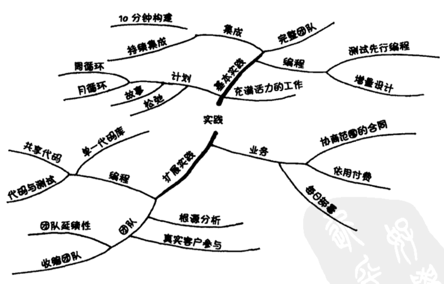

### 第 7 章 基本实践

当你使用 XP 来改进软件开发效率时，本章所提到的实践你都可以放心地施行。首先应用哪项实践完全取决于你所处的环境和你认为最有机会改进的地方。有些人需要计划，因为他们不知道需要干什么。有些人需要质量相关方面的实践，因为他们制造了太多的缺陷以至于无法从中抽身。

#### 坐在一起

在大到足够容纳整个团队的开放空间中进行开发。为了满足隐私和“自己的”空间的需要，可以在附近设置一些私人空间，或者对工作时间做出限制，这样团队成员对隐私的需求可以在其他地方得到满足。

我曾为芝加哥郊区一个陷入困境的项目做咨询。这个项目陷入困境真是让人不可思议，因为项目团队是由公司里最好的技术天才组成的。我在小隔间之间走来走去，试图找出他们的程序问题出在哪儿。

两天后，我突然发现：我走的太多了。这些高级员工在角落处都有自己的办公室，每一个都散布在这个建筑物不同层的不同角落。团队成员每天只有少许时间进行交流。所以我建议他们找个地方坐到一起来。当我一个月后再去时，这个项目正热火朝天地进行着。他们能找到的唯一可以让大家坐到一起的地方就是机房。虽然他们每天都要在一个冰冷、通风和嘈杂的房间中花上 4 到 5 个小时，但是他们很快乐，因为他们成功了。

我从那次实践中汲取了两个教训。其一，不管客户说的问题是什么，它终归是人的问题，单单用技术解决是不够的。另外一个教训就是，坐到一起来，用我们所有的感官知觉进行交流，这一点太重要了。

有必要的话，你可以逐步实现“坐在一起”。在你的小隔间里放一张舒适的椅子以鼓励交谈；花上半天时间在会议室里写程序；或者申请一个会议室进行一周的开放空间试验。所有这些都是在探索如何找到一个能使你团队更有效率的工作空间。

在团队还没准备好时就拆掉小隔间之间的墙是会破坏生产力的。如果团队成员的安全感需要他们拥有自己的小空间，在用共享成功的安全感替换这种安全感之前就将其移除，可能会导致怨恨和抵制情绪的产生。只需要少许鼓励，团队就能够形成自己的空间。如果团队知道物理上的接近可以促进沟通并且了解沟通的价值，一旦给予机会，他们就能开放自己的空间。

“坐在一起”的实践是否意味着多点（multisite）开发的团队不能执行 XP 呢？第 21 章“纯度”将会更加深入地探讨这个问题，简单的答案是“否”，分布在不同地方的团队可以执行 XP。实践包含了理论以及对结果的预示。“坐在一起”预示着见面的时间越多，项目就越有人情味和生产率。如果你有一个多点开发的项目并且一切都进行得很好，那么就继续保持下去。如果出现了问题，则可以想办法使大家坐到一起，即使这意味着需要旅行。

#### 完整团队

将拥有项目成功所必须得各种技能和视角的人都包含进团队。其实这就是过去早就有了的交叉功能团队（cross-function team）的想法。但这个实践的名字反映了它的目的：一种团队的整体感，成功所需要的所有资源准备。一个健康的项目需要热烈的交互，这些交互应该主要是按团队来进行组织，而不是以不同的功能组为单位进行。

人们需要团队感：

- 我们属于它；
- 我们都在其中；
- 我们相互支持彼此的工作、成长和学习。

“完整团队”的组成是动态的。如果一组技能或意见变得重要，就将懂得那些技术的人吸收进团队。如果不再需要某个人，那么可以让他离开团队。例如，如果你的项目需要对数据库做一些改动，那么你的团队需要一名数据库管理员。当数据库变化的需求减弱时，那个人就不再是团队必要的一分子了，至少对于这个例子来说是这样的。

一个常见的问题是理想团队的大小。Malcolm Gladwell 所著的《引爆流行》中描述了团队大小的两个断点：12 和 150。许多军事、宗教和商业的组织，超过这个极限时就需要对团队进行拆分。12 是人们能够在一天中充分交流的人数上限。团队超过 150 人，你就不能记住每个人了。超过这两个极限就很难维持彼此之间的信任，而信任是合作所必需的。对于较大的项目，可以通过建立团队的团队来解决交流问题，以扩大 XP 的使用范围。

有些组织试图由“碎片人”来组成团队：“你 40% 的工作时间为这些顾客服务，60% 的工作时间为那些顾客服务”。这种情况下，大量的时间浪费在工作任务的切换上，将程序员组成团队之后，你立刻就能看到它所带来的改进。由团队来负责响应客户的需求，这样就将程序员从支离破碎的思考中解放出来了。同时客户也从完整团队中精通各种专门技术的专家那儿获益。人们需要赞同感和归属感。周一和周四参与这个程序，周二、周三、周五参与那个程序，没有固定的工作伙伴，这样会破坏团队感，是不利于生产率的。

#### 信息工作空间

让你的工作空间与你的工作相关。一个对项目感兴趣的观察者应该能够走进团队并在 15 秒之内对项目如何运转有一个大致的概念。他也应该能够通过近距离的观察而获得更多的真正或潜在问题的相关信息。

许多团队通过在墙上放置故事卡片来部分地实现这项实践。将这些卡片分类存放在不同的地方能够迅速地传递信息。如果“已做完”区域的卡片总不增，那么团队需要在计划、估算或执行方面做哪些改进呢？同时我也在思考：什么客户应该和团队一起工作，以使范围变化对业务的冲击降低到最小限度。下图显示了一个理想的故事墙，贴着已分类的各种故事。

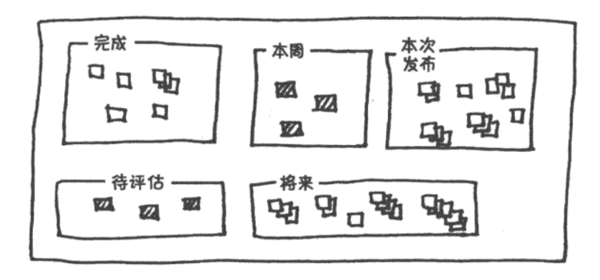

工作空间（下图）还需要提供其他的人性需求。水和小吃可以提供舒适感并促进积极的社会交互。干净和有序的环境可以使大脑将注意力集中区思考手边的问题。另外，在公共空间编程，人们仍需要私人空间，这一点可以通过分隔的小隔间或者限制工作时间来提供。

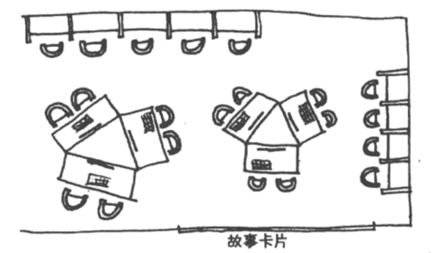

另外一个信息工作空间的实现是最大的可视化的图表。如果你有个问题需要稳步进展，开始绘制它的图表吧。一旦这个问题得到解决或者这个图表停止了更新，就把它取下来，将空间用于重要的、活跃的信息。

#### 充满活力地工作

只要你可以在有效率的时间段内高效地工作就足够了。今天没有效率地透支自己，从而毁掉接下来两天的工作，这对你和你的团队都不利。

工作时间长的倾向是从哪儿来的呢？我经常被问及 XP 实践的“科学”依据，好像科学某种程度上可以为项目的成功或失败负责一样。在工作时间方面，我希望能够逆转这种争论。软件团队成员每周工作 80 个小时比每周 40 个小时能创造更多价值，有科学依据吗？软件开发是一个洞察力的游戏，而洞察力来自于准备好的、休息好的和放松的头脑。

从我自己的情况来看，我会延长工作时间来使项目重新得到控制，如果不这么做就失去控制的话。我不能控制整个项目如何进展，不能控制产品销售；但我总可以熬夜。只要有足够的咖啡因和雪茄，我就可以超越某个临界点从而长时间地敲击键盘，但从这个临界点开始，我实际上就已经开始在做不利于这个项目的事情了。这种情况（做不利于项目的事情）其实是很容易发生的，当你太疲倦的时候，你很难意识到你正在降低项目的价值。

你生病的时候，安心养病是尊重你自己和团队其他人最好的方式。照顾好自己才能使自己最快地回到充满活力的工作中去。同时你又保护了团队不会因此而失去更多的生产率。带病工作并不能体现出你对工作的负责，因为这并不是在帮助团队。

你可以对工作时间做出更多改进。使用同样长的时间，但对时间进行更好的管理。每天明确两个小时的编码时间。关闭电话和邮件提醒，两个小时只进行编程。这样的改进对于眼下来说就足够了，并且为以后花更少时间工作打下了基础。

#### 结对编程

所有产品程序的编写都由坐在一台机器前的两个人完成。放置好机器，使得搭档能舒适地并肩而坐。前后移动键盘和鼠标，使你在打字的时候感觉舒适。结对编程是一种两个人之间的对话，他们同时编程（分析、设计和测试）并尽量编得更好。结对程序员：

- 使彼此都专注于任务；
- 一起头脑风暴，讨论系统的精化；
- 理清想法；
- 当搭档陷入困境时要主动，这样才能减少挫折；
- 使彼此都对团队的实践负责。

结对并不意味着你不能独立思考。人们既需要友谊也需要隐私。如果你需要单独思考一个想法，那么就去做，然后回来你的团队报到。甚至你可以单独构造原型，这是不妨碍结对的。但这不能成为你脱离团队行事的借口。探索完后，把最终想法（不是代码）带回团队。有了搭档，你可以迅速地对它重新实现。这个结果将会被广泛理解，这是有利于整个项目的。

结对编程很辛苦，但效果非常好。大部分程序员一天不能结对超过 5 或 6 小时。这样进行一个星期以后，他们就需要一个远离工作的休闲周末了。结对时我总在身边放瓶水，这对我的健康是有好处的，在我注意到它的时候，可以提醒我该休息了。这些休息保证了我一整天都精神抖擞地工作。

经常地轮换结对。有些团队报告，他们每 60 分钟（在解决难题时为 30 分钟）定时轮换搭档，这取得了很好的效果。我想我不喜欢这样，不过我也没有试过。我喜欢每几个小时换一个新搭档一起编程，在开发中自然中断的时候进行切换。

#### 结对与个人空间

出现一个问题需要解说一下，就是结对编程中的亲密接触。不同的人和文化对舒服的身体空间的大小要求是不同的。与一位喜欢近距离交流的意大利人结对，和与一位喜欢有几英尺个人空间的丹麦人结对，是完全不同的。如果你没有意识到这种差别，那将感到非常的不舒服。为了能够很好地工作，双方的个人空间都必须得到尊重。

结对时个人的卫生与健康是个重要的问题。咳嗽时遮住你的嘴，不要在生病的时候来工作，避免使用强烈古龙香水，因为这或许会影响到你的搭档。

在一起高效地工作感觉不错。对于某些成员来说这是工作空间的一种新体验。如果程序员感情上不够成熟，不能辨别鼓励与赞赏，那么和异性的结对工作可能会带来男女情感，而这对团队是不利的。如果在结对时产生了这些情感，应该停止与此人结对，一直到你有责任感了并能处理好你的情感。即使这种情感是相互的，也会伤害到团队。如果你们想有亲密的关系，那么你们其中一人应该离开团队，这样一来你就可以在个人环境中建立个人关系，而不会将团队交流和这种私人的情感交流弄混淆。理想情况下，工作时的情感只能与工作有关。

在结对时尊重个体区别是重要的。下图中，男士太过靠近那位女士，使她感到不舒适。这时他俩都无法做出最好的技术决定，虽然他们可能完全没有意识到他们不舒适的根源在哪儿。

如果你与团队中某人结对时感觉不舒服，那么去跟某个可靠的人（一个受人尊敬的成员，经理或是人力资源部的同事）讨论一下。如果你感觉不舒服，这个团队就没有发挥它的作用。因为别人可能也不舒服。

#### 故事

使用客户可见的功能单元进行计划。“在相同的响应时间内处理 5 倍数量的贸易。” “给用户提供一种双击的方式，使他们可以频繁地进行数字拨号。” 写好故事之后，就马上试着去估计实现它需要的工作量。

软件开发已经被“需求”这个词误导了，“需求”在词典中被定义为“必须或强制的东西”。这个词带有一种绝对和永久的含义，这抑制了“拥抱变化”。“需求”这个词显然是用错了。如果你不管 1000 页的“需求”，直接部署系统的 20% 或者 10%，甚至 5%，你可能就已经实现了整个系统所预想的商业利益。那么其他的 80% 呢？——不是“需求”，不是真正必须或强制的。

故事与其他需求实践的关键区别就是“早早估算（early estimation）”。估算为业务和技术观点的交互提供了一个机会，什么东西可以较早创造价值？一个想法在什么时候最有潜力？如果团队知道产品特性的成本，就可以根据它们的价值来进行拆分、合并或扩展范围。

为每个故事取一个简单的名称，以及简短的描述或图示。把故事写在索引卡上，并放置在经常路过的墙上。下图是一个我想如何实现扫描程序的故事卡示例。我所见到的将故事用计算机实现的其他各种尝试，都没有在真实的墙上用真实卡片更加有效。如果你需要使用某种熟悉的方式向组织中的其他部门汇报进展的话，则可以周期性地将这些卡片整理成那种格式。

XP 风格的计划的一个特点就是在故事生命周期中很早就进行估算。这使每个人都去思考如何从最小的投资中获取最大的回报。如果有人问我想要法拉利还是小型货车，我会选择法拉利，无疑它有趣得多。但如果有人追问：“你是想要 150,000 美元的法拉利还是 25,000 的小型货车？”，我马上就可以做出更英明的决定。如果加上新的条件，诸如“我需要拉 5 个孩子”或“它必须每小时能走 150 英里”，一切就更清楚了。有些情况下两个决定都有意义。你不能单凭想象做出好的决定。要英明地选择汽车，你必须知道你的条件，包括费用和使用目的。其他事情也是一样。

#### 周循环

一次计划一周的工作。在每周开始的时候开会。在这个会议中：

1. 回顾迄今为止的进展，包括上周的实际进展与期望进展的吻合程度。
2. 让客户挑选在这周内要实现的故事。
3. 把故事分解成任务。团队成员签字接受这些任务并估算它们的工作量。

在一周开始时编写在完成故事时要运行的自动化测试。然后将本周剩余的时间用于完成故事和使测试通过。一个对自己工作感到自豪的团队将会完整地实现故事，而不仅仅是使测试通过。目标是周末有一个可部署的软件，这是让每个人都会为之庆祝的进展。

星期是一个普遍使用的时间尺度。一个星期与两个或三个星期（如我在第 1 版中所推荐的）不同的美妙之处是每个人都盯着星期五。团队（程序员、测试员和客户一起）的工作就是编写测试然后使它们在 5 天内运行。如果到了星期三你已清除并不是所有测试都会运行通过，故事将不能完成，也无法准备好部署，但你仍有时间去选择最有价值的故事并完成它们。

有些人喜欢把星期二或星期三作为他们的一周开始。我第一看到的时候很惊讶，但这种情况却足够普遍，因此应该提一下。曾有一个经理告诉我：“星期一是讨厌的，计划是讨厌的，那为什么要将它们放在一起？”我不认为计划是讨厌的，但同时，改变周期的起点是有些意义的，只要它不会给人们带来周末加班的压力。周末加班是不可忍受的；如果真正的问题是估算过于乐观，那么就应该在改进估算上下功夫。

计划是一种必要的浪费，它本身不能创造多少价值。可以逐步减少你花费在计划上的时间比例。有些团队开始需要花费一整天来做一周的计划，但通过逐步地改进计划技巧，最后只需要一个小时。

我喜欢将故事划分成任务，由个体成员对其负责和估算。我认为任务的所有权对满足人类的占有欲有很大帮助。但是我也见过其他的运行良好的风格。你可以编写小的故事，从而不需要划分单独的任务，这种途径的成本更适合客户工作。你也可以维护一个任务栈，从而不需要签字领取工作。当程序员准备开始一个新任务时，他从栈的顶部取出一个任务。这样他没机会选择自己特别关注或特别擅长的任务，但它确保了每个程序员可以获得各种不同的任务。（结对给了程序员使用专家技能的机会，不管任务是谁拿到的。）

每周的节奏也给团队和个体一个方便的、经常的和可预知的试验平台。“好，下周我们将在每个小时准点地切换结对伙伴”或“每天早上我将在编程之前玩 5 分钟。”

#### 季度循环

一次计划一个季度的工作。每个季度根据更大的目标对团队、项目、进度和安排做一次反省。在季度计划中：

- 确定瓶颈，尤其是那些在团队控制之外的。
- 开始修补措施。
- 计划季度的主题。
- 挑选对应那些主题的整个季度的故事。
- 集中在宏观想法上，考虑项目和组织的关系。

季度是另外一个自然的、广泛使用的、用于项目时间组织的时间刻度。使用季度作为计划范围能与其他随季度发生的商业活动很好地同步。季度也是同外部供应商和客户交互的一个合适的时间间隔。

将“主题”从“故事”中分离出来是为了解决团队陷于事务细节而缺乏通盘考虑（一周的故事和更宏观的构思之间的关系）的趋势。主题也适用于更大粒度的计划，比如制订推销路线。

对于团队反省、查找令人痛苦却未发觉的瓶颈，季度也是一个不错的时间间隔。你也可以按季度计划和评估长期运行的试验。

#### 松弛

在任何计划中，都包含了一些假如落后了就可以取消的小任务。你总可以在后来增加更多的故事、并且交付比承诺更多的故事。在不信任和不兑现承诺的气氛中，实现你的承诺是很重要的，已实现的许诺对重建信任关系是大有帮助的。

在冰岛，有一项冬季运动是在穷乡僻壤开大卡车。这些卡车都是四轮驱动的，平时用两轮驱动。如果两轮驱动时陷住了，可以用四轮驱动摆脱困境。如果四轮驱动时也陷住了，那就是真的陷住了。

我记得有两次谈话：一次是和一个有 100 人向其汇报的中层经理，另外一次是和他的主管经理，在组织中管着 300 人。我建议中层经理鼓励他的团队只在他们有信心真正能做到的事情上签字。因为他们很长时间以来都是高承诺、低交付。“哦，我不能那样做。如果我不同意激进的（即不现实的）计划，我会被解雇的。” 第二天，我同那个主管经理交谈。“哦，他们从不准时完成，不过无所谓，他们的交付仍足够我们所需的。”

我一直在直接地观察由他们习惯性的高承诺所产生的令人难以置信的浪费：难以管理的缺陷负载，沮丧的士气和敌对的关系。实现承诺，即使是不起眼的，也会起到消除浪费的作用。清晰的、真诚的交流会缓解紧张和改进可信度。

你可以通过很多方式来构建“松弛”。一周 8 小时可能是“滑稽的一周”，或者将每周预算的 20% 用于程序员所选的任务。你可能不得不从自身的松弛做起，告诉自己你实际上认为一个任务需要多长时间，给自己时间去做它，即使组织中其他人还没有准备好真诚清晰的交流。

#### 10 分钟构建

在 10 分钟之内自动地构建整个系统和运行所有的测试。超过 10 分钟的构建，人们一般很少愿意使用它，因此会导致反馈机制的丧失。更短的构建则不能给你时间去喝咖啡。

物理学中有具体可靠的自然恒量。在地球的零海拔高度上，重力加速度是 9.8m/s2，你可以用它来计算重力。而软件开发中则几乎没有这样的确定性。10 分钟构建接近于我们在软件工程中所了解的。我观察过几个使用自动创建和测试过程的团队，他们从来没有让这个过程超过 10 分钟。如果超过了，就会有人将它优化到 10 分钟。

10 分钟构建是一个理想状态。在通向理想之路上你要做什么？这个实践的陈述给出了 3 条线索：1）在 10 分钟之内自动地构建（build）整个系统并运行所有的测试。2）如果你的过程不是自动的，则首先需要实现其自动化，然后你可以只构建系统中改变的部分。3）最后，你可以只运行部分测试，这些测试应覆盖因改变而存在风险的那部分系统。

对于系统哪部分需要构建和哪部分需要测试的任何猜测都会引入犯错的风险。如果你错了，你可能放过了不可预知的错误，并将遭受它们带来的所有社会和经济成本的损失。但是，能够对系统的某些部分运行测试总比任何部分都不测试要好得多。

自动构建比需要人工干预的构建有价值得多。随着压力增加，人工构建会趋向于用得越来越少，越来越差，从而导致错误变多，压力变得更大。实践应该减轻压力。自动构建在危急情况成了一个压力缓解器。“我们犯错了吗？让我们构建看看”。

#### 持续集成

不超过两个小时就对改变的地方进行一次集成和测试。团队编程并不是分而治之，而是分、治以及集成。集成步骤是不可预知的，但很容易就花费比原始编程更多的时间。你等待越长的时间才集成，花费就越多，越不可预知。

持续集成最普通的风格是异步的。我检入（check in）我做的改动，不久，构建系统注意到变动并且开始构建和测试。如果有问题，会用邮件、文本信息或（最酷的）闪烁红灯等方法通知我。

我更喜欢同步模型，我和搭档在结对编程一段时间后集成，这段时间不会超过几小时。我们等待构建结束和整组测试运行，确认无需回退了，然后再继续进行下去。

显然异步集成是对每日构建的一个大的改进（尤其是没有自动化测试的情况下），但是它们都不具有同步风格的构建方式所固有的反省时间。等待编译和测试时是很自然的讨论时间，讨论我们刚刚一起做的东西，是否可以做得更好。同步构建也为简短清楚地反馈循环创造了积极的推动力。如果在开始新任务半小时之后才得到问题通知，我得浪费时间回想我做了什么，解决问题，然后回到新任务中被打断的地方。

集成和构建的结果应该是一个完整的产品。如果目标是烧成 CD，那么就烧一张 CD；如果目标是部署一个 Web 站点，那么就部署一个 Web 站点，即使是部署到一个测试环境上也是可以的。持续集成应该足够全面，以保证最后第一次部署整个系统时不至于太麻烦。

#### 测试优先编程

在改变任何代码之前先编写一个自动化测试。测试优先编程能马上解决很多问题：

- 范围蔓延——很容易就会使程序失去控制并引入一些“以防万一”的代码。通过显式客观地描述程序应该做什么，你可以给自己一个编码的焦点。如果你很想将其他代码加进来，就再写一个测试（等你手头的测试运行通过后）。
- 耦合与内聚——如果测试编写起来很困难，这是个信号，说明在设计上有问题，而不是测试的问题。低耦合、高内聚的代码是很容易测试的。
- 信任——如果一段代码不能运行，那么它的作者是很难得到别人信任的。通过编写干净的可运行代码，并运用自动化测试来证明你的意图，你就给了你的队友一个信任你的理由。
- 节奏——编程的时候很容易就会几个小时都不知道自己在干什么。如果使用测试优先编程的方法，下一步要做的工作就会很清楚：要么编写另外一个测试，要么让没有通过的测试运行。这样很快就会演变成一种自然而高效的节奏：测试，编码，重构，测试，编码，重构。

除了测试，XP 社区在验证系统行为方面并没有太多的其他探索。静态分析和模型检查之类的工具也可以采用测试优先的风格来使用。例如，先通过一个“测试”表明系统没有死锁。在每次变化发生之后，再次验证系统没有死锁。但我见过的静态分析工具在设计时都没有考虑过这种用法。它们运行太慢，因而不能成为以分钟计时的编程循环的一部分。不过这好像只是关注点的问题，不是本质限制。

测试优先编程的另一个精化是持续测试，最早由 David Saff 和 Michael Ernst 在《An Experimental Evaluation of Continuous Testing During Development》中提到，在 Erich Gamma 和我合著的《Contributing to Eclipse》中也有过探讨。在持续测试中，每次程序变化的时候都运行测试，很像增量编译器在源代码每次变化时运行。测试失败报告的格式跟编译错误一样。持续测试缩短了发现错误的时间，从而缩短了修正错误的时间。但这些测试必须能够快速地运行。

测试优先编码时所写的测试有个限制，它们测试程序的观点是微观的：这两个对象一起工作得如何？随着经验增长，你能让这些测试越来越可靠。由于它们的范围限制，这些测试往往能够迅速运行。你可以在一个 10 分钟构建中运行成千上万个这样的测试。

#### 增量设计

每天都考虑你的系统设计，力求使得系统设计适应当天的系统需求。如果你对系统最佳设计的理解发生了飞跃性的进步，则需要进行逐步而持久的工作，让设计和你对系统的理解重新保持一致。

我在学校所学的正好和上面的策略相反：“在开始实现前提出所有的设计，否则就永远没有机会了”。这种策略的理性判断来自于 Barry Boehm 的 1960 年国防部合同的研究，研究显示，修正缺陷的费用随时间以指数增长。如果今天软件在增加功能时，同样的数据也适用的话，那么大规模的设计变化带来的费用会随时间剧烈增长。这种情况下，最经济的设计策略就是尽早做大的决策和推迟所有小的决策。

这个影响了软件开发正统思想几十年的设想（变化的成本随时间增长）几乎没有得到什么详细审查。这个设想或许不再有效。变化带来的成本增加和缺陷的情况是一样的吗？即使假定变化有时使成本增长了，那么在什么情况下变化的成本没有增长呢？如果变化的成本并不是日益昂贵，那么对于软件开发的最好方法，这一点暗示了什么呢？

XP 团队努力地创造各种条件以保证改变软件的费用不会灾难性地上涨。自动化测试、设计的持续改进和显式的社会过程，所有这些都有助于保持变化的低成本。

XP 团队对他们根据未来需求调整设计的能力充满自信。由于这点，XP 团队既可以满足他们对迅速和经常成功的人性需求，又可以满足将投资推迟到最后可靠时刻（the last responsible moment）的经济需求。有些已经阅读和应用本书第 1 版的团队并没有理解关于最后可靠时刻的部分。他们尽快的实现一个又一个故事，却没有对设计给予足够重视。日常对设计的不关注导致变化的成本暴涨。结果就是产生设计糟糕的、脆弱的、难以变化的系统。

对 XP 团队的建议不是将短期运行的设计投入降到最低，而是要保持在设计上的投入与至今为止的系统需求成比例。问题不是要不要设计，而是什么时候设计。增量设计建议的最佳设计时机是在取得了相关经验之后。

通过小的安全的步骤进行设计，下一个问题是，在系统的什么地方改进设计。我已经找到的一个实用的简单方法是消除重复。如果相同逻辑出现在两个地方，就从设计出发考虑如何才能只保留一处。没有重复的设计更易于做出改变。因为你不会发现这样的情况：为了添加一个特性而不得不在几个地方修改代码。

作为一个改进的方向，增量设计没有说在取得任何体验之前的设计是可怕的，而是说临近使用再设计会更有效率。随着用小的安全的步骤改变系统，你的专业技能也在增长，能够推迟越来越多的设计投资。这也将导致系统更简单，进度更快，测试更易于编写，同时也因为系统更小，团队需要的交流也会更少。

随着更多的团队投入到每日设计中，他们注意到，尽管所开发系统的目的各不相同，他们所做的变化却是相似的。“重构”是一门关于设计的知识，系统化归纳了这些重复出现的变化模式。这些重构可以发生在任何粒度。几乎没有什么决策是一旦做出就不能改变的。因此，系统开始时可以很小，然后随着需要而增长，这样就不会产生过高的费用。

#### 那么现在

本章的实践不是 XP 的全部。它们提供了一个尊重、沟通和反馈的基础，孕育着简单和勇气。团队成员可以用他们不断增长的信心和能力去构建团队内外的关系。

一旦这些实践都得到很好的应用，XP 会给您带来丰厚的回报。然后是进一步的发展：直接支持软件开发更加完美的业务关系。

### 第 8 章 启程

你已经在开发软件了，你已经启程。XP 不仅改进你的开发过程，也改进你的过程经验。使用 XP，从你现在所在的地方开始，通过添加符合你的目标以及表达你的价值观的各种实践来不断调整。在你添加这些实践时，它们之间的协同会让你以前无法想象的事情成为可能。然后，你会想要更多的实践。等你已经完整地应用了 XP，你就会充满活力、自信，并成为活跃团体的一部分，会比以前更少压力地以一种近乎难以置信的速度工作。

XP 可能代表了你努力改进的新的方向或者加速度。那么，你如何开始，又从哪里开始呢？

首先，没有对所有人都适用的起点。如果存在任何基本实践所面向解决的问题，都可以马上采取这些实践以进行改进。觉得被不得不做的事情淹没了？就自己开始采用周循环。在星期开始时花时间写下你认为本周内能够完成的所有事情。如果太多了，则可以按照团队的需要来进行优先级排序。

开始时每次改变一件事比较容易一些。我认为，仅仅通过看了本书，然后决定实践 XP，是很难在新的环境中执行所有实践、支持所有价值观，并应用所有原则的。XP 的技术技能及其背后的态度是需要时间去学习的。虽然在一切都就位时 XP 运转最好，但你需要一个起点。

当然这并不是说改变就一定要缓慢进行。一个强烈希望改进的团队可以快速地推进，在继续下一个实践之前，并不需要太多的时间去消化一个改变。但如果改变得太快，你就有退回到原来实践和价值观的风险。一旦发生这种情况，则需要花时间来进行重新组织，提醒自己你所希望拥有的价值观，回顾你的实践并提醒自己选择它们的原因。新习惯是需要时间去巩固的。

那么，如何决定首先改变什么呢？通过观察你正在做什么以及你想要什么，来选择第一个实践。可以使用 XP 风格的计划方法（来做出这个决定）：编写改进软件开发过程的故事——“构建自动化”，“坚持测试先行”，“与 Joe 结对编程两小时”。对每个故事要花费的时间做出估计，确定过程改进的预算，并且先选择一个故事来执行。在发现了容易的或有价值的以及困难的情况时再做出相应的调整。

我自己就曾在一些计划应用 XP 的组织中使用过以上过程。一个团队的故事包括培训课程、试验性项目尝试和教育高层主管。主办方要求能看到立即的改变，即使每个人都知道这是不可能的。使用 XP 风格的计划方法来进行改变使得我们可以和他们进行沟通、按照优先级排序，并使主办方有机会看到我们正在做什么，已经发生了什么改变。

改变从意识开始。改变所需要的意识来自于感觉、直觉、事实或局外人的反馈。感觉虽然有价值，但需要和事实或可信任的观点相互校验。

意识可能来自度量。度量中的趋势可以在结果变糟之前指出何时应该做出改变。我曾指导过一个团队仔细检查他们开发后期的所有缺陷，发现所有这些缺陷都是单人编程产生的。如果一个团队不能对过去的经历进行准确的反省，它就无法做出一个明智的决定，关于在多大程度上进行结对编程。

一旦认识到需要改变，就可以开始改变了。你可以把基本实践作为开始来改进开发实践。每项基本实践都描述了一个行为的连续集，找到你在每项实践中的当前定位，选择一个实践，该实践的目的与你的变化优先级相符合，向该实践所描述的终点前移一步，看看开发过程中的人性和效率是否得到了提高。

例如，我可能决定需要更紧密的技术合作；或者，我即将面对一次大的集成，尽管设计和代码都通过了评审，但我还是觉得越来越紧张；又或者，我应该怎样进行更多的合作？

结对编程是处理技术合作问题的实践。最极端的情况下，它建议所有长期的代码都应该由两个人编写，并且两个人在编程时应该讨论。或许我的团队不愿意“放弃”那么多的时间，因为我们都要对自己的代码负责。但我可以往前迈进一步：挑选我担心的一段代码，让别人跟我结对一两个小时写出它和系统另一部分的接口。选择那部分的负责人作为我的搭档是比较明智的，当然前提是他愿意做这件事情。

一旦我们尝试过结对编程，就可以评价更紧密的技术合作是有助于还是有碍于团队目标的完成。就可以根据我们所知的来决定是否要进一步加强我们的合作，以及采用什么样的方式：结对、评审或其他的方法。

做出改变之后，有时我会怀念过去的工作方式带来的那种熟悉的感觉，这种感觉会超过新方法带来的改进。即使我做出了改变，但其他相关的人仍会对我的改变进行抵制，使我回到过去的工作方式而不是坚持自己的新标准。使形势变得复杂的还有我自己对新实践的不安全感。一边编程一边编写自动化测试，编程的速度到底会更快还是更慢？因为我总是想尽量避免将过去的工作方式进行不适当的改变。

改变总是从自身开始。你唯一能够改变的人是你自己。不论你的组织功能多么健全或者情况恰好相反，你都可以自己开始应用 XP。团队中的任何一个人都可以开始改变自己的行为：程序员可以先写测试；测试员可以使他们的测试自动化；客户可以撰写故事和排定优先级；主管们可以希望有透明度。

第一个团队强制实行实践会破坏信任并导致怨言。主管们可以激励团队的责任感，但团队是使用 XP、改进的瀑布模型，还是完全混乱的开发过程，完全取决于他们自己。使用 XP，团队可以在缺陷、评估和生产率等领域产生显著的改进。改进需要整个团队更紧密地合作。你可以提出你对责任感和团队合作的期望，然后帮助他们战胜改变带来的焦虑。

#### 为实践绘图

下面是一个练习，帮助揭示每项实践对你和你的团队意味着什么。

下图是对应“充满活力地工作”这一实践的图。中间是这个实践，正下方是我领会到的这个实践的目的：保持工作和生活的平衡。附在实践上的是相关影响因素和实践进行地不顺利的一些征兆（在这个例子中）。当你思考一个实践的时候，画出你想到的任何东西。可以采用文本或图形等任何你喜欢的方式。

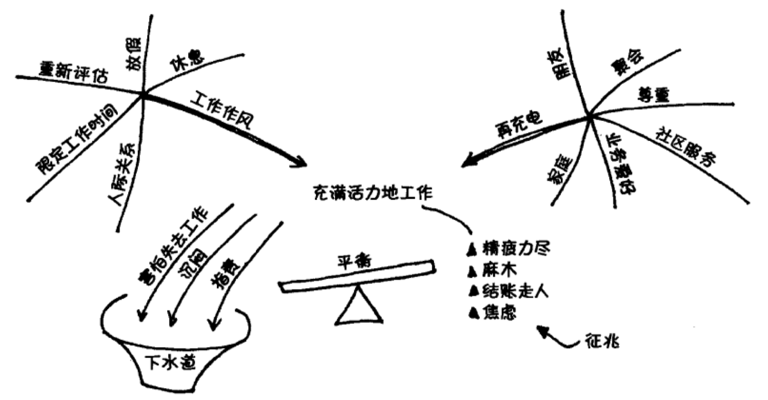

这个练习没有“正确”的答案。这个例子包含了我今天的答案：每个成员和团队对实践的含义都会有不同的解释。关于实践相关内容的讨论是这个练习的一个有价值的副作用。

一旦你有潜在的改变要做，那么不妨做一些。所有关于如何让事情变得更好的那些好想法，在执行之前都是没价值的。我已经挨过了太多“借酒浇愁”的时光，所有改变的能量都被浪费在强烈的抱怨中了。一旦发现了对你的改进有意义的主意，就放手做。如果你们能作为一个团队进行改变，那就太好了。如果不能，那就单独进行直到能同你信任的人分享你的收获。

我推荐用半天时间仔细检查所有的实践，大家一起做出决定，看看对每个实践需要做出什么改变。把最后的结果图张贴在团队工作室的墙壁上。当一个改变就位的时候，看看下面可以做什么新的改变，并开始致力于这些新改变。

#### 小结

不论你的职位是什么，不论你的工作是如何被软件开发所影响，如果说我要和你交流一些什么的话，那就是：和目前相比，软件开发应该能够带来更多（回报）。同时，缺陷会很少，因此更引人注目。对软件开发而言，因进度不足导致的大的范围调整只应该发生在进度表的前一半。在花费了项目预算的很小比率的资金之后，就应该进行最初的软件部署。团队的规模应该可以扩大、缩小，而不带来灾难性的后果。XP 是到达这个境界的一条途径。如果我们在开发过程中带着人类的本性工作，就会产生大幅提升效率的机会。

### 第 9 章 扩展实践

在完成基本实践初步的工作之前，本章的实践对于我来说是困难的或危险的。例如，如果你没有将缺陷率降低到接近于零（使用结对编程、持续集成或测试优先编程）就开始每日部署，灾难马上就会降临。对下一步需要改进什么，你要相信直觉。如果下面这些实践看起来合适，就试一试。也许它会起作用；也许你会发现，在使用它来改进开发过程之前，还有更多工作要做。

#### 真实客户参与

将那些生活或业务受到待开发系统影响的人纳入到团队中来。有远见的客户可以参与季度计划和周计划。拿出开发资金的一部分分给他们，让他们提出想要的功能。如果这些客户可以比市场上其他人提前 6 个月看到一些问题，那么做出他们想要的系统会使你领先于你的竞争对手。如果你的产品对他们有价值，他们会乐意参与开发的。客户参与的要点在于，让提出需求的人和开发这些需求的人直接沟通，减少浪费。

在我看来，“完整团队”就意味着有客户参与，但我并没有见过多少团队在尽全力让真正的客户参与进来。有真正客户的参与，你会得到不一样的结果，他们正是你要设法满足的人。如果没有客户或者真实客户“代理”的参与，你开发的功能可能不被使用，书写的测试也可能不能反映真实的（客户的）接受准则（acceptance criteria），这些都将导致浪费。同时，你也失去了在对项目持不同观点的人们之间建立联系的机会。

我听到的对“客户参与”的异议是：有的人将得到他真正想要的系统，但这个系统并不适合其他人。相比之下，通用化一个成功的系统比定制一个不能解决任何人问题的系统更容易。而保证系统的通用是团队中市场人员的工作。通常来说，客户的需求与团队的开发能力越接近，开发就越有价值。

“香肠工厂”是另外一个对“客户参与”的异议。“如果客户知道了软件开发有多么混乱，就不会再信任我们。” 你确信他们现在信任你吗？软件能反映出制造它的组织（的水平）。如果客户已经在使用你的软件，那么他们就很清楚你是怎样开发的。如果客户还没有开始使用，他们也很快就会使用的。如果你表现得值得信赖，什么也不遮掩，那么你会有更强的生产能力。（想象一下不再需要花时间来遮掩的感觉吧。）如果你有了精确的评估和低缺陷率，让客户参与到开发过程中来会培养信任，也会鼓励持续的改进。

#### 增量部署

在更换遗留系统时，从项目很早的阶段就要开始逐步承担遗留系统的负荷。我最近跟一个朋友聊天，谈到一家杂货连锁店计划用一个软件包来代替过去复杂的自产软件。他们的计划是在软件包中重新实现现有的功能然后在某个周日的晚上进行交接。我的第一反应就是：“这样肯定不行。”

大的部署工作只会偶尔有效。如果你几个月没有添加任何新功能而只是在为了 [D-Day](https://en.wikipedia.org/wiki/Normandy_landings) 做准备，员工们长时间工作并且周末加班。即使这个赌打赢了，新系统运转良好，大家也会因为疲劳过度，几周或几个月内都不能恢复有效的开发。如果这个赌没赢，新的系统被迫下马，成本甚至会更高。大的部署会导致高风险和昂贵的人力及经济成本。

那么，替代的方法应该是什么呢？找到你能马上处理的一小片功能或少量的数据集，并部署它。但这样的话，你或者可以找到并行运行两个程序的方法，对文件进行分拆和合并；或者培训你的用户同时使用两个程序。这些技术的或社会的辅助手段都是为了（开发的）保险而付出的代价。

我过去也相信增量部署，但并不是发自肺腑的。改变我看法的是一个将 9000 份合同迁移到新系统的工作。在工作几个月后，我们可以处理 80% 的合同，但是因为数据质量的问题，我们无法为剩下的 20% 找到匹配的结果。我们花费了 6 个月试图使剩下的合同运转起来，包括复制旧系统中的错误。（你无法相信为了将浮点数四舍五入他们都干了些什么！）然后我们的经理改变了优先次序，让我们转换另外一组不同的合同。在年底我们没有部署任何合同到新系统中，我损失了相当于一栋新房子价值的奖金。现在我真的，真的相信增量部署。

#### 团队连续性

将高效的团队凝聚在一起。在大组织中有一种趋势，那就是将人抽象成物品：即插即用的编程单位。软件中价值的创造不仅取决于开发人员所知道的和所做的事情，也取决于他们之间的关系以及他们共同完成的事情。忽视关系和信任的价值，而仅仅是简化调度问题，这在经济上将是失败的。

小的组织没有这样的问题。因为只有一个团队。一旦团队成员凝聚起来，一旦成员彼此信任，除了共同的灾难之外就没有什么可以将这个团队分开了。大组织常常忽视团队的价值，把“编程资源”比喻成分子/流体。一旦项目完成了，他们重新回到“池”中。这种调度的目标是充分利用所有的程序员。这种策略可以将微观效率最大化，但是会破坏组织的整体效率，它追求让每个个体都忙于敲打键盘的虚幻效率，而忽略了让员工尽量与熟悉和信任的同事一起工作的价值。

让团队始终凝聚在一起并不意味着团队是完全静态的。我曾吃惊于新成员为已建立的 XP 团队做出贡献的迅速程度。他们坚持要求第一个星期签约接受任务，而且一个月后就能独立地做出贡献。通过保持团队成员在一起，并且鼓励合理数量的调整，组织可以获得团队稳定性和知识经验的持续传播所带来的双重收益。

#### 收缩团队

随着团队能力的增强，保持工作量不变，同时逐渐减少团队的规模。这样可以从团队中抽出人来组成更多的团队。如果一个团队人数太少，就将它与其他的小团队合并。这是丰田生产系统实践过的。我没有实际用过这种实践，但我觉得它很有意义，所以我将这个内容放在这里。我曾见过一些增加工作量的策略，比如创建越来越大的团队，但这样做的效果很差，因此需要考虑其他的选择方案。

由于我没有体验过这种实践，因此我用类比的方式来进行说明。比方说 5 个人一起在一个生产车间工作。那么，确保尽可能多的人都在尽全力工作，而不是给每个人安排相同的工作量。这时候第 5 个人可能只需要 30% 的时间工作。这样很好。团队成员在工作的同时也思考如何改进工作过程。他们会尝试各种方法来改进，最终他们去除足够多的浪费，以至于不再需要这第 5 个人。如果试图让每个人都看上去很忙，则会使得团队有过剩资源的情况不太明显。

在软件开发中尝试同样的方法。计算出每周内客户需要多少故事。努力改进开发直到有些团队成员闲下来，这样就可以收缩团队然后继续工作。

#### 根源分析

每次开发后发现一个缺陷，都要同时排除这个缺陷和产生它的原因。我们的目标不仅仅是这个缺陷不再重现，还要保证团队不要再犯同类的错误。

下面是 XP 中一个响应缺陷的过程：

1. 编写系统级自动测试，用以演示缺陷及原本想要的行为。这可由客户、客户支持或开发者来完成。
2. 编写范围尽可能小单同样能再现这个缺陷的单元测试。
3. 修改系统以通过单元测试。这也应该使系统测试通过。如果不能，返回到步骤 2。
4. 一旦缺陷排除了，找出产生这个缺陷的原因，也找出没有发现它的原因。采取必要的措施来防止这类缺陷将来再次出现。

关于最后一步，[大野耐一（Taiichi Ohno）](https://en.wikipedia.org/wiki/Taiichi_Ohno)有一个简单的练习，对为什么发生某个问题提出五个疑问。例如：

1. 为什么我们遗漏这个缺陷？因为我们不知道昨天晚上余额变成了负数。
2. 我们为什么不知道？因为只有 Crosby 女士知道，但她并不是团队的一部分。
3. 为什么她不是这个团队的一部分？因为她仍在维护那个其他人不知道如何维护的旧系统。
4. 为什么没有其他人知道如何维护？因为培训其他人并不是管理上优先考虑的事情。
5. 为什么不是管理上优先考虑的事情？因为他们不知道 20,000 美元的投资可以为我们节省 500,000 美元。

在问了五个为什么之后，你发现隐藏在缺陷后面的是人的问题（几乎总是人的问题）。处理这个问题及在解决这个问题的过程中碰到的其他问题会使你放心，你再也不必处理这类问题了。

我已经在扩展实践中提出了正式的回归测试，而不是再写一个测试，因为大部分团队有着太多的缺陷，以至于不能为解决掉每一个缺陷投资过多。一旦缺陷率下降至每周或每个月一次，投资才是相称的，团队还有其他改进实践的方式。这样的团队为更深入地审视自身的缺点做好了准备。

#### 共享代码

团队里的任何人可以在任何时候改善系统的任何部分。如果系统出错了，并且修正它没有超出我正在做的事情的范围，那么我应该挺身出来修正它。

我曾听到的一个反对意见是，如果没有人为代码负责，那么每个人都会表现得不负责任。有人会做些权宜的修改，这样会给下一个必须接触这块代码的人造成混乱。正是因为有这种风险，我将共享代码列为扩展实践。在团队培养出集体责任感以前，没有人负责，质量也就会下降。成员会不顾团队整体结果地加以修改。

除了“每个人都为自己”之外还有其他的团队合作模式。团队成员可以共同承担责任，不仅为他们提交给用户产品的质量负责，也为他们给团队工作感到自豪。结对编程可以帮助队友彼此明确他们对彼此的质量承诺，同时也帮助他们对质量的组成达成共同的期望。

持续集成是集体代码所有制的另外一个重要的先决条件。如果待改进的地方很多，一次两小时的结对编程就可能会涉及系统的很多部分。两个结对做出的改动就可能会涉及很多以及很广泛的地方，某些改动会发生冲突，而解决这些冲突需要付出昂贵的成本。如果团队在做许多改动，就需要缩短集成的时间间隔以保持低集成成本。

#### 代码和测试

项目中需要维护的永久制品只有代码和测试，其他的文档都可以从代码和测试中生成。至于项目的重要历史记录，则依靠社会机制（social mechanism）来维护。

客户为以下这些功能付费，系统现在的功能和团队将来能使系统具有的功能。任何对以上这两项有贡献的制品（artifact），它本身就是有价值的，除此之外其他一切都是浪费。

代码和测试是一种进行一次就容易改进一点的实践。一个有五个阶段的复杂的文档驱动过程，这个过程在每次团队掌握更多经验的时候才会变得轻松一点。团队越擅长增量设计，需要预先做的设计决策就越少。季度性的循环对业务优先级表示得越清晰，需求文档就会越薄。

而几十年来软件开发的趋势却恰恰相反。拘泥于形式而妨碍了价值流。软件开发中有价值的决策是这样的：我们要做什么？我们不做什么？我们如何做我们要做的事情？将这些决策放在一起，它们能够彼此支持，并流畅地产生价值流。丢掉过时的制品使改进成为可能。

#### 单一代码库

保持一个代码流。你可以在一个临时分支上开发，但永远不要让它的生存期超过几小时。

多代码流是软件开发中巨大的浪费源。我在目前部署的软件中修正了一个缺陷，然后我不得不翻新修正所有其他已部署的版本和正在进行中的开发分支。然后发现我的修正破坏了某些人正在进行的工作，接着他们又改动我做的修改。如此循环不断。

有时候，虽然有正当的理由来保留源代码的众多版本，但是所有这些只是为了方便的权宜之计，只是看不到严重后果的局部优化。如果你有多个代码库，那么请提出一个逐渐减少数量的适当计划来。你可以改善构建系统，那样就可以从一个代码库生成几个产品。你可以把变更放到配置文件里。无论做什么，都要改进开发过程，直到不再需要多个版本的代码为止。

我的一个客户针对七种不同的客户建了七个不同的代码库，这使得成本超出了他们的承受能力。开发时间远远超过以前的项目。程序员代码中的缺陷也比以前多很多。编程不再像开始那么有趣了。当我指出多代码库的高成本和这个实践不可能成功时，客户回答说他们完全承受不了重新整合这些代码的工作。我甚至不能说服客户试着从 7 个版本较少到 6 个或者为下一个顾客提供已存在版本的一个变种。

不要让你的源代码有更多的版本。与其增加新的代码库，不如修正那些潜在地妨碍你使用单一代码库的设计问题。如果你有正当理由使用多版本，那么把那些理由看作是需要挑战的假设，而不是把它当作绝对的理由。或许弄清楚深层的假设需要些时间，但那样能开启下一轮改进的大门。

#### 每日部署

每天晚上都需要将新代码融合到产品中。因为程序员桌面上和产品之间的任何差距都有风险。没有与已部署的软件同步的程序员是冒着风险的，冒着在没有精确反馈信息的情况下做决策的风险。

每日部署只是一个扩展实践，是因为它有太多的先决条件。这些先决条件如下：缺陷率至多只能是每年几个。构建环境必须是平稳而且自动化的。部署工具必须是自动化的，具有增量产出和失败回滚的能力。最重要的是，团队成员之间及团队与客户之间必须是高度信任的。

这种更频繁部署的趋势是明显的。我的即时通信程序每隔几天就会得到更新。大型网站每天都在不知不觉地改变。根据这种趋势可推断出我们需要每日部署。

实践可以指明前进的方向，每日部署就是一个好例子。如果你每年只部署一次，也许每日部署看起来就像是做白日梦。我所见过的那些认为他们每年部署 1 次的团队实际上部署了 12 次：一个发布的版本和 11 个补丁。虽然团队通过这种方式也可以做小的功能改进，但是他们会因为需要这么做感到尴尬，而并不把这当作一个机会。12 个发布的版本比 11 个补丁要好听得多。

如果你的项目需要花费数周或数月才可用，那如何实施每日部署？一个大项目中包含了许多任务：重构数据库，实现新特性，更改用户界面。你可以继续后面的工作，但并不更改用户对系统的体验（不更改用户界面），在一个功能完成之后，就可以在用户界面上做适当的修改，将其体现出来了。

频繁地部署有许多障碍。有些是技术上的，比如缺陷太多或需要节省开支的部署方法。有些是心理或社会上的，比如部署过程的压力太大以至于团队成员不想再进行第二次。有些是商业相关的，比如没有频繁发布的收费方式。不论障碍是什么，你都要努力去消除它，然后自然而然地开始频繁的部署，这样将帮助你改进开发。

#### 协商范围的合同

签订具有固定时间、成本和质量的软件开发合同，但是要求就系统的精确边界进行不断地协商。通过签署一系列的短期合同而不是一个长长的合同，可减少风险。

你可以朝着协商的范围前进。只要双方同意，可将大而长的合同分成两份或多份，附有可选的实现部分。有“变化的要求”的高成本合同，可以在开始时少确定点项目边界，以降低变化带来的成本。

协商合同的范围是一种对软件开发的建议。有一种调整供应商利益和客户利益的机制是，支持沟通和反馈，并让每个人都有勇气去做在现在看起来正确的事情，而不用仅仅因为合同去做那些无用的事情。可能由于商业或法律上的原因，在目前这样做对你来说是不明智的。但是朝着协商范围的方向前进，你会知道哪些地方需要改进。

#### 依用付费

对于依用付费的系统，你可以在系统每次被使用时收费。现金是最终的回馈。资金不仅是具体的，而且你可以消费它。将软件开发同资金流直接联系起来能够为系统的改进提供精确而及时的信息。

许多软件已经是“依用付费”的了。电话程控交换、电子股票交易和航空预订系统都是在每次交易时收费。虽然“依用付费”在商业上有利有弊，但通过它获得的信息能帮助改进软件开发。

我所见过的“依用付费”的极端形式是一个通信产品。用户为每条信息付费。开发中的每个故事都是为促进信息的使用而精心挑选的。例如对新手机的支持，同时做成本估算和收益估算。通过分析系统的使用情况来获得对收益估算的精确反馈。团队能使用这些信息来优化成本和提高利润。

当前典型的安排是每次发布一个版本都要求客户付费。但这种方式使供应商和客户的利益对立起来。供应商为了自己的利益会发布许多版本，而每个版本包含尽可能少的功能。客户则希望版本少一点（因为每次升级都要付费），希望每个版本包含许多功能。这两种利益之间的冲突会减少沟通和反馈。

即使你不能实施“依用付费”，你也应该能实现订阅模型，这样每月或每季度地卖软件产品。使用这种订阅模型，团队至少可以通过保持率（retention rate，继续订阅的客户人数）告诉团队成员他们做得怎么样。即使更小一些的商业模型的变化，也会让合同更多地倾向于支付支持费用，而不是先期的收益。

对“依用付费”的一个反对意见是，客户想要预先知道开发费用。当然，如果依用付费有足够大的价格优势，客户可能就不会介意这一点了。与只有许可证收入这个唯一的反馈信息的团队相比，一个可以使用“依用付费”所反馈的信息的团队应该工作得更有效率。

#### 小结

基本实践和扩展实践并不足以让你成功地开发软件，但是我的观察让我相信，它们是优秀软件开发团队的核心。如果你发现自己有一些没有被这些实践覆盖的问题，那么你应该回顾一下你的价值观和原则，以找到适合你的团队的解决方案。

### 第 10 章 完整 XP 团队

要让软件开发高效地进行，需要采纳很多人的观点。“完整团队”的 XP 实践表明，各种人结合在一起工作使得项目开发更高效。为了个人的成功他们必须作为一个团体一起工作。XP 团队中的每个人都要把自己的未来跟他的工作领域联系起来。XP 首先指出了程序员在项目中的有效工作方式。下面开始是团队中每个成员的工作介绍。

流的原则表明，平稳的软件流比偶尔的大规模部署创造的价值更多。在组织软件开发中的不同工作时，流尤其重要，但应用起来却很困难。我记得曾参加一个全天会议，计划一个组织如何开发软件。程序员和主管人员全程参与会议。另外还安排了相关的不同工作的代表参加会议，让他们表述自己的观点——关于需要什么样的开发风格。

程序员从谈论 XP 开始：风险管理、即时回报、反馈以及为什么喜欢跨越阶段的活动。所有的人都点头赞成，这些都是有意义的事情。

然后是架构师。他们认为，虽然 XP 对于编程来说不错，但是如果他们在项目开始阶段就设计好架构，所有事情的进行都将平稳得多。他们遭到很多人的反对，反对意见认为：“流”以及“流”的含义意味着，在开始时仅需要设计足够启动开发的架构，然后应该随着开发的进行逐步将架构细化。架构师们不情愿地承认，虽然可以这么做，但最好还是在架构阶段做架构设计。

接着是交互设计师们。他们认为，虽然 XP 对于编程来说不错，但是如果他们在项目开始的阶段就设计好交互，所有事情的进行都将平稳得多。程序员、主管人员和架构师们又回到了关于流的争论。交互界面设计时们认为，虽然可以在开始时设计足够启动开发的交互，接下来持续地精化交互，但是这样比不上在项目开始阶段就做好交互设计。

当底层设计者们建议让他们在项目开始阶段就做好所有的底层设计时，会议变成了一场闹剧。我们没花多少时间就让他们勉强同意增量工作。

故事的结局是不愉快的。你不能说服其他人违背自己的意愿。这些人都没有把自己看作是团队的一部分。在压力下，他们还是倒退回尽力预先做好属于他们的工作。

这就好像是持不同观点的人被捆绑在一起在冰上行走，所有他们想做的是争论谁是第一个。其实谁是第一个并不要紧，整个团队并没有认识到他们被捆绑在一起。事实上，齐头并进（比任何一群人试图迫使其他人紧随其后）将会取得更多的进步。

#### 测试员

XP 团队中的测试员帮助客户在实施前选择和编写系统级的自动化测试，并为程序员指导相关的测试技术。在 XP 团队中，排除小错误的大多数责任落在了程序员身上。测试优先编程的结果是一套可以帮助项目保持稳定的测试。在开发早期，测试员的角色转变为，在功能没有实现之前帮助定义和说明可接受的系统功能的组成部分。

在周循环中，降临至选定故事头上的第一件事就是它们将被变成系统级的自动化测试。这是强大的测试技术可以发挥杠杆作用的地方。客户可能更了解他们想看到的系统的常规行为，而测试员擅长的是着眼于“巧合之处（happy path）”并询问如果出现了故障将会发生什么。例如，“好，但是如果三次登录失败怎么办？之后应该发生什么？” 测试员之间应加强交流。他们保证系统级的测试只有当故事被充分实现及部署好后才能成功通过。

一旦本周写好的测试失败了，测试员们会继续编写新的测试以揭示需要描述的新细节。测试员们也可以进一步地自动化和协调测试。最后，如果程序员遇到棘手的测试问题，测试员可以与其结对帮助解决问题。

#### 交互设计师

XP 团队中的交互设计师要选择系统的整体隐喻，编写故事和评估已部署系统的使用情况来为新故事寻找机会。团队要优先处理最终用户所关心的。交互设计的工具，例如角色（personas）与目标（goal），能帮助团队分析和搞清楚用户领域，虽然这不能取代同真实人物的交谈。

对交互设计师的许多建议都是基于阶段性开发模型的：首先交互设计师勾勒出系统应该做什么，然后程序员编程实现。阶段减少了反馈并限制了流的价值。不把开发分成阶段，可能对交互设计和 XP 团队中的其他部分都有好处。

在 XP 团队中，交互设计师与客户合作，帮助编写和澄清故事。在这个过程中交互设计师们可以使用他们通常使用的工具。他们也分析系统的真实使用情况以决定系统下一步需要做什么。交互设计师预先指定一些用户接口并在项目的整个周期进行持续精化。

#### 架构师

XP 中的架构师要查找并进行大规模的重构、编写系统级的架构压力测试，并实现故事。在项目的整个周期，架构师逐步地应用他们的专业知识到项目中。他们指导着项目架构的进化。小系统的架构应该与大系统的架构不一样。对于小系统，架构师要确保系统有适当小的架构。随着系统的增长，架构师要确保架构的跟进。

将大的架构变化分解成小而安全的步骤，是 XP 团队的挑战之一。权力与责任一致的原则表明，给一个人权力做决定而不必亲自承担后果，其他人还不得不服从他的决定，这样是不好的。架构师们像其他程序员们一样签约参加编程任务，但他们同时要注意会带来巨大利益的大的改动机会。

测试能传达架构的意图。我曾同一个信用卡处理机的架构师交谈，他说在这样一个高性能要求的环境中，你不希望出现任何可能有障碍的架构。为了达到这个目的，他的团队有完善的压力测试环境。当他们想要改进架构时，他们会先改进压力测试直至系统崩溃。然后他们会改进架构直至刚好符合测试。

我向另外一个公司的架构师建议了这种策略。他抱怨道，他所有的时间都花费在编写规格说明及向开发者们解释这些说明上，他对没有时间去编码感到非常沮丧。我建议他写一个测试基础设施（testing infrastructure），然后用测试来代替规格说明及其解释。如果他发现了一个设计漏洞，就应该编写一个用于指出那个漏洞的测试。虽然我没能说服他尝试这个主意，但是我仍认为它是有价值的。

XP 团队中架构师的另外一个任务是划分系统。但划分也不是预先就能一次做好的任务。XP 团队不是分而治之，而是先“治”后“分”。首先一个小团队编写一个小系统，然后找到自然的分割线，为便于扩展将系统划分成相对独立的部分。架构师们要帮助选择最合适的分离线，在各组专注于各小部分时，架构师应该谨记大的蓝图设计，把系统作为一个整体跟进。

#### 项目经理

XP 团队中的项目经理负责促进团队内的沟通，协调同客户、供应商及组织其他角色的沟通。项目经理充当项目历史的记录者，提醒团队已经取得多少进展。项目经理需要有创造力，来包装项目信息陈述给主管和同行。需要频繁地变更信息来保持准确性，项目经理的挑战在于有效地和别人沟通这些变更。

计划在 XP 中是一个活动，而不是一个阶段。项目经理负责保持计划与现实同步。计划这一过程经常都会是实施改进的最佳位置。也许团队开始时每周都得花上一天来做这周的计划，但随着持续的改进，他们能够用更少的时间获得更好的结果。最好的团队能在一个小时内精确地计划一周的工作，但是达到这样的效率需要实践的积累。

信息是双向流动的：流入和流出团队。项目经理要促进团队与客户、赞助商、供应商和用户方的沟通。为了促进沟通，他们根据需要将团队内的合适人选介绍给团队外的合适人选，而不是充当一个交流瓶颈。项目经理同样要促进团队内部沟通以增强团队的凝聚力和信心。项目经理作为团队的一个高效的促进者，比作为一个重要信息的控制者，对团队的帮助更大。

#### 产品经理

在 XP 中，产品经理要编写故事、挑选每季度循环的主题和故事、挑选周循环的故事、在实现工作涉及故事没有设计的领域时回答疑问。产品经理不是只在项目开始阶段挑选一些故事然后就可以休息了。他们要随时关注在每个时刻什么可以发生了，而不是提前预测什么将发生，一个例子就是 XP 中的计划。

一旦团队负担过重，产品经理要通过分析真实需求和设想需求之间的不同，来帮助团队决定优先做哪些事情。产品经理要调整故事和主题，让它们与正在发生的真实情况相适应。

故事应该依据业务而不是技术的原因来排序。从第一个星期开始，我们的目标就是一个可运行的系统。产品经理的工作不必从开始至结束始终贯穿。我曾同产品经理谈起过一个计划工具项目。他首先想要试用的是编辑特性，而程序员认为在用户进入系统之前，修改信息是没有意义的。由于编辑特性是产品中最有价值的部分，所以产品经理定义了一组可以由程序员手工输入的虚拟数据集；然后每个人都可以看见编辑特性是什么样的。这使得整个团队可以早早看到产品的核心，从而有大量的时间来改进它。

第一个周循环结束时系统应该是“完整的”。如果计划要处理图像，那么第一周结束时就应该能够处理图像。产品经理通过挑选故事来达到这个目的。

产品经理促进客户和程序员之间的交流，确保团队能够倾听到最重要的客户所关心的东西，并且根据这些来工作。如果团队在进行“真实客户参与”的实践，产品经理的责任是要让系统的进展方式能同时满足那些挑选故事的客户的需要和市场的整体需要。

#### 主管人员

主管人员要给 XP 团队提供勇气、自信和责任感。XP 团队的力量以及朝着共同目标的共同前进都有可能是缺点。如果团队目标不能和公司目标保持一致怎么办？如果因为压力和成功的兴奋使目标偏移了怎么办？主管人员负责或监督 XP 团队的工作之一就是清晰地表达并维持更大范围的目标。

主管人员负责或监督 XP 团队的另外一项工作是监控、鼓励和促进改进。由于 XP 的目标是发展杰出的软件开发规范，主管人员有权看到的不仅是一个团队开发的好的软件，同时还有其持续的改进。

主管人员可以自由地要求关于 XP 项目任何方面的解释。这个解释应该是有意义的。如果解释得没有意义，主管人员应该要求团队反省并提供一个清晰的解释。

在任何一个决策的过程中，主管人员都应期望得到关于各种情况的真诚清楚的解释。面对问题时，主管人员需要保持洞察力，即使在面对边界需要裁剪的情况时，也能将注意力集中在组织的真正需要和项目的真正需求上。因为经常公开交流，所以在需要做出决策时，主管人员已经拥有了必要的信息来做出英明的决定。

我相信两个尺度可以衡量 XP 团队的运行情况。首先是开发之后所找到的缺陷数量。在首次部署中，XP 团队应有极少缺陷，并从那儿开始取得迅速的进展。有些 XP 团队已经在改进之路上走过了好几年，每年只见到少量缺陷。没有缺陷是令人满意的，但每一个缺陷都是团队学习和改进的机会。

我使用的第二个尺度是，一个想法从投资开始到初次产生收益之间的时间间隔。即使是小组织也通常会发现需要超过一年时间使收益超过投资。渐渐地减少从投资到收益之间的时间间隔，整个团队能获得更多有用和及时的反馈。

开发之后的缺陷和投资回报率是团队效率的指示器，就好像速度计是速度的指示器。你不能通过拨动速度计的指针来使汽车跑得更快。如果你想跑得更快，你要加大油门，然后注视速度计看看是否生效。同样地，虽然你可以根据度量确立目标，但你的团队首先需要处理根本的问题。试图直接玩数字游戏不会改进项目中除了数字之外的任何东西，还会损害项目中透明性的价值。

XP 团队可能不符合组织的要求，主管人员工作的一部分就是将团队积极地呈现在组织中其他部门面前。XP 团队会坚持自己的优点，主管人员需要有在批评面前继续前进的勇气。一旦团队开始频繁地部署新功能，价值流的瓶颈会转移到组织中其他地方，主管人员需要让公司以积极的眼光看待这个转移。在约束转移后，在为了不让其他部门看起来糟糕而将软件开发改回去的要求面前，主管人员必须要坚持下去。

评价 XP 团队的人们应该知道一个高效的团队看起来是什么样子。这可能与他们曾见到的其他团队不同。例如，在 XP 团队中谈话和工作是形影不离的。谈话的嗡嗡声是健康的一个标志。沉默是风险堆积的声音。主管人员需要学会新的经验法则来理解 XP 团队，并把自己的经验和洞察力高效地应用到 XP 团队。

#### 技术文献书写员

XP 团队的技术出版物（publication）的作用是要提供关于系统特性的早期反馈，以及同用户建立更亲密的关系。由于 XP 团队中技术文献书写员是第一个看到这些特性的（经常在它们还只是草图时），所以这个角色的第一部分功能就是提供关于系统特性的早期反馈。如果书写员正与团队其余人员端坐于房间中，他会说，“我将如何解释那个？” 也许有一个好的解释方式，也许没有。无论有或没有，整个团队都知道。用语言或图来表达系统功能是为团队创造反馈的重要环节。

这个角色的第二部分是同用户建立更亲密的关系：帮助他们了解产品、倾听他们的反馈、用进一步的出版物或新故事来澄清混淆的情况。出版物可以是任何形式：指南、参考手册、技术概述、视频和音频。书写员应该倾听客户，注意用户真正使用产品时所产生的各种各样的误解。交流中的薄弱环节可以由进一步的出版物来弥补。并将产品中的薄弱环节提供给计划过程。例如，你可以根据用户的批评挑选用于处理特定“用户错误”的故事。

XP 中编写技术出版物的挑战来自于使用 XP 开发的系统的变化步伐。过去的方法中，你会在开发的早期确定详细的规格说明书，书写员根据它来编写手册，程序员根据它编写代码。而在 XP 中，完整精确的规格说明书很晚才会确定。团队越出色，就越喜欢在开发后期做一些大的改变。这让技术出版物总是在尽力追赶。

但你可以靠的很近。可以将本周的故事作为下周的文档任务，在故事完成之后的一个星期内完成文档。一旦你掌握了这一点，你可以试着在完成故事的同一周内完成文档。

什么是完美的文档？在所描述的特性完成的同时，文档也应该完成；如果发现需要改进，文档的更新是微不足道的；文档应该是便宜的，它不会增加基本开发周期的时间；同时，文档应该对用户有价值、对团队有价值。

XP 的哲学是从你现在所处的位置开始走向完美。从你现在所处的位置，你能取得一些提高吗？如果你因为使用书面手册导致开发周期增加 6 个星期，你能完全使用电子版吗？你能在部署 6 个星期之后送出书面手册吗？如果你已经有了完整的电子文档，但它要等到功能完成两个月后才能完成，你能找到一条捷径使它在两个星期之后完成吗？在同一周内完成呢？

XP 团队应该从真正的使用中获取反馈。如果在你的网站上有在线的手册，你可以监控它的使用。如果用户从不看某类文档，那么不要再编写。你可以用剩下的时间做更好的事情。如果文档是随着产品部署的，并且产品内嵌了使用记录追踪，那么要求在记录追踪中加入文档使用。这能帮助获得更多客户所重视的东西。

#### 用户

XP 团队中的用户帮助编写和挑选故事并在开发中做出领域相关的决策。如果他们有广博的知识和对类似于目前正构建的系统的经验，如果他们与广大的用户群体有牢固的关系，并且这些用户会在系统完全部署后使用系统，那么他们是最有价值的。用户必须谨记，他们是代表整个用户群体的。在做出影响面广泛的决策之前，他们要同这个群体中的其他人进行交谈。同时为团队提供其他的故事去工作。

#### 程序员

XP 团队中的程序员评估故事和任务，将故事细分成任务、编写测试、编写实现功能、自动化枯燥的开发过程、逐步地改进系统设计。因为程序员相互之间存在紧密的技术合作，并且需要结对编写产品编码，因此他们需要培养良好的社交能力和处理关系的技巧。

#### 人力资源

有报告指出：团队刚开始应用 XP 时，在人力资源方面会面临两个挑战：考评和雇佣。考评的问题是，大多数的考评和加薪都是基于个人目标和成绩，但是 XP 是注重团队的表现。如果一个程序员花费了一半的时间同其他人结对，那你怎么考评评估他个人的表现呢？如果要根据个人表现评估考评，那么他会有多少动机去帮助其他人呢？

对 XP 团队成员的个人考评和应用 XP 之前没有什么差别。在 XP 中，有价值的雇员是这样的：

- 行为受人尊敬。
- 与他人相处良好。
- 主动承担任务。
- 言而有信。

团队已经在两个方面解决了考评的问题：要么继续用个人的目标、考评和加薪，要么转移到基于团队的激励机制和加薪。XP 的透明性为经理们提供了丰富的用于个人考评的信息。每个团队成员每周都公开地签字领取、评估和完成直接与用户要求相关的任务。然而，对无私行为的需要使得某些组织给团队整体加薪，而不是对个人。两外一个主意是把两种做法结合起来：个人的评估和加薪，以及优秀团队的奖金。

XP 团队的雇佣与现有的雇佣不同。XP 团队更注重团队合作和社交技巧。一个技术上极其熟练的独行者，和一个可以胜任工作同时具备较强社交能力的程序员，如果要在两人之中做个选择，XP 团队一致地选择社交能力强的候选人。最佳的面试方法是让候选人同团队一起工作一天。结对编程为技术和社交技巧的测试提供了一个很好的方法。

#### 角色

成熟 XP 团队的角色不是固定和严格的。我们的目标是让每个人为团队的成功作出最大的努力。首先，固定的角色可以帮助培养新习惯，比如让技术人员做技术决策，业务人员做业务决策。但是，在团队成员间建立了相互尊重的新关系以后，固定角色妨碍了每个人做出最大贡献的目标。如果程序员在某个时候最适合于编写故事，那么程序员就可以编写故事。如果项目经理在某个时候最适合于为架构改进提供建议，那么项目经理就可以为架构改进提供建议。

前面谈到角色可以给 XP 团队做贡献，我不是在暗示存在一个人到一个角色的简单映射。程序员可能在某种程度上是架构师。用户可能变成产品经理。技术文献书写员也可以做测试。目标不是让人员去填充那些抽象的角色，而是让每个成员为团队发挥自己最大的作用。

团队成熟以后，谨记着让权力和责任保持一致。团队中的每个人都可以提出建议改变一些东西，但是他们应该准备用行为来支持他们所关注的东西。

### 第 11 章 约束理论

我们首先通过找出哪些问题是开发的问题，来寻找改进软件开发的契机。XP 并不旨在解决市场、销售或是管理问题。这并不是因为非软件瓶颈不重要，而是在于 XP 不想涉及太广而缺少深度。或许在其他领域也有极限的方法，但这超出了 XP 的范围。XP 是一个价值观、原则和实践的统一体，它着眼于解决软件开发问题。我们需要一种方法将软件开发作为一个整体来看待。

一种考虑整个系统吞吐量的方法是约束理论。我将用一个我自己洗衣间里的例子（见下图）来说明这个理论。我的洗衣机需要 45 分钟清洗衣服，干衣机需要 90 分钟烘干衣服，折叠这些衣服需要 15 分钟。

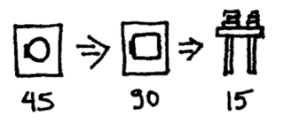

这个系统的瓶颈在烘干环节。即使我有两台洗衣机仍不能洗完更多的衣服。因为仅仅是暂时性的清洗更多的衣服，然后我就不得不面对堆满整个房间等待烘干的那些湿衣服，也许因此反而只能完成更少的洗衣工作。如果我想洗更多的衣服，除了在烘干环节上想办法别无选择。

约束理论认为任何系统在某一时间只存在一个约束（偶尔也会存在两个）。要提高系统的整体吞吐率，那么必须首先找出那个约束，并确保它能够全速工作，然后再寻找某些办法，或者增加约束的容量，来分流一部分工作到其它非约束部分，或者完全消除约束。

怎样在系统中找到约束呢？大量的工作在约束之处累积，即并没有很多烘干的衣服等待着折叠，而是存在很多湿衣服需要烘干。

干衣机就是约束。为确保干衣机是全速工作的，我打开恼人的蜂鸣器，它可以在干衣机完成工作时通知我。每当听到蜂鸣器响，我就换上新的湿衣服。我不需要洗衣机蜂鸣器，因为我从干衣机中取出一次衣服时才在洗衣机中放入衣服清洗。工作是根据实际的需求在系统中推进，而不是根据计划的要求。

如果我仍然需要洗更多的衣服，就需要提高烘干环节的容量。我可以买一个更大的干衣机，或者保持干衣机通风孔通畅提高烘干速度。我也可以买一个速度更快的干衣机来分流烘干环节的负担，或者，我可以把衣服拿到室外的太阳下晒干，如下图所示。

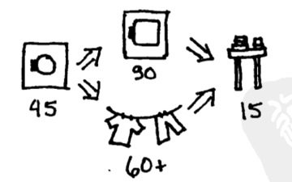

现在，我们所说的约束就转移到了洗衣机或者折叠衣服之处。约束理论认为约束总是存在的。我们消除一个约束的同时也产生了另一个约束。微观的优化是永远都不够的，要改进我们的结果，我们必须在决定改变什么之前先观察整个形势。

在软件中，系统的约束同样需要识别出来。下图是我们熟悉的、通常不是很有效的软件开发瀑布模型。

即使我知道每一步所需要的时间，仍然不能识别出瓶颈。要找到瓶颈，就要寻找工作堆积的地方。如果实体关联图（ER 图）包括了太多需要实现的特性而让实现环节延期，我怀疑实现环节是约束。如果许多特性已经实现了，但是等待着集成和发布，我怀疑集成过程是约束。

如果集成是约束，那么我首先希望确保集成这个环节在给定的输入和环境下能够尽可能平稳地运行。也许我们可以从实现环节调配人员到集成环节。我曾经见过一个超负荷的部署员同时让 20 个程序员参与部署工作，而其实让较少的程序员帮助部署有助于提高整体的吞吐率。

一旦集成环节能够稳定地工作，我便可以从前面的环节中寻找方法，来减少集成这部分的工作。比如实施阶段引入部分的自动化测试。这样做也许会使实现变慢，但能够改进整个系统的吞吐率（实际上自动测试可能让实现变得更快，这个我们在其他章节来讲述了）。

上面关乎工作在系统中推进的观点在软件中同样成立。软件开发的“推”模式（下图）就是堆积需求等待处理，然后堆积设计等待实现，接着堆积代码等待集成和测试，最后累积成为名副其实的大爆炸集成。XP 采用“拉”模式（下图）。这种方式是故事在即将要实现时才做详细说明，进而由详细说明拉动着测试，然后设计程序接口来满足测试的需求。同时我们要考虑代码的编写要匹配测试和接口，设计也需要精化来匹配代码的需求。设计程序接口来满足测试的要求，编写代码来匹配测试和接口，编写代码的时候精化设计来匹配代码的需求，这些又决定了接下来要详细说明哪个故事。这期间，其余的故事将留在故事板上，直到选择来实现它们。

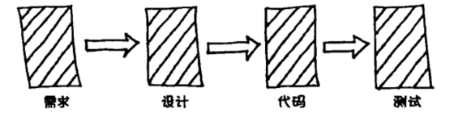

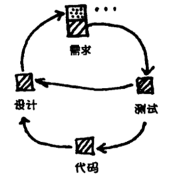

约束理论和其他组织变更理论具有同样的假设：整个组织关注的是整体的吞吐率而不是微观的优化。如果每个人都试图确保自己那部分的功能不被当作约束的话，变革就不会发生。如果开发者说：“是的，编写自动测试会是‘一件好事’，但是它会延缓我的进度而且让我负担过重。” 于是我们的组织将不会发生任何改变，而不论这个改变对组织进而对其中的个体是如何的有利。为了坚持变化，薪酬制度和文化必须面向整体的生产能力而不是个体的生产力。

约束理论的一个弱点是它只是一个模型。它就像一张地图，而不是一块实际的版图。人们开发软件并不能限制在一个盒子般的模型中。一个组织越是接近高效但沟通混乱，和约束理论进行的映射就越不精确。软件开发的过程是人来操作的过程，而不是一个工厂。然而，约束理论是一个能逐渐明白自身过程的好方法。将你目前的过程画成一系列连接的活动，然后寻找哪里是工作的聚集之处。

约束理论能够帮助我们找到瓶颈，但是如果瓶颈和软件无关怎么办？我的一位客户曾在飞机上部署非安全关键软件。他们的第一位合作人用了四个月的时间部署一个已经完成的软件，因为需要当飞机接受服务的时候才能够进行部署。我的那个客户因此又找到了第二位合作人，他可以使用一些设施，使得每天都能够部署这个软件，从而也消除了约束（将约束转移到了市场）。如果瓶颈存在于软件开发之外，那么答案也必须来自于软件开发之外。

我有时不禁想扩展 XP 的范围去涵盖一些如选择生意伙伴这样的主题。有时我会担心如果 XP 不能涵盖广泛的问题，人们就会认为它并不重要。当然，在更清醒的时候，我相信在一个清晰而更加专业的领域中 XP 的价值将更明显。

有时 XP 能够帮助将约束完全转移到软件开发之外，所以对于一个采用 XP 的组织，将会有连锁反应。比如，你开始组织周例会，在会上，团队中关注业务的角色（例如产品经理和客户）选择那个星期需要添加的特性。程序员也许会很快地完成任务，以至于产品营销跟不上开发的脚步。这样约束就被转移到软件开发之外了。

有这样一个令人难过但仍然被一再重复的故事：开发团队开始应用 XP，并且极大地改进了产品质量和生产率，但是后来它被解散了，负责人被解雇了，团队的其他成员也被拆散了。为什么会发生这样的事情？从约束理论的角度来看，这个团队的绩效改进将约束转移到了组织的其他地方。新的约束（比如说营销，不能足够快的决定 XP 团队需要什么）不希望成为大家的焦点。因此，没有人真正关心组织的生产能力。于是骚乱的“根源” XP 就被责怪和抹杀了。

主管人员的支持，与团队之外的成员的牢靠关系，这二者对应用 XP 都十分重要，这正是因为一旦软件开发的作用聚集起来，应用 XP 将会改变组织其他部分的工作结构。如果你没有主管的支持，那就要做好准备在不被承认和没有保护的情况下独自更好地完成工作。

### 第 12 章 计划：管理范围

共享计划的状态提供了一个线索，即关于被该计划影响的人之间关系的状态。不切实际的计划暴露的是一种不清晰、不平衡的关系。而一个双方认可的、在必要时会调整以反映实际情况变化的计划，体现的则是一种相互尊重、互惠互利的关系。

计划可以使目标和方向清楚明确。XP 中的计划开始于把当前的目的、假设和事实公布于众。利用当前明确的信息，你们可以就什么是范围之内的、什么是范围之外的，以及下一步该做什么达成共识。

XP 中的计划就像是购买杂货。想象你走进一件杂货铺，口袋里揣着 100 元钱。货架上的每件货物都贴着标价。这里面有些货物是你需要的，而有些是你不需要的，还有一些是你想买的，但是超出了你的预算。如果你带着价值 101 元的食物走到收银台，你就不得不放回一些东西。在购物时你的工作就是明智地使用这 100 元来购买你所需要的东西，并且尽可能多地买你想要的物品。

在 XP 中，货物就是故事，价格是对故事的评估，预算是总共可用的时间。项目预期的部署日期通常是较早设定的，所以你知道你有多少时间可用在故事上。如果你口袋里有两百个结对-小时，而购物车里有价值四百结对-小时的故事，那么挑选总计两百个结对-小时的最有价值的故事集合。否则，人人都知道你购物车里的物品超过了你的购买能力。

计划的一部分工作是从所有可能性中决定下一步要做什么。计划是复杂的，因为对故事的成本及价值的估算是不确定的。即我们赖以做出决定的信息是变化的。所以我们用反馈来改进评估，尽可能晚地做出基于最佳信息的决定。这就是为什么在 XP 中计划是一个每天、每周和每个季度都要做的活动。随着事实的出现，计划也在不断地改变以适应事实。

计划不是对未来的预测。计划至多通过表达你今天所知道的来估计明天也许会发生的事情。计划的不确定性也没有否定其价值。它能够帮助你与其他团队间的协调同步。计划给了你一个出发点，帮助团队中的每一个人根据团队目标来做出决定。

当我还是个年轻的软件工程师时，学会了根据三个变量来管理项目，即速度、质量和价格。项目发起人会设定其中的两个变量，而团队则评估第三个。如果计划不被接受，那么谈判也将随之开始了。

这个模型在实践中运行得并不好。时间和成本通常在项目之外设定，这使得质量成为你唯一能操作的变量。降低你的工作质量并不能减少工作量，这只是把工作推后，如此一来，项目的延迟则并不明显代表是你的责任。你以这种方式制造工作进展的假象，但这是以减少成就感和损害团队关系为代价的。我们所说的成就感应来自于完成高品质的工作。

这个模型遗漏的变量是范围。如果我们让“范围”显式化，那么：

- 我们拥有一种安全的适应方式。
- 我们拥有一个谈判的途径。
- 我们拥有对荒谬的、不必要的需求的一种限制。

任何时间尺度的计划都有这样四个步骤：

1. 列出可能需要完成的工作部件。
2. 估算这些部件。
3. 为计划周期设定一个预算。
4. 就预算内需要完成的工作达成共识。谈判时，不要改变这些估算或者预算。

我们需要聆听团队中每个人的声音。计划提供了一个平台，团队可以在其中了解到各方的希望，但是只对需求负责。

这个过程以结对编程这样的粒度来运转，计划几个小时内预期满足的测试用例和要改进的设计；以小组为规模来计划每天的活动；团队的周计划或者季度计划相对来说更为正式。在这一过程中，故事被列在了一张表单中，估算也更为正式，整个计划的过程要花上几小时或几天。

计划是我们共同来做的一件事情，需要合作。计划是一个听、说以及将目标和特定时间段联系在一起的训练。它对于每个团队成员都是有价值的输入。没有计划，我们就是很少沟通、缺乏效率的个体。也只有当我们和谐地计划和工作的时候，我们才构成了一个团队。

团队中的每个人都应该参与计划。一些 XP 团队将客户拉拢，让客户站在团队这边，制定一周工作的预算。这样做只是让“零和游戏”远离程序员，他们就没有工作的紧迫感。这么做将失去双赢的机会。整个团队一起也许能够找到一种方法，可以满足客户看似违背惯例的需求。如果团队不知道所有相关的需求和问题，就不能做出好的业务或技术决定。

在选择下一步要实现哪些故事的时候，通常把故事按几种方式排序。将故事按空间位置列举出来可以提供对故事之间关系的新认识，同时也使得选择故事的过程更顺利。你可以把关于风险的故事放在左边，将关于价值的故事放在上面。另外，你可以将所有关于性能调优的故事放在桌子一角，将所有新功能的故事放在另一角。不管什么时候我在计划中感到迷惑了，就可以收起桌上的所有故事，重新洗牌，然后重新摆放。

要评估一个故事，你便要通过你知道的关于相似故事的一切，想象出一个结对需要多少小时或多少天来完成这个故事。“完成”的意思是已经为部署做好准备，包括所有的测试、实现、重构和与用户的讨论。随着你对类似故事的知识增长，你的评估也会越来越准确。评估是基于与故事相伴的合理工作，有些评估也许会较好而另一些较差，但是如果每个人轮流评估一次，最后我们将得到一个平均值。

最开始，这些评估可能会错得离谱。基于经验的评估相对来说会更准确。同时，尽快地得到反馈对改进评估很重要。如果你有一个月的时间详细计划一个项目，可以把时间划分为四个单周来进行迭代开发，与此同时可以改进评估。如果你有一周时间计划项目，采用五天进行迭代，每天一次。反馈循环将会给你提供信息，同时这些经验将指导你做出更加准确的评估。尽快获取这些经验，这样你的评估就能更快地改进了。

上面讲述的内容提供了货品（故事）和价格（评估）。那么，你怎样确定预算呢（即完成的时间和团队的规模）？度量一下你平均一周有多少生产人时，计算结对时要除以二。如果一个团队有六个程序员，每天四小时的编程时间，那么应该计划每周有十二个结对小时。结对的一个缺陷是将编程时间减半。以我的经验，结对效率比单人的效率要高不止两倍。我单独完成工作所需要的实际时间（算上调试时间）是结对完成需要的时间的两倍多，所以结对实际上让你提前完工并且产出整洁的代码。比较结对编程和单独编程的价值时，你需要考虑完成可部署代码的时间和生产率。我们的目标是按期交付符合预算的有价值的软件。计划中的具体数字很要紧，但只是服务于这个目标时才要紧。因此，计划时你必须把所有相关的数字包括在你的计算中。

本书第 1 版有一个更抽象的评估模型，其中故事成本按 1、2 或 3 “点”计算。较大的故事必须分解才能计划。一旦你开始实现故事，你将很快就会发现通常在一周之内自己能完成多少个“点”。现在我更喜欢用实际时间进行估算，让所有的交互尽可能地清楚、直接和透明。

一天之内能够完成多少工作是有一个限制的。注意这个实际的限制能让你更有效地制定计划和成功交付。程序员应该完成两倍的工作量这种说法是行不通的。程序员能够增加技能和效率，但是他们不能一经要求就完成更多的工作。对于创造性的工作来说，花更多的时间坐在桌子旁并不代表提高生产率。

不论你用时间还是“点”作单位，你都需要处理实际结果与计划不符的情况。如果你采用实际时间评估，修改已经完成故事的评估作为经验。如果你采用点评估，修改后继周期的预算。Martin Fowler 在“昨天的天气（yesterday's weather）”中提到：每周计划与上周实际完成工作量一样的工作。每当确认了新信息就相应地调整计划。

有时候你会在周期当中发现进度比计划要慢，就要想办法重新跟上计划。也许我们会问，你是否被不太重要的问题分心了？你是否在某个能帮助你的实践上松懈了？如果没有过程改变能够恢复计划和现实的平衡，那么可以请求客户选择他们希望首先完成的故事。全力完成这些故事，不管其他故事。重新计划所花费的时间将使团队在朝着部署之日前进的过程中更加和谐且更有效率，而且会有更多更好的效用。如果没有调整，那么就说明你是在谎言下工作。因为我们每个人都知道这样的情况，所以就不得不隐藏它来保护自己。这样的方式不可能完成和部署好的软件产品，同时也会破坏团队和个人的信心。

事情进展不顺利的时候就是我们最需坚持价值观和原则的时候，同时修改我们已有的实践去尽可能地保持效率。不准确的平评估是信息的错误，而不是价值观或者原则的错误。如果是数字上的错误，那么就需要改正数字，沟通结果。

在索引卡上写故事，并把卡片放在墙上明显的地方。很多团队试图跳过这个步骤而直接采用计算机化的故事版本。我从没见过这种方式能够起作用。因为故事存放在计算机中使得人们不再相信它们。故事之间只有通过不断地互动才使它们更有价值。卡片是个工具，目标之间的互动和联系，故事中的共享信念，都是其有价值的部分。你并不能把关系自动化。我们的目标是有一个每个人都相信并且努力为之工作的计划。

项目中有一种力量的平衡：有些人只需要将工作完成，而有些人需要做好工作。共同点是他们都有做可信计划所必须的信息。墙上的卡片是一种实践透明度的途径，将其作为重视和尊重每个团队成员的输入。

项目经理负责把卡片翻译成组织内其他部门所需要的任何格式，他还要指导其他人去阅读墙上的卡片。我们没有什么需要隐藏。那就是计划，开放而且可用的，它反映了一种使软件开发价值最大化的关系。

### 第 13 章 尽早测试、经常测试、自动测试

缺陷破坏了有效软件开发所需的信任。客户需要信任软件；客户经理需要信任进度报告；程序员则需要彼此信任。而缺陷破坏了这种信任。没有信任，人们就得花费大量的时间来保护自己免受别人可能出现的错误的影响。

但是，缺陷不可能完全消除，而且，将平均缺陷间隔时间（MTTD）从一个月增加到一年看起来是极其昂贵的，而增加到一个世纪的花费，就像航天飞机上运行的代码要求的那样，根本就是天文数字。

软件开发的窘境在于：出现缺陷需要付出极大代价，消除缺陷也是如此。但是，多数缺陷最终所付出代价超过预防缺陷的代价。缺陷一旦出现，代价极大，包括修复缺陷的直接成本，还有因缺陷引起的客户关系破坏、生意丢失以及开发时间损失等非直接成本。XP 的实践旨在，首先通过清晰的沟通使得缺陷不再出现，其次，如果出现，保证团队借此学会如何在未来避免发生类似问题。

缺陷是不可避免的，因为总是会有意外的情形出现。在意外的情形下，即那种程序员事先根本料不到的情形，软件行为就很可能会超出其想象。

可接受的缺陷水平是多样化的。软件开发的一个目标就是减少缺陷的出现，直到经济上能够接受的水平。这个水平对不同的软件来说是不同的。世界最大的网站每秒钟可能发生上百个软件错误，却仍然是经济可行的，因为 99.99% 的网页可以正确显示，任何用户都感觉该网站是可靠的。而对于航天飞机来说，可能就要求把软件相关失效，限制在一个世纪只发生一次。

软件开发的另一个目标是减少缺陷的出现到一个可以适度增长团队信任的水平。用于减少缺陷的投资，跟对团队工作的投资一样有意义。一个程序员引入的错误会增加其他所有人的工作难度。每个团队成员引起的影响其他人的错误，都会导致整个团队的研发时间、精力以及彼此信任的成本消耗。而良好的工作，良好的团队工作，会增进士气和信心。如果你能尊重和信任你的同事，你就会更有效率地工作并享受到工作中的更多乐趣。隐藏错误以保护自己，有时看起来是必要的，其实却是时间和精力的巨大浪费。我们需要彼此间的信任来激励参与者。工作顺利时我们会感觉很好。我们需要在实验中和犯错误时确保安全，测试就负起这样的责任，通过测试我们能肯定我们没破坏什么。

多数团队已经选择忍受缺陷，近期仍是如此。想拥有本质上无缺陷的代码、或是一个月或一年才出现一次缺陷的代码，被认为是不可能的。甚至将缺陷率减半看起来也太昂贵了，无论是在金钱花费上还是在时间进度上。XP 中很多社会实践，例如结对编程，目的就是要减少缺陷。XP 中的测试就是一种直接处理缺陷的技术活动，此外，XP 应用两个原则来提高测试的成本效益：复核，缺陷成本递增率。

如果你用一种方式对一列数字求和，很多错误都可能导致你的运算结果出错。用两种不同的方式加，比方说从开头加起和从末尾加起，如果两种方式你得到了相同的答案，那么答案很可能就是正确的，因为你出现两个同样偏差错误的可能性非常小。

软件测试就是复核。一旦你写出测试，就道出了想让一个运算做什么。你实现这个运算时，是完全不同的表示形式。如果这两种表达形式相称，代码和测试就是协调的，很大程度上是正确的。

缺陷成本递增率（Defect Cost Increase，DCI）是 XP 中用来提高测试成本效益的另一个原则。DCI 是经验证明了的为数不多的几个软件开发原理之一：越早发现缺陷，所需的花费就越少。如果你部署之后十几年才发现缺陷，你不得不首先重建历史背景和上下文语境以领会代码的意图，哪些假设错了，应该修改什么不致影响程序其他（假定正确）部分。如果在缺陷诞生之时就发觉，那么修复它所需的代价是最小。

DCI 意味着反馈回路长（下图）的软件开发是比较昂贵的，并且会有很多残留的缺陷。找出并修复这些缺陷的预算是有限的。找出和修复缺陷的成本越高，残留在部署代码中的缺陷就越多。

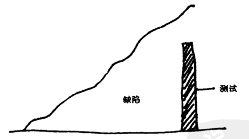

XP 反向运用 DCI 来减少修复缺陷的成本和部署缺陷的数量。通过在编程的内部循环引入自动测试（下图），XP 努力更快、更经济地修复错误。这使得 XP 团队有可能经济地开发没没什么缺陷的软件——按照同代人的标准来说。

更频繁的测试有几个含义。一是犯错的人自己写测试。如果引起缺陷和检测缺陷的时间间隔是几个月，这两种行为由不同人完成是有意义的。如果这两种行为的间隔仅仅是几分钟，两个人之间的预期交流成本是付不起的，即使每个程序员有专职的测试人员。在某些情况下，协调的成本远远超过缩短这个间隔带来的效益，除非你让程序员来写测试。

如果由程序员撰写测试，我们仍然需要系统的另一个角度视图。一个或一对程序员，把对系统功能的单一观点带入代码和测试，结果会失去复核的部分价值。当两种截然不同的思路得到相同答案时，复核最有效。这就是拷贝运算的结果作为期望值的危险性的原因所在，你只思考了一遍，而最好再手工运算一遍以获得另一个角度视图。

为了在复核中获得最大的收益，XP 中有两套测试：一套是从程序员的角度写的，完整地测试系统各组成部分；另一套是从客户或用户角度写的，将系统功能作为一个整体测试。这些测试互相复核。如果程序员的测试是完美的，客户的测试不会找出任何错误。

XP 测试的即时性也意味着测试必须是自动的。我曾经陷于关于自动测试和手工测试的争论，这种争论在 XP 中是不存在的。随着时间推移，通过改进设计和定制开发工具，团队不断降低自动测试的成本，直至所有测试都变成自动的。自动测试打破了传统的压力循环（下图）。

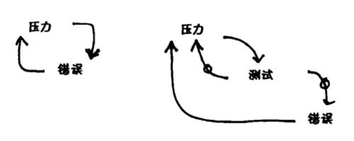

手工测试时，团队的压力越大，团队成员在编程和测试过程中出现的错误也会越多。而自动测试时，运行测试本身就是个压力解除器。团队的压力越大，就运行越多的测试。这些测试也减少了程序员检测时漏网错误的数量。

β 测试是测试出实践薄弱和客户沟通差劲的征兆。但是，在到尽早和频繁测试的过渡期中，适当地保留当前测试实践是比较明智的。团队的目标是消除所有的开发期之后的测试，把测试资源转移到开发周期中更能发挥杠杆作用的部分。有某些测试形式（像压力和负载测试）在开发“完成”后发现缺陷，把它们引入到开发周期中来，持续、自动地运行压力和负载测试。

静态验证是复核的一种有效形式，尤其是对很难动态再现的缺陷。要发挥静态检测的最大价值，其速度必须更快，成为开发内部循环的一部分。基于程序的变化，静态检测器必须在几秒钟内提供反馈，就像增量编译器做的那样。即使是现在，静态检测一个真实程序可能也需要花费几天，但对于在程序并发属性方面提供信心，静态检测仍然是十分有价值的。当程序有复核的需求时，写静态验证语句，跟写其他测试一样，每次写一点。

DCI 告诉我们，测试应该靠近编程进行，但并没有准确说明什么时候测试。代码实现之后的测试是具有优势的，因为有意义。毕竟，你不可能检查还没有做出来的物理部件的容限。这是“测试”这个词背后的物理隐喻误导人的地方。因为软件是一个虚拟的世界，之前或之后“测试”同样有意义。你可以编写代码使其吻合一个模子，或者铸造一个模子以配合代码。只要可以创造最大收益，你选哪个做法都行。最后你把两者放在一起看它们是否匹配（下图）。

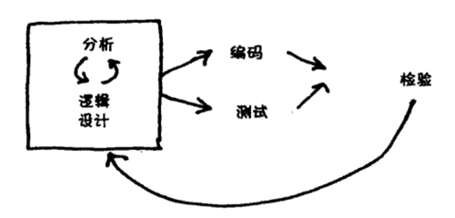

先写代码后写测试，或者先写测试后写代码，两个顺序都行。XP 中，只要可能，先写测试后写代码。先写测试有几个优势。软件开发中有这样一句谚语，实现不应该过度影响接口。先写测试是完成这两者分离的具体方式。同时，测试也满足人们希望确保安全的需求。当我写下我能想到的所有可能失败的测试，并且这些测试都通过了，我就敢肯定我的代码是正确的。其他我没有想到的测试可能失败，但是至少我能够指出系统实际做什么，就像测试所演示的那样。

测试能够提供进度的度量方法。如果我有 10 个测试失败并且修复了其中的 1 个，那么我就有了进展。也就是说，我尽可能每次只让一个测试失败。如果我测试优先编程，我写一个失败的测试，让它运转正常，然后开始写另一个失败测试。让第一个测试运转的经验常常能给第二个测试的编写提供信息。如果我的测试是基于无效的假设，那么当假设被证明是错的时，我不得不修改所有测试。通过系统级别的测试能让我确定，整个系统在周末是运转得通的。

在 XP 中，测试与编程同样重要。撰写和运行测试提供给团队一个做引以为傲的工作的机会。当团队在未曾预料的方向快速推进时，运行测试给了团队一个有根据的信心基础。通过加强团队内部以及与客户之间的信任关系，测试在软件开发中贡献了很大的价值。

### 第 14 章 设计：时间的价值

增量设计是早早交付功能，并且在项目生命周期中每周持续的交付功能。XP 将软件设计的渐进主义推向一个极限，并提出如果设计是日常事务的一部分，项目运转会更平稳。本章探索信奉增量设计的技术、经济和人文方面的原因。

在保持平衡的生态系统中，永久培养（permaculture）是一种赖以生存的哲学和实践。在永久性的培养过程中，我把设计看作是互惠的相关元素组成的系统。这个定义的每个词都有含义。“元素”表示系统不能仅仅理解为一个整体。“相关”表示设计中的各个元素不是孤立的，而是彼此相互联系在一起的。这些联系，还有从设计到元素的分解，正是设计者要操作和处理的东西，不管是有意识或无意识的，不论好坏。“互惠”表示这些联系能够加强各个元素，使之比孤立时更加强大，使得整个系统超越各个孤立元素的总和。

是设计使得软件这么有价值。不像物理世界，在软件世界里我们能无止境地复制元素而不花一分钱。当我们在元素间创造了更有益的新联系，我们能把这些联系复制到所有存在的元素中去。软件是一种杠杆游戏。一个好的主意能够节省数百万美金的花费，同时创造数百万美金的收入。

不幸的是，软件设计已经被物理设计活动的隐喻束缚住了。如果你已经有一座 50 层高的摩天大楼，你不可能在这个地基上再建一座 50 层的高楼，因为你已经出租了所有的空间。你不可能用起重机把这个庞然大物抬起来替换地基。

等价转换是软件的日常事务。分布式系统可能使用远程过程调用作为初始的通信技术。随着系统的经验增长，团队能够明白转向 CORBA 技术是如何改进系统的。一年后，团队用消息队列替换了 CORBA 技术。在这个过程的每个阶段，系统始终是运行的。这个过程每个阶段都为转向下一个阶段提供了经验。这就好像我们从一个狗窝开始，然后逐步替换零件，最终盖成摩天大楼，而且自始至终一直住在这个建筑物里。这在物理世界里是荒诞的，但在软件开发中却是明智、低风险的一种技术。

在物理世界里，单个转换代价太大，增量设计不起作用。中间阶段的价值太小或者变化的代价太大（零件被毁，而在重建进程中复制零件的开销很大）。尽管如此，正如 Stewart Brand 的著作《建筑物如何学习（How Buildings Learn）》中所述，甚至是物理建筑也可以进行增量设计与构建，利用已有建筑物的经验为设计的下一阶段提供信息，这种方法单凭思考推测是办不到的。

使得软件的增量设计如此有价值的部分原因是，我们往往都是第一次写某种应用。即使这是同一个主题的第无数次变化，也总有一种更好的方式来设计这个软件。因为软件设计具有一定的杠杆效应，同时设计理念是随着经验而改进的，耐心是一个软件设计者可以拥有的最有价值的技能之一。只需设计足够的东西来得到反馈，然后利用反馈改进设计，保证足以获得下一轮的反馈即可，这是一门艺术。

软件的一个常用隐喻是建筑物构建。例如，Steve McConnell 在《代码大全（Code Complete）》中推出了软件构建隐喻。Beth Andres-Beck，Smith 戏剧学院的学生，已经指出这个隐喻的基本原理缺陷：在建筑世界逆转进度是极其困难的。某天你可以移动木桩和准绳来改变楼层平面设计，两天后，地基灌好了，再做同样的改变需要花 10,000 美元。这种成本不对称性刻画了建筑中的活动及其关系。

但软件中，逆转一天的工作是小事一桩。你损失的全部只是那天的工作。有了这个彻底的不同，适合于建筑业的活动顺序就不适合软件了。问题不是是否要设计，而是什么时间设计。

MacConnel 写道，“在 10 年的时间里，钟摆从‘设计所有东西’摆到‘什么也不设计’。但是事先大量设计（Big Design Up Front，BDUF）的替换不是事先不设计，而是事先少量设计（Little Design Up Front，LDUF）或者说事先足够设计（Enough Design Up Front，EDUF）。” 这是针对假想敌的论题。实现之前设计的替换是实现之后设计。有些事先设计是必要的，但足以得到初始实现即可。一旦实现到位，设计的真正约束就显而易见，这时再进行进一步的设计。非但不是“什么也不设计”，XP 的策略是“始终设计”。

下面的图帮你形象化地说明应该什么时候设计。图的纵坐标是设计的质量。其中一条水平线代表成功所需的设计质量的最小值。软件设计是奇特的，因为通常有很多种设计方案能够使软件取得成功。成功的设计不担保软件成功，但是设计失败肯定导致软件失败。

每张图上有三个点，一个代表你“出于本能”会设计得怎么样；一个代表你真的经过仔细思考会设计得怎么样；还有一个代表你根据经验会设计得怎么样。三者之间的关系和最小设计阈值的位置暗示你事先设计是否是一个好的选择，或者说使用增量设计是否你的处境会更好。

下图表示仅需已有设计就已足够胜任。以前任何设计方法都可以做到。你可以今天就勇往直前设计，就能够成功。

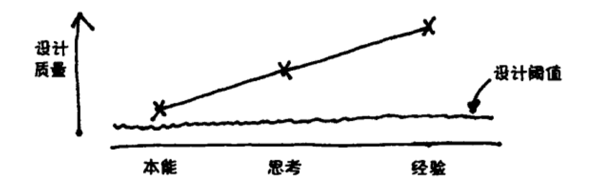

下图的场景表明什么时候设计不是那么明朗。仔细思考可以产生一个好的答案，但是经验能够产生更好的答案。你不能选择完全不设计，因为潜意识的设计将导致失败。你现在就把大量投资投入到设计，还是等到有了一些实践经验之后呢？

下图的案例增量设计是不可避免的。缺乏经验的思考不会产生足够好的设计。只有经验才能产生足够的理解去做一个足够好的设计。

决定何时设计时需要考虑的一个因素是，不同策略的可用价值。如果缺乏反馈的纯粹思考可以创造大部分价值（下图），早点设计更有意义。如果经验创造大部分价值（下图），更有意义的做法是，今天只做可以开动的足够的设计，然后根据经验做大部分设计。

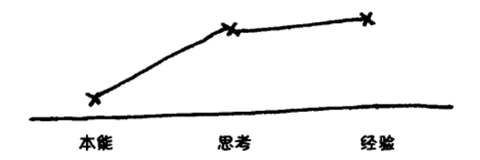

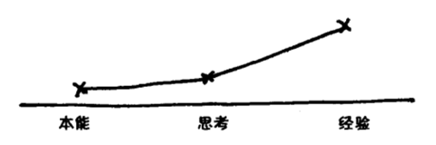

决定何时设计的另一个因素是成本。如果你早早设计，设计的初始成本只是你花费的时间。如果你犯了很多错误，不得不在项目生命周期里修复或加工，那么总成本会很高。基于经验设计的成本是初始梗概设计的时间（比事先设计所需时间少），加上把之后的设计决策翻新到运行代码或活跃数据的成本。很多 XP 实践致力于降低实时设计的成本。

一个特别重要的设计问题是数据库设计。ThoughtWorks 的 Pramod Sadalage 提出了一个优秀的增量数据库设计策略。

- 首先建立一个空数据库。
- 采用脚本自动加载所有的列表和必要的已存数据。
- 依次给脚本编号，使得运行脚本可以让数据库从任何早期阶段到达后期阶段。

脚本代码的特定版本表示数据库设计的一个特定版本。部署系统一个新版本包括转出新代码和运行设计/迁移脚本。为了缩短停工期，部署应该保持小且频繁。

我所知的最强大的启发式设计规则是“有且仅有一次”：数据、结构或者逻辑应该只存在于系统的一个地方。我通过找出重复来发现需要投入设计的地方。我一直设计直到找到一种方式将分散的表达统一在一起。模式就是这些设计改进的共同目标，是一般无需重复的代码结构。重复不好，因为它使得改变一个概念就得在几个地方修改代码。没有重复的代码具有一个概念改变只需一处代码改变的性质。如果你的代码具有这种性质，继续改变的花费就降低了。

反对增量设计的争论可归结为“我们不能”和“我们不想”两点。解决“不能”可通过学习在运行的代码和数据的环境中进行设计所必需的技能。“不想”有点难办。我当然直到我工作的系统中的很多潜在设计改进，但是我从来没有投入时间在系统中实现它们。最常见的是，我过于狭隘的关注于给系统增加一个新特性的问题，而没有改进设计。我没有试图在整个团队的生产率和今天的任务之间取得平衡。我不认为在某个地方加入一个本不属于它的特性会有多糟。我认为真的工作好不会有多少动力和满足感。

如果你面对的是一团乱麻，你仍然可以开始改进设计。开始在你走过的地方把灯点亮。一边修改代码，一边整理。抵抗诱惑，不要让设计改进涉及太远的地方。养成习惯，只改进今天影响到你的设计。列出需要时间来解决的大的改进。很快你会发现，你一直在改变的代码已经设计得相当好了。当你进入以老方法设计的未触及的系统部分，你将感到惊奇。

有时团队不能在一周内完成设计改进的同时仍交付新功能。增量设计的一部分就是指出如何逐步改进设计。例如本章开始的例子，从远程过程调用转到 CORBA。即使起先小心设计，运用远程过程调用的一些假设还是会遗漏在跟通信无关的代码里。当你接触到这些代码，把这些设计集中到尽可能少的地方。最终，插入新通信协议的工作便可在一周内完成。

这样长时间进行的修改看起来比停止开发而做一次性修改花费多。在 XP 中，软件设计不是为了设计而设计。设计是服务于技术和商业人员之间的信任关系的。所需功能的每周交付是这种关系的基础。理论上最好的设计方法是什么并不要紧。相比于维持在团队中创造价值的各种关系来说，为设计人员提供方便的优先级并不高。

概括来说，向 XP 风格设计的转换是设计决策时期的转换。推迟设计，到可以根据经验进行及可以马上使用设计的时候。这就允许团队：

- 更早部署软件。
- 毫无疑问地做决策。
- 避免忍受糟糕的决策。
- 当起始设计假设被取代时，维持开发的速度。

这个策略的代价是，需要纪律来保证贯穿项目生命周期持续投入到设计，以小的步骤进行大的改变，这样才能维持有价值的新功能的“流”。

#### 简单

XP 团队更喜欢尽可能简单的解决方案。下面是评价设计简单性的四个标准：

1. **适合于希望得到它的人们**。设计如何华丽优美并不重要，如果需要使用它工作的人不明白它，它对他们来说就不简单。
2. **易交流**。需要交流的所有思想都表现在系统中。就像单词表里的单词，系统的每个元素都需要跟未来的读者沟通。
3. **提取了共因子**。逻辑或结构的重复使得代码难以理解和修改。
4. **最小化**。在以上三点限制下，系统应该具有尽可能少的元素。元素越少就意味着需要的测试、归档和交流地越少。

趋向简单的项目可以改善软件开发的人性化和生产率。

### 第 15 章 增大 XP 规模

人们常常会问如何增大 XP 规模。一百个人不可能每周一次地在一个会议室中详细地计划他们的工作。但一百个人能以沟通、反馈、简单、勇气和尊重的精神一起工作。创建和维持一个一百人的团体与创建和维持一个十二人的团体相比是非常不同的工作，但是始终是能做到的。

项目中的人数并不是软件开发规模的唯一衡量标准。软件发展可以在很多维上扩大规模：

- 人数
- 投资
- 整个组织的大小
- 时间
- 问题的复杂性
- 解决方案的复杂性
- 故障的后果

#### 人数

当人们谈论扩大规模时，多数人似乎指的是人数这一维。每个我访问过的中型公司都喜欢回忆以前通常如何做事。问题可能只是得到解决了。有时候他们会认识到当解决问题的方法中有两个程序员时就不再起作用。他们的解决方案“不能扩大规模”。的确，五十个开发人员并不能像两个开发人员那样行动，但严格控制和频繁开始结束不是唯一的解决方案。

当面对一个大问题时，我用三个步骤工作：

1. 将问题转化为小问题。
2. 应用简单的解决方案。
3. 如果还有问题则应用复杂的解决方案。

按照这个步骤，当面对看起来需要大团队的情况时，可能问题实际上可以由小团队解决。我曾经看到一个组织，从五十人发展到三百人并且计划发展到两千人，这样进行的方式其实每一步都增加了他们的问题并且失去了整体的生产能力。这些组织仅拘泥于在员工人数上扩大规模，好像不想相信他们的问题其实可以由最初的五十个开发者更好地解决。

如果仅仅用小的团队不起作用，那就把大的编程问题转化为一些小的问题，每个问题可以由小团队来解决。首先，由一个小团队解决问题的一小部分，然后我们沿着它的自然分割线划分系统，让几个团队开始在其中工作。分割系统的同时可能会引入风险，使得集成时可能合不起来，所以要频繁地集成以协调各团队之间不同的假设。这是一个“治而分之”的策略，而不是“分而治之”的策略。下一章提到的 Sabre Airline Solutions 公司广泛地使用这个策略。

“治而分之”的目标是能够把每个团队当作单独的团队管理，以限制协调的成本。尽管如此，整个系统仍然需要频繁的集成。这个独立性设想偶尔出现的例外可当做异常管理。如果这些例外变成规范，团队不得不花太多的时间协调，以期看到系统是否有办法更改结构让团队恢复独立。只有当这样不行时，大项目管理的负荷才是适当的。

简而言之，当明显需要大团队来工作时，我们首先要问问小团队是否能够解决这个问题，如果那样做也不起作用的话，可以由小团队首先开始项目，然后在自治的团队中划分工作。

#### 投资

经常有人问我怎样在 XP 的项目中解决大的投资。例如，曾经好几次有人问我，XP 风格的开发是一种消费还是一种资本投资。将其看作消费的公司可以把 XP 看作对一个已部署项目的维护。把大部分软件开发看作资本投资的公司可以使用季度或年度的周期针对特定问题的批准执行大量的开发，即使项目的精确范围没有预先详细说明。

问题在于如何处理软件开发中的账目，而不在于 XP 本身。盲目地把用于工厂和小器具范围内的账目模型应用到软件开发这种不同类型的活动中，不可避免地会在账目上引起分歧和曲解。在清算账目和软件开发之间重新构思一个互惠互利的关系，是 XP 范围之外有待去做的有趣工作。

如果你要以 XP 的风格开始一次大规模的软件开发，尽早在财政上找个同盟帮助你操纵这些问题。每家公司给软件做账的方式似乎都有些不同。

#### 组织的大小

当组织的大部分没有改变时，如何在组织的一部分中应用 XP 呢？当团队即将开始迅速地创造越来越多的精确信息时，强迫一些不情愿的人去听这些信息反而会树敌，而团队却需要他们作为朋友。我们的目标既不是隐瞒新的工作也不是强迫其他人去改变。确保以组织其他习惯的形式保持与他们沟通。

在这个领域，XP 团队可以从能干的项目经理身上受益。如果每月大型的员工会议想看到某种形式的幻灯片，那么这就是 XP 项目经理需要准备的。项目经理要以一种组织能够吸收的形式介绍所需的信息。墙上的故事卡仍然是“事实”，欢迎任何想要学习和阅读它们的人来看看，并且询问问题。项目经理要确保满足组织的预期。这可能是一个挑战，因为 XP 团队里进行的事情和其他团队相比有一些不同。我们要尊重组织里其他人，而不要为你自己的利益把你新发现的知识和能力强加给别人。

满足组织的预期，同时维持 XP 的好的方面，有时是需要创造力的。每个项目都需要给客户准备一份详细的季度计划，这似乎跟 XP 以及每周谈判的形式是矛盾的。然而，老板的老板却能够明智地发现季度计划的目的及什么时候来阅读它，即在季度末尾的季度性管理评审时才阅读它们。通过把计划与实际发生的事情相比较来考评团队是否表现得负责任。

在 XP 团队中，项目经理每周五回来询问每个队员这个星期做了什么。他以季度计划的形式记录这些信息。在季度评审时，就会看到团队计划包含了组织中最精确的评估。

这个过程中没有人试图说谎，而且整个事情都是在会议桌上发生。同时整个管理链也知道正在发生的事情。团队以正确的形式满足了组织的期望，也满足了季度计划的精神：确实为有效率使用时间负责。

#### 时间

长期运行的 XP 项目会运转地很好，因为测试预防了许多常见的维护错误，并且描述了开发过程。在时间上扩大规模的最简单的情形是让团队在整个项目的过程中维护项目的连贯性。从而使自动化测试和增量设计可以用来保持系统进一步成长的活力和能力。我十年前指导过一个团队使用这些技巧，从那时到现在他们一直稳定地增加功能。缺陷几乎很少。进度并不引人注意但是比较稳定。十年时间开发一个大而复杂的系统，即使由小团队开发，进度也不必是壮观的。

如果频繁地开始和停止项目，每次停工后团队又被解散，这样随着时间的进展将更难维护，在这种情况下，XP 团队在项目停工前经常要写一个“[罗塞塔石碑](https://en.wikipedia.org/wiki/Rosetta_Stone)”的文档。这个摘要用来指导将来的维护人员，并告诉他们怎样运行构建和测试过程，指出从哪里着手学习系统比较有趣。包含在构建中的测试可以防止维护人员用自己的方式学习系统时落入陷阱。

#### 问题的复杂性

XP 非常适合需要专家紧密协作的项目。这些项目初期的一个挑战是，让每个人都协调工作，同时相互学习取长补短。例如，一次我参与一个人寿保险项目。那里的保险精算师在我学习保险精算数学的时候对我非常耐心。一个月后，我会犯一些愚蠢的错误。几个月后，我有时甚至可以帮上忙。我从未做过保险精算师，但是产生的系统（和团队）相对来说更强壮——相比保险精算师在他的小角落工作而我独自做用户界面的工作情况而言。

#### 解决方案的复杂性

有时系统会变得庞大而复杂，超出了他们解决问题的比例。这时的挑战就是要阻止问题进一步恶化。当每解决一个缺陷却产生三个缺陷时，苦斗的团队很难继续下去。这时 XP 能帮忙解决。

一个客户开始对构建过程受控。团队改进构建使得这一过程可以花费 1 小时在任何机器上完全自动地运行，而不是在一台专用的机器上面耗费 24 小时同时还需要人工干预运行。然后，团队编制了故事并创立了故事板，这样每人都知道谁工作了什么及花费多长时间。经过两年稳定的改进，团队减少了 60% 的成本，从 70 个工程师减少到 20 个；修正缺陷的时间减少了 66%；主版本和服版本的发布时间减少了 75%，从十个星期减少到两个星期。一旦团队已经停止了深奥难懂的钻研，就开始消除额外的复杂性，同时修正缺陷。

XP 处理额外复杂性的策略是一样的：分解复杂性，同时持续交付。让你所在的角落明朗化。如果你在一个区域修正一个缺陷，把你所负责的地方整理好。一个异议就是这个“额外的”整理工作要花太长时间，而且团队很可能在修正缺陷的中断上浪费时间。因此，整理能保住减少工作和开支。可见的计划使每个人都更容易明白时间消耗在哪里，因此更容易接受针对做好工作的必要的评估。

#### 故障的后果

你怎样在安全关键项目中使用 XP？因为第一价值观是安全，因此有些受其影响的规则就要改变了。正如我碰到的一个医院软件团队说的，“如果我们犯错了，婴儿就死了。” 在生命紧要关头的情势下，除了 XP 我们还需要更多东西。

一个系统不能证明是安全的，除非在其构建的过程中牢记着一组安全原则，并且由安全专家来审计。虽然这些和 XP 兼容，但是实践还必须跟团队的日常工作合成一体。例如，重构必须保持系统的安全性和功能性。

电子医疗设备在它们被允许部署之前是要被审计的。XP 的流原则建议审计不应该是在项目结束时的一个阶段，而应该较早并且经常地审计。诸如 DO-178B 的审核师指导手册明确地允许软件开发生命周期不是严格的瀑布模型。下面是来自食物和药品管理局（FDA）的《FDA 审核员手册暨医疗设备软件售前服从内容的产业指导手册（Guidance for FDA Reviewers and Industry Guidance for the Content of Premarket Submissions for Software Contained in Medical Devices）》的一个例子：

“有许多生命周期模型，诸如：瀑布模型、螺旋模型、演化模型、增量模型、自上而下的功能分解（或逐步精化）模型、形式化转换模型等。医疗设备软件可以用当中任何模型或其他模型生产，只要选用的模型结合了足够的风险管理活动和反馈过程。”

和审计师建立持续的关系可以提高你成功审计的机会。

可追溯性（连接系统什么改变了与为什么改变的能力）是 XP 的组成部分，尽管信息没有例行记录。实现可追溯性的唯一改变是对这个信息做物理记录。如果我正在改变这行代码，那是因为我写了它的测试，这个测试是 5 月 24 日安排的、准备 5 月 28 日部署的故事的系统级测试的一部分。你的审核师会告诉你用什么格式保存这些信息。

#### 小结

通过保持警觉和适当的调整，就可以扩大极限编程的规模。一些问题可以简化到易于由小的 XP 团队处理；而对于其他的问题，则必须增强 XP。基本的价值观和原则可应用于所有规模。实践也可以不断修改来适应你的具体情形。

### 第 16 章 访谈

### 第 17 章 XP 诞生的故事

### 第 18 章 泰勒主义和软件

### 第 19 章 丰田生产制度

### 第 20 章 应用 XP

### 第 21 章 纯度

### 第 22 章 离岸开发

### 第 23 章 永恒的编程之道

### 第 24 章 XP 和社区

### 第 25 章 结语
